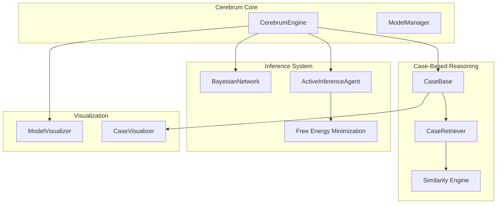

# Personal AI Infrastructure — Cerebrum Module

**Version**: v0.1.7 | **Status**: Active | **Last Updated**: February 2026

## Overview

CEREBRUM provides advanced reasoning capabilities for Personal AI Infrastructure. It combines case-based reasoning with Bayesian inference to enhance AI decision-making, learn from past experiences, and provide uncertainty-aware recommendations.

## PAI Capabilities

### Case-Based Reasoning for Code

Learn from past coding decisions:

```python
from codomyrmex.cerebrum import CerebrumEngine, Case, CaseBase

# Create a case base from project history
case_base = CaseBase()

# Add cases from past code reviews
case_base.add(Case(
    features={
        "pattern": "singleton",
        "language": "python",
        "context": "database_connection"
    },
    solution="Use connection pooling instead",
    outcome=0.95  # Success rate
))

# Query for similar situations
engine = CerebrumEngine()
current_case = {"pattern": "singleton", "language": "python", "context": "api_client"}
recommendation = engine.reason(current_case, case_base)

print(recommendation.suggested_solution)
print(recommendation.confidence)
```

### Bayesian Code Analysis

Probabilistic reasoning about code quality:

```python
from codomyrmex.cerebrum import BayesianNetwork, InferenceEngine

# Define a network for bug prediction
network = BayesianNetwork()
network.add_node("code_complexity", ["low", "medium", "high"])
network.add_node("test_coverage", ["low", "medium", "high"])
network.add_node("bug_probability", ["low", "medium", "high"])

# Set relationships
network.add_edge("code_complexity", "bug_probability")
network.add_edge("test_coverage", "bug_probability")

# Inference
inference = InferenceEngine(network)
result = inference.query(
    "bug_probability",
    evidence={"code_complexity": "high", "test_coverage": "low"}
)
# Returns probability distribution over bug_probability
```

### Active Inference Agents

AI agents that actively minimize uncertainty:

```python
from codomyrmex.cerebrum import ActiveInferenceAgent, BeliefState

# Create an active inference agent for code review
agent = ActiveInferenceAgent()

# Set current beliefs and preferences
agent.set_belief_state(BeliefState(
    current={
        "code_quality": 0.6,
        "documentation_coverage": 0.4,
        "test_coverage": 0.7
    },
    preferred={
        "code_quality": 0.9,
        "documentation_coverage": 0.8,
        "test_coverage": 0.9
    }
))

# Agent selects actions to move toward preferred state
action = agent.select_policy()
# Returns: "improve_documentation" (largest gap from preferred)
```

## PAI Architecture



## PAI Use Cases

### 1. Knowledge-Augmented Code Generation

```python
from codomyrmex.cerebrum import CerebrumEngine, CaseBase
from codomyrmex.agents import CodeEditor

# Load project-specific case base
case_base = CaseBase.load("project_patterns")
cerebrum = CerebrumEngine()
editor = CodeEditor()

# Get context from similar past cases
context = cerebrum.retrieve_similar(
    features={"task": "api_endpoint", "framework": "fastapi"}
)

# Generate code with knowledge context
code = editor.generate(
    specification="User authentication endpoint",
    context=context.as_prompt_context()
)
```

### 2. Uncertainty-Aware Recommendations

```python
from codomyrmex.cerebrum import BayesianNetwork, InferenceEngine

# Build uncertainty model
network = BayesianNetwork()
# ... configure network ...

inference = InferenceEngine(network)

# Get recommendation with confidence
result = inference.query("recommended_action", evidence=current_state)

if result.max_probability < 0.7:
    print("Recommendation uncertain, requesting human review")
else:
    print(f"Recommended: {result.most_likely} ({result.max_probability:.1%})")
```

### 3. Adaptive Learning

```python
from codomyrmex.cerebrum import CerebrumEngine, Case

engine = CerebrumEngine()

# After a successful code change
engine.add_case(Case(
    features=extracted_features,
    solution=applied_solution,
    outcome=measured_success
))

# Future similar situations will benefit from this experience
```

## PAI Configuration

### Environment Variables

```bash
# Cerebrum Settings
export CODOMYRMEX_CEREBRUM_CASE_BASE_PATH="~/.codomyrmex/cases"
export CODOMYRMEX_CEREBRUM_SIMILARITY_THRESHOLD="0.7"
export CODOMYRMEX_CEREBRUM_MAX_CASES="10000"
```

### Configuration Files

```yaml
# config/cerebrum.yaml
case_based_reasoning:
  similarity_metric: "cosine"
  retrieval_limit: 10
  adaptation_enabled: true

bayesian_inference:
  max_iterations: 1000
  convergence_threshold: 0.001

active_inference:
  planning_horizon: 5
  exploration_factor: 0.1
```

## Signposting

### Navigation

- **Self**: [PAI.md](PAI.md)
- **Parent**: [../PAI.md](../PAI.md) - Source PAI documentation
- **Project Root PAI**: [../../../PAI.md](../../../PAI.md) - Main PAI documentation

### Related Documentation

- [README.md](README.md) - Module overview
- [AGENTS.md](AGENTS.md) - Agent coordination
- [API_SPECIFICATION.md](API_SPECIFICATION.md) - API documentation
- [../agents/PAI.md](../agents/PAI.md) - Agent PAI features
- [../llm/PAI.md](../llm/PAI.md) - LLM PAI features
