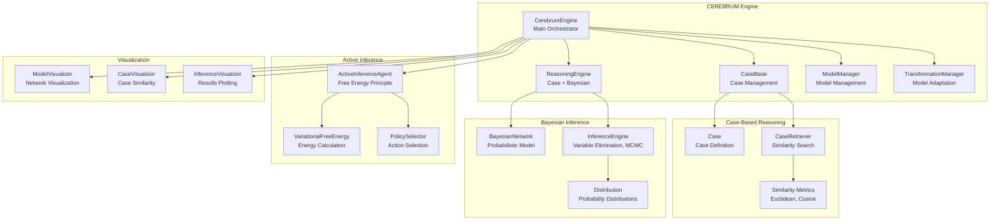

# src/codomyrmex/cerebrum

## Signposting
- **Parent**: [codomyrmex](../README.md)
- **Children**:
    - [docs](docs/README.md)
    - [tests](tests/README.md)
- **Key Artifacts**:
    - [Agent Guide](AGENTS.md)
    - [Functional Spec](SPEC.md)

**Version**: v0.1.0 | **Status**: Active | **Last Updated**: January 2026

## Overview

CEREBRUM (Case-Enabled Reasoning Engine with Bayesian Representations for Unified Modeling) is a unified modeling framework that integrates case-based reasoning with Bayesian probabilistic inference. This module provides comprehensive tools for developing, testing, and deploying cognitive models that combine the strengths of case-based reasoning with probabilistic inference.

The cerebrum module enables intelligent reasoning by retrieving similar past cases and applying Bayesian inference to make predictions, adapt models, and learn from experience.

## CEREBRUM Architecture



## Key Features

- **Case-Based Reasoning**: Retrieve and reason from similar past cases using flexible similarity metrics
- **Bayesian Inference**: Perform probabilistic inference on Bayesian networks with multiple inference methods
- **Active Inference**: Implement active inference agents based on the free energy principle
- **Model Transformation**: Adapt and learn models from new cases and feedback
- **Visualization**: Visualize networks, case similarity, and inference results
- **Integration Ready**: Designed to integrate with `ai_code_editing`, `pattern_matching`, and other modules

## Quick Start

### Basic Usage

```python
from codomyrmex.cerebrum import CerebrumEngine, Case, CerebrumConfig
from codomyrmex.logging_monitoring import setup_logging

# Setup logging
setup_logging()

# Create engine
config = CerebrumConfig(case_similarity_threshold=0.7)
engine = CerebrumEngine(config)

# Add cases
case1 = Case(
    case_id="case_001",
    features={"complexity": 5, "language": "python"},
    outcome="success"
)
engine.add_case(case1)

# Query similar cases
query = Case(
    case_id="query_001",
    features={"complexity": 4, "language": "python"}
)
result = engine.reason(query)

print(f"Prediction: {result.prediction}, Confidence: {result.confidence}")
```

### Bayesian Inference

```python
from codomyrmex.cerebrum import BayesianNetwork, InferenceEngine

# Create Bayesian network
network = BayesianNetwork(name="code_quality")
network.add_node("complexity", values=["low", "medium", "high"])
network.add_node("quality", values=["good", "bad"])

# Add edge and set CPT
network.add_edge("complexity", "quality")
network.set_cpt("quality", {
    ("low",): {"good": 0.9, "bad": 0.1},
    ("medium",): {"good": 0.6, "bad": 0.4},
    ("high",): {"good": 0.2, "bad": 0.8}
})

# Perform inference
inference = InferenceEngine(network)
evidence = {"complexity": "high"}
result = inference.compute_marginal("quality", evidence)
print(f"Quality distribution: {result.probabilities}")
```

### Active Inference

```python
from codomyrmex.cerebrum import ActiveInferenceAgent

# Create agent
agent = ActiveInferenceAgent(
    states=["state1", "state2"],
    observations=["obs1", "obs2"],
    actions=["action1", "action2"]
)

# Set models
agent.set_transition_model({
    "state1_action1": {"state1": 0.7, "state2": 0.3},
    "state2_action1": {"state1": 0.4, "state2": 0.6}
})

agent.set_observation_model({
    "state1": {"obs1": 0.8, "obs2": 0.2},
    "state2": {"obs1": 0.3, "obs2": 0.7}
})

# Select action
action = agent.select_action()
print(f"Selected action: {action}")
```

## Integration with Other Modules

### With `fpf` (First Principles Framework)

Comprehensive analysis of FPF specification using CEREBRUM:

```python
from codomyrmex.cerebrum.fpf_orchestration import FPFOrchestrator

# Create orchestrator
orchestrator = FPFOrchestrator(output_dir="output/fpf_analysis")

# Run comprehensive analysis
results = orchestrator.run_comprehensive_analysis()

# Access results
print(f"Analyzed {results['fpf_statistics']['total_patterns']} patterns")
print(f"Critical patterns: {len(results['fpf_analysis']['critical_patterns'])}")
```

**Combinatorics Analysis:**

```python
from codomyrmex.cerebrum.fpf_combinatorics import FPFCombinatoricsAnalyzer

# Analyze all pattern combinations
analyzer = FPFCombinatoricsAnalyzer(output_dir="output/combinatorics")
results = analyzer.run_comprehensive_combinatorics()

# Results include:
# - Pattern pair analysis
# - Dependency chain analysis
# - Concept co-occurrence
# - Cross-part relationships
# - All visualizations
```

**Command Line:**

```bash
# Comprehensive analysis
python -m codomyrmex.cerebrum.scripts.run_comprehensive_fpf_analysis

# With options
python -m codomyrmex.cerebrum.scripts.run_comprehensive_fpf_analysis \
    --fpf-spec FPF-Spec.md \
    --output-dir output/my_analysis
```

### With `ai_code_editing`

Use case-based reasoning to enhance code generation:

```python
from codomyrmex.cerebrum import CerebrumEngine, Case
from codomyrmex.agents.ai_code_editing import generate_code_snippet

# Create case from code generation request
case = Case(
    case_id="code_gen_001",
    features={"language": "python", "complexity": "medium"},
    outcome="generated_code"
)

# Reason about similar code generation patterns
result = engine.reason(case)
# Use result to enhance prompt or select model
```

### With `pattern_matching`

Use case-based reasoning for pattern recognition:

```python
from codomyrmex.cerebrum import Case, CaseBase

# Create cases from code patterns
pattern_case = Case(
    case_id="pattern_001",
    features={"pattern_type": "singleton", "language": "python"},
    outcome="design_pattern"
)

# Retrieve similar patterns
similar = case_base.retrieve_similar(pattern_case, k=5)
```

## Module Components

### Core Components

- **CerebrumEngine**: Main orchestrator coordinating all components
- **CaseBase**: Collection of cases with similarity search
- **CaseRetriever**: Retrieves similar cases using various strategies
- **BayesianNetwork**: Represents probabilistic graphical models
- **InferenceEngine**: Performs probabilistic inference
- **ActiveInferenceAgent**: Implements active inference principles

### Supporting Components

- **ModelManager**: Manages multiple cognitive models
- **ReasoningEngine**: Combines case-based and Bayesian reasoning
- **TransformationManager**: Handles model adaptation and learning
- **Visualization Tools**: ModelVisualizer, CaseVisualizer, InferenceVisualizer

## Configuration

The module uses `CerebrumConfig` for configuration:

```python
from codomyrmex.cerebrum import CerebrumConfig

config = CerebrumConfig(
    case_similarity_threshold=0.7,
    max_retrieved_cases=10,
    inference_method="variable_elimination",
    adaptation_rate=0.1,
    learning_rate=0.01
)
```

## Dependencies

**Core Dependencies:**
- `numpy`: Numerical computations
- `scipy`: Statistical functions
- `networkx`: Graph structures (for Bayesian networks)
- `scikit-learn`: Similarity metrics (optional)

**Codomyrmex Dependencies:**
- `logging_monitoring`: Structured logging
- `model_context_protocol`: MCP tool definitions
- `data_visualization`: Visualization utilities (optional)

## API Reference

See [API_SPECIFICATION.md](API_SPECIFICATION.md) for complete API documentation.

## Usage Examples

See [USAGE_EXAMPLES.md](USAGE_EXAMPLES.md) for detailed usage examples.

## Security Considerations

See [SECURITY.md](SECURITY.md) for security considerations and best practices.

## Citation

If you use CEREBRUM in your research, please cite:

```
@misc{friedman2025cerebrum,
  author = {Friedman, Daniel Ari},
  title = {CEREBRUM: Case-Enabled Reasoning Engine with Bayesian Representations for Unified Modeling},
  year = {2025},
  month = {April},
  version = {1.4},
  doi = {10.5281/zenodo.15170907},
  url = {https://doi.org/10.5281/zenodo.15170907},
  publisher = {Active Inference Institute}
}
```

## License

CC BY-NC-ND 4.0 (as per original CEREBRUM project)

## Navigation

- **Technical Documentation**: [AGENTS.md](AGENTS.md)
- **Functional Specification**: [SPEC.md](SPEC.md)
- **API Reference**: [API_SPECIFICATION.md](API_SPECIFICATION.md)
- **Usage Examples**: [USAGE_EXAMPLES.md](USAGE_EXAMPLES.md)
- **MCP Tools**: [MCP_TOOL_SPECIFICATION.md](MCP_TOOL_SPECIFICATION.md)
- **Security**: [SECURITY.md](SECURITY.md)
- **Changelog**: [CHANGELOG.md](CHANGELOG.md)

## Getting Started

To use this module in your project, import the necessary components:

```python
# Example usage
from codomyrmex.codomyrmex.cerebrum import main_component

def example():
    
    print(f"Result: {result}")
```

<!-- Navigation Links keyword for score -->
