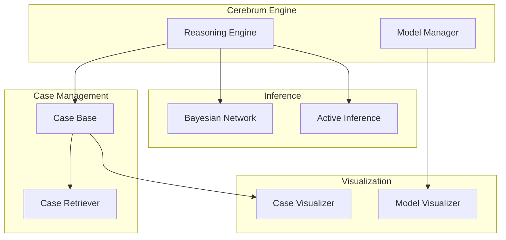

# Cerebrum Module

**Version**: v0.1.0 | **Status**: Active | **Last Updated**: January 2026

## Overview

CEREBRUM (Case-Enabled Reasoning Engine with Bayesian Representations for Unified Modeling) provides case-based reasoning combined with Bayesian probabilistic inference for cognitive modeling, code reasoning, and AI enhancement. This **Specialized Layer** module offers advanced reasoning capabilities for AI-driven analysis and decision-making.

## Key Features

- **Case-Based Reasoning**: Learn from past cases and apply to new situations
- **Bayesian Inference**: Probabilistic reasoning with uncertainty quantification
- **Active Inference**: Agents that minimize free energy for optimal decision-making
- **Model Transformation**: Adapt models through learning and transformation
- **Visualization**: Rich visualization tools for reasoning processes

## Quick Start

### Basic Case-Based Reasoning

```python
from codomyrmex.cerebrum import CerebrumEngine, Case, CaseBase

# Create engine and case base
engine = CerebrumEngine()
case_base = CaseBase()

# Add cases
case_base.add(Case(
    features={"language": "python", "complexity": 0.7},
    solution="Use async/await pattern",
    outcome=0.9
))

# Query for similar cases
result = engine.reason(
    query={"language": "python", "complexity": 0.6},
    case_base=case_base
)
print(result.recommended_solution)
```

### Bayesian Inference

```python
from codomyrmex.cerebrum import BayesianNetwork, InferenceEngine

# Create network
network = BayesianNetwork()
network.add_node("bug_type", ["syntax", "logic", "runtime"])
network.add_node("severity", ["low", "medium", "high"])
network.add_edge("bug_type", "severity")

# Set probabilities
network.set_cpd("bug_type", [0.3, 0.5, 0.2])
network.set_cpd("severity", [...])  # Conditional probabilities

# Perform inference
inference = InferenceEngine(network)
result = inference.query("severity", evidence={"bug_type": "logic"})
```

### Active Inference Agent

```python
from codomyrmex.cerebrum import ActiveInferenceAgent, BeliefState

# Create agent with beliefs
agent = ActiveInferenceAgent()
agent.set_belief_state(BeliefState(
    current={"code_quality": 0.6},
    preferred={"code_quality": 0.9}
))

# Agent selects actions to minimize free energy
action = agent.select_policy()
```

## Directory Structure

```
cerebrum/
├── core/              # Core reasoning engine and models
│   ├── engine.py      # CerebrumEngine main class
│   ├── case.py        # Case management
│   ├── model.py       # Model representations
│   └── transform.py   # Model transformations
├── inference/         # Bayesian and active inference
│   ├── bayesian.py    # Bayesian network inference
│   ├── active.py      # Active inference agents
│   └── distribution.py # Probability distributions
├── visualization/     # Visualization components
│   ├── model_viz.py   # Model visualizers
│   ├── case_viz.py    # Case visualizers
│   └── inference_viz.py # Inference visualizers
└── fpf/               # Functional Programming Framework integration
```

## Key Classes

| Class | Purpose |
| :--- | :--- |
| `CerebrumEngine` | Main orchestrator for reasoning operations |
| `Case`, `CaseBase` | Case storage and management |
| `CaseRetriever` | Similar case retrieval |
| `BayesianNetwork` | Probabilistic graphical models |
| `InferenceEngine` | Bayesian inference operations |
| `ActiveInferenceAgent` | Free energy minimizing agents |
| `ModelVisualizer` | Reasoning visualization |

## Architecture



## Integration Points

- **logging_monitoring**: Structured logging for reasoning traces
- **data_visualization**: Extended visualization capabilities
- **pattern_matching**: Pattern-based case retrieval
- **agents**: AI agent reasoning enhancement

## Related Documentation

- [API Specification](API_SPECIFICATION.md)
- [MCP Tool Specification](MCP_TOOL_SPECIFICATION.md)
- [Usage Examples](USAGE_EXAMPLES.md)
- [Security Considerations](SECURITY.md)

## Signposting

### Navigation

- **Self**: [README.md](README.md)
- **Parent**: [src/codomyrmex](../README.md)
- **Siblings**: [agents](../agents/README.md), [fpf](../fpf/README.md), [data_visualization](../data_visualization/README.md)

### Related Files

- [AGENTS.md](AGENTS.md) - Agent coordination for this module
- [SPEC.md](SPEC.md) - Functional specification
- [CHANGELOG.md](CHANGELOG.md) - Version history
