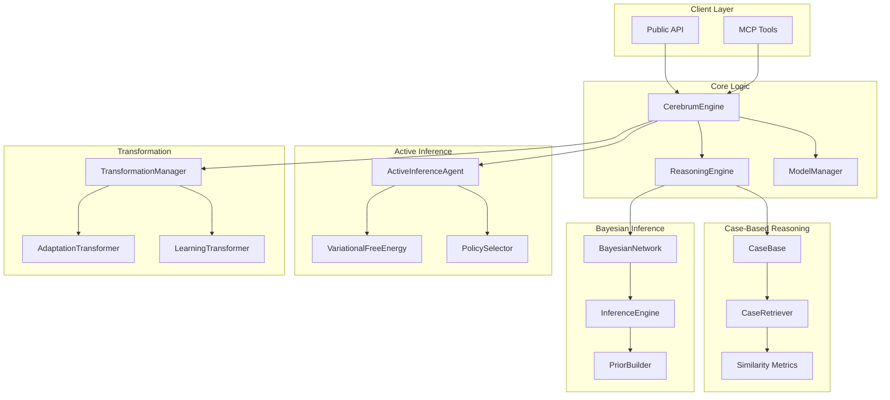

# cerebrum - Functional Specification

**Version**: v1.0.0 | **Status**: Active | **Last Updated**: February 2026

## Purpose

The `cerebrum` module serves as the cognitive modeling layer of Codomyrmex, integrating case-based reasoning with Bayesian probabilistic inference. It provides a unified framework for developing, testing, and deploying cognitive models that combine the strengths of case-based reasoning with probabilistic inference.

## Design Principles

### Modularity

- **Component Separation**: Case-based reasoning, Bayesian inference, and active inference are separate components that can be used independently or together.
- **Clear Interfaces**: Public API is stable and well-defined.
- **Extensibility**: New similarity metrics, inference methods, and transformation strategies can be added.

### Internal Coherence

- **Unified Case Representation**: All cases follow the same structure with features, context, and outcomes.
- **Consistent Inference**: Bayesian inference uses standard probabilistic methods.
- **Standardized Transformations**: Model transformations follow consistent patterns.

### Parsimony

- **Dependencies**: Depends on `logging_monitoring` for logging, `model_context_protocol` for MCP tools, and optional `data_visualization` for visualization.
- **Focus**: Does NOT execute code directly. Does NOT manage file systems beyond visualization outputs.
- **Minimal External Dependencies**: Uses numpy, scipy, networkx for core functionality.

### Functionality

- **Robustness**: Handles missing cases, invalid networks, and inference failures gracefully.
- **Quality**: Provides confidence scores and evidence for all predictions.
- **Performance**: Efficient case retrieval and inference algorithms.

### Testing

- **Unit Tests**: Test each component independently with mock data.
- **Integration Tests**: Test component interactions and end-to-end workflows.
- **Performance Tests**: Benchmark case retrieval and inference performance.

## Architecture

## Functional Requirements

### Core Capabilities

1. **Case-Based Reasoning**: Retrieve and reason from similar past cases
2. **Bayesian Inference**: Perform probabilistic inference on Bayesian networks
3. **Active Inference**: Implement active inference agents based on free energy principle
4. **Model Transformation**: Adapt and learn models from new cases and feedback
5. **Visualization**: Visualize networks, case similarity, and inference results

### Quality Standards

- **Deterministic Output Structure**: All results follow consistent data structures
- **Confidence Scores**: All predictions include confidence scores
- **Error Handling**: All operations handle errors gracefully with informative messages
- **Performance**: Case retrieval should be efficient even with large case bases

## Interface Contracts

### Public API

- `CerebrumEngine`: Main orchestrator
- `Case`, `CaseBase`, `CaseRetriever`: Case management
- `BayesianNetwork`, `InferenceEngine`: Bayesian inference
- `ActiveInferenceAgent`: Active inference
- `Model`, `ReasoningResult`: Model and result structures
- `TransformationManager`: Model transformation
- `ModelVisualizer`, `CaseVisualizer`, `InferenceVisualizer`: Visualization

### Dependencies

- `codomyrmex.logging_monitoring`: For structured logging
- `codomyrmex.model_context_protocol`: For MCP tool definitions
- `codomyrmex.data_visualization`: For visualization (optional)

## Implementation Guidelines

### Usage Patterns

- Use `CerebrumEngine` for high-level operations
- Use `CaseBase` and `CaseRetriever` for case-based reasoning
- Use `BayesianNetwork` and `InferenceEngine` for probabilistic inference
- Use `ActiveInferenceAgent` for active inference scenarios
- Use `TransformationManager` for model adaptation and learning

### Error Handling

- Catch module-specific exceptions (`CerebrumError`, `CaseError`, etc.)
- Log errors using `logging_monitoring`
- Return informative error messages in results

### Performance Considerations

- Case retrieval uses efficient similarity computation
- Bayesian inference supports multiple methods (exact and approximate)
- Large case bases may require indexing or caching

## Navigation

- **Human Documentation**: [README.md](README.md)
- **Technical Documentation**: [AGENTS.md](AGENTS.md)
- **Package SPEC**: [../SPEC.md](../SPEC.md)

<!-- Navigation Links keyword for score -->

