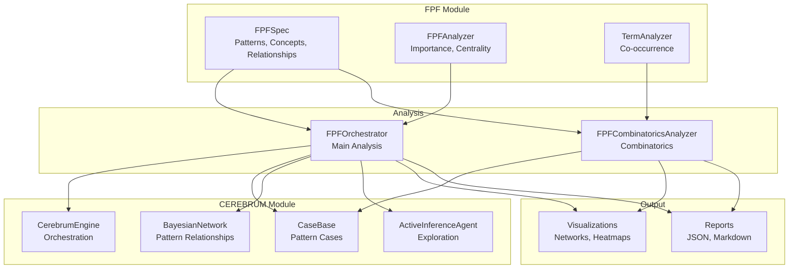

# CEREBRUM-FPF Integration

This document describes the integration of CEREBRUM methods with the First Principles Framework (FPF) module.

## Overview

The CEREBRUM-FPF integration applies case-based reasoning, Bayesian inference, and active inference to analyze and reason about the First Principles Framework specification. This enables:

- **Pattern Similarity Analysis**: Find similar FPF patterns using case-based reasoning
- **Probabilistic Pattern Relationships**: Model pattern dependencies using Bayesian networks
- **Intelligent Exploration**: Use active inference to guide FPF exploration
- **Comprehensive Combinatorics**: Analyze all pattern combinations, chains, and relationships

## Architecture



## Components

### FPFOrchestrator

Main orchestration class that applies all CEREBRUM methods to FPF:

- **Case Creation**: Converts FPF patterns to cases with features (status, part, keywords, dependencies)
- **Bayesian Network Building**: Creates networks from pattern relationships
- **Active Inference**: Guides exploration of FPF patterns
- **Comprehensive Analysis**: Combines all methods for complete analysis

### FPFCombinatoricsAnalyzer

Analyzes all combinatorics of FPF patterns:

- **Pattern Pairs**: Analyzes all pairs for similarity and relationships
- **Dependency Chains**: Finds and analyzes dependency chains
- **Concept Co-occurrence**: Analyzes concept co-occurrence networks
- **Cross-Part Relationships**: Analyzes relationships between different FPF parts

## Usage

### Basic Orchestration

```python
from codomyrmex.cerebrum.fpf_orchestration import FPFOrchestrator

# Create orchestrator
orchestrator = FPFOrchestrator(output_dir="output/fpf_analysis")

# Run analysis
results = orchestrator.run_comprehensive_analysis()
```

### Combinatorics Analysis

```python
from codomyrmex.cerebrum.fpf_combinatorics import FPFCombinatoricsAnalyzer

# Create analyzer
analyzer = FPFCombinatoricsAnalyzer(output_dir="output/combinatorics")

# Run combinatorics
results = analyzer.run_comprehensive_combinatorics()
```

### Command Line

```bash
# Comprehensive analysis
python -m codomyrmex.cerebrum.scripts.run_comprehensive_fpf_analysis

# With local FPF spec
python -m codomyrmex.cerebrum.scripts.run_comprehensive_fpf_analysis \
    --fpf-spec path/to/FPF-Spec.md \
    --output-dir output/my_analysis
```

## Output

### Analysis Results

- **comprehensive_analysis.json**: Complete analysis with all CEREBRUM results
- **combinatorics_analysis.json**: Combinatorics analysis results
- **comprehensive_analysis.md**: Human-readable markdown report

### Visualizations

- **bayesian_network.png**: Bayesian network structure
- **case_similarity.png**: Case similarity visualization
- **inference_results.png**: Inference result distributions
- **pair_similarity_heatmap.png**: Pattern pair similarity matrix
- **dependency_chains.png**: Dependency chain visualization
- **concept_cooccurrence_network.png**: Concept co-occurrence network
- **cross_part_relationships.png**: Cross-part relationship network

## Analysis Types

### Case-Based Reasoning

- Creates cases from FPF patterns
- Uses pattern features (status, part, keywords, dependencies)
- Finds similar patterns
- Predicts pattern importance

### Bayesian Inference

- Models pattern relationships as Bayesian network
- Infers pattern importance from status and dependencies
- Computes posterior distributions

### Active Inference

- Guides exploration of FPF patterns
- Selects which patterns to analyze next
- Optimizes information gain

### Combinatorics

- Analyzes all pattern pairs
- Finds dependency chains
- Analyzes concept co-occurrence
- Examines cross-part relationships

## Integration Points

The integration demonstrates how CEREBRUM can be applied to structured knowledge bases like FPF, enabling:

1. **Similarity Search**: Find similar patterns using case-based reasoning
2. **Probabilistic Modeling**: Model pattern relationships probabilistically
3. **Intelligent Exploration**: Guide exploration using active inference
4. **Comprehensive Analysis**: Analyze all combinations and relationships

## See Also

- [CEREBRUM README](../README.md)
- [FPF Module](../../fpf/README.md)
- [Usage Examples](../USAGE_EXAMPLES.md)


## Navigation Links

- **Parent**: [Project Overview](../README.md)
- **Module Index**: [All Agents](../../AGENTS.md)
- **Documentation**: [Reference Guides](../../../../docs/README.md)
- **Home**: [Root README](../../../README.md)
