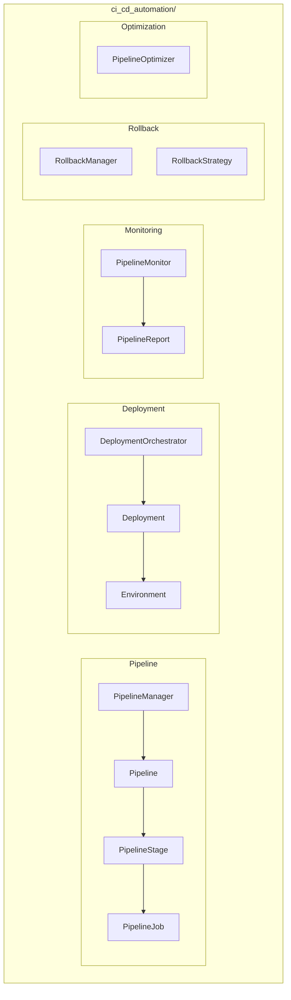

# CI/CD Automation Module

**Version**: v0.1.0 | **Status**: Active | **Last Updated**: January 2026

## Overview

The CI/CD Automation module provides continuous integration and deployment capabilities for the Codomyrmex ecosystem. It includes pipeline management, automated testing, deployment orchestration, rollback handling, and performance optimization.

## Architecture



## Key Classes

| Class | Purpose |
|-------|---------|
| `PipelineManager` | Pipeline lifecycle management |
| `Pipeline` | Pipeline definition |
| `PipelineStage` | Stage within pipeline |
| `PipelineJob` | Job within stage |
| `DeploymentOrchestrator` | Deployment coordination |
| `Deployment` | Deployment configuration |
| `Environment` | Target environment |
| `PipelineMonitor` | Real-time monitoring |
| `PipelineReport` | Execution analytics |
| `RollbackManager` | Rollback operations |
| `RollbackStrategy` | Rollback configuration |
| `PipelineOptimizer` | Performance tuning |

## Quick Start

### Create Pipeline

```python
from codomyrmex.ci_cd_automation import (
    PipelineManager,
    create_pipeline,
    Pipeline,
    PipelineStage
)

manager = PipelineManager()

pipeline = create_pipeline(
    name="build-test-deploy",
    stages=[
        PipelineStage(name="build", jobs=["compile", "lint"]),
        PipelineStage(name="test", jobs=["unit", "integration"]),
        PipelineStage(name="deploy", jobs=["staging", "production"])
    ]
)
```

### Run Pipeline

```python
from codomyrmex.ci_cd_automation import run_pipeline

result = run_pipeline(
    pipeline_name="build-test-deploy",
    branch="main",
    variables={"VERSION": "1.0.0"}
)

print(f"Status: {result.status}")
print(f"Duration: {result.duration}s")
```

### Manage Deployments

```python
from codomyrmex.ci_cd_automation import (
    DeploymentOrchestrator,
    manage_deployments,
    Environment
)

orchestrator = DeploymentOrchestrator()

result = manage_deployments(
    artifact="myapp:1.0.0",
    environment=Environment.PRODUCTION,
    strategy="rolling"
)
```

### Handle Rollbacks

```python
from codomyrmex.ci_cd_automation import (
    RollbackManager,
    handle_rollback,
    RollbackStrategy
)

rollback = handle_rollback(
    deployment_id="deploy-123",
    strategy=RollbackStrategy.IMMEDIATE,
    target_version="0.9.0"
)
```

### Monitor Pipelines

```python
from codomyrmex.ci_cd_automation import (
    monitor_pipeline_health,
    generate_pipeline_reports
)

health = monitor_pipeline_health(pipeline_id="pl-123")
print(f"Success rate: {health.success_rate:.1%}")

report = generate_pipeline_reports(
    pipeline_id="pl-123",
    period="7d"
)
```

## Exceptions

| Exception | When Raised |
|-----------|-------------|
| `PipelineError` | General pipeline error |
| `BuildError` | Build failure |
| `DeploymentError` | Deployment failure |
| `ArtifactError` | Artifact operations |
| `StageError` | Stage execution |
| `RollbackError` | Rollback failure |

## Integration Points

- **logging_monitoring**: Pipeline logging
- **containerization**: Container builds
- **git_operations**: Source control
- **security**: Security scanning

## Navigation

- **Parent**: [../README.md](../README.md)
- **Siblings**: [containerization](../containerization/), [deployment](../deployment/)
- **Spec**: [SPEC.md](SPEC.md)
