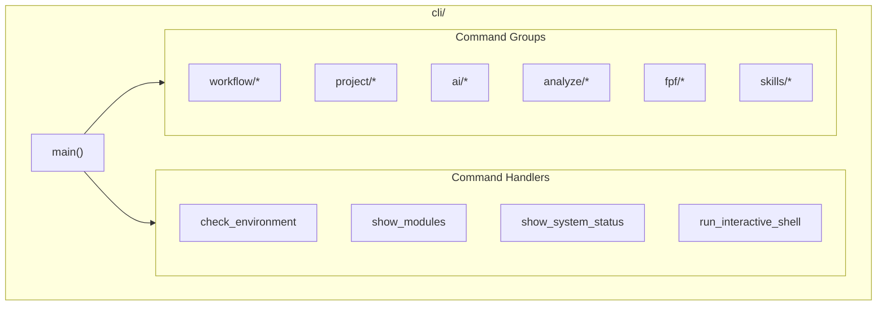

# CLI Module

**Version**: v0.1.0 | **Status**: Active | **Last Updated**: January 2026

## Overview

The CLI module provides the command-line interface for the Codomyrmex development platform. It serves as the primary entry point for user interaction with all Codomyrmex capabilities.

## Architecture



## Commands

### Core Commands

| Command | Description |
|---------|-------------|
| `codomyrmex --help` | Show help |
| `codomyrmex check` | Verify environment |
| `codomyrmex modules` | List modules |
| `codomyrmex status` | System dashboard |
| `codomyrmex shell` | Interactive shell |

### Workflow Commands

| Command | Description |
|---------|-------------|
| `workflow create` | Create workflow |
| `workflow list` | List workflows |
| `workflow run` | Execute workflow |

### Project Commands

| Command | Description |
|---------|-------------|
| `project create` | Create project |
| `project list` | List projects |

### AI Commands

| Command | Description |
|---------|-------------|
| `ai generate` | Generate code |
| `ai refactor` | Refactor code |

### Analysis Commands

| Command | Description |
|---------|-------------|
| `analyze code` | Code analysis |
| `analyze git` | Git analysis |

### FPF Commands

| Command | Description |
|---------|-------------|
| `fpf fetch` | Fetch FPF data |
| `fpf parse` | Parse FPF docs |
| `fpf export` | Export FPF |
| `fpf search` | Search FPF |
| `fpf visualize` | Visualize FPF |

### Skills Commands

| Command | Description |
|---------|-------------|
| `skills sync` | Sync skills |
| `skills list` | List skills |
| `skills get` | Get skill details |

## Quick Start

### Check Environment

```bash
$ codomyrmex check
✓ Python 3.12.0
✓ Git 2.40.0
✓ Docker 24.0.0
✓ All dependencies installed
```

### List Modules

```bash
$ codomyrmex modules
Available modules:
  agents        ✓ Active
  cerebrum      ✓ Active
  coding        ✓ Active
  ...
```

### Create Workflow

```bash
$ codomyrmex workflow create my-workflow
Created workflow: my-workflow
```

### AI Code Generation

```bash
codomyrmex ai generate --prompt "Create a REST API"
```

### Run Analysis

```bash
codomyrmex analyze code src/
```

## Programmatic Usage

```python
from codomyrmex.cli import (
    check_environment,
    show_modules,
    handle_workflow_create
)

# Check environment
check_environment()

# Create workflow programmatically
handle_workflow_create("my-workflow")
```

## Demo Functions

```python
from codomyrmex.cli import (
    demo_data_visualization,
    demo_ai_code_editing,
    demo_code_execution,
    demo_git_operations
)

demo_data_visualization()
```

## Integration Points

- **All modules**: CLI exposes all modules
- **orchestrator**: Workflow execution

## Navigation

- **Parent**: [../README.md](../README.md)
- **Siblings**: [terminal_interface](../terminal_interface/), [orchestrator](../orchestrator/)
- **Spec**: [SPEC.md](SPEC.md)
