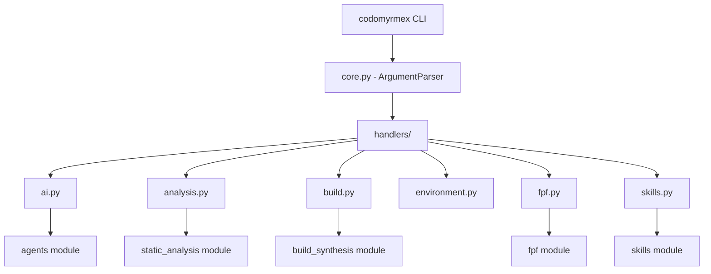

# cli - Functional Specification

**Version**: v0.1.0 | **Status**: Active | **Last Updated**: January 2026

## Purpose

Command-line interface providing unified access to all Codomyrmex modules and workflows through the `codomyrmex` command.

## Design Principles

### Modularity

- Commands organized by domain (workflow, project, ai, analyze, build, fpf, skills)
- Handler implementations in separate files for maintainability
- Composable command structure with subparsers

### Functionality

- Supports both synchronous and asynchronous operations
- Performance monitoring integration (--performance flag)
- Verbose output mode (--verbose flag)

### Documentation

- Built-in help for all commands and subcommands
- Usage examples in epilog
- Clear error messages for invalid usage

## Architecture

## Command Groups

| Command | Subcommands | Purpose |
|---------|------------|---------|
| `check` | - | Validate environment setup |
| `info` | - | Show project information |
| `modules` | - | List available modules |
| `status` | - | Show system status dashboard |
| `shell` | - | Launch interactive shell |
| `workflow` | list, create, run | Workflow management |
| `project` | list, create | Project management |
| `orchestration` | status, health | Orchestration system |
| `ai` | generate, refactor | AI-powered operations |
| `analyze` | code, git | Code analysis |
| `build` | project | Build operations |
| `fpf` | fetch, parse, export, search, visualize, context, analyze, report | FPF operations |
| `skills` | sync, list, get, search | Skills management |

## Navigation

- **Human Documentation**: [README.md](README.md)
- **Technical Documentation**: [AGENTS.md](AGENTS.md)
- **Parent Directory**: [codomyrmex](../README.md)
- **Project Root**: [README](../../../README.md)
