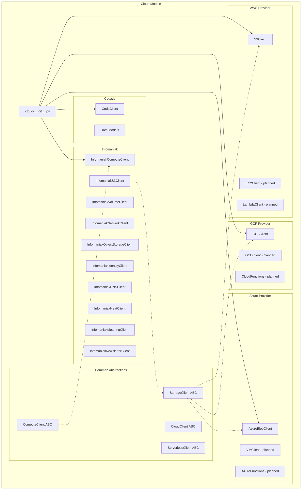

# Cloud Services Module

**Version**: v0.2.0 | **Status**: Active | **Last Updated**: February 2026

## Overview

The Cloud Services module provides unified, provider-agnostic interfaces for interacting with cloud platforms:

| Provider | Component | Description |
|----------|-----------|-------------|
| **AWS** | `S3Client` | Amazon S3 object storage |
| **GCP** | `GCSClient` | Google Cloud Storage |
| **Azure** | `AzureBlobClient` | Azure Blob Storage |
| **Coda.io** | `CodaClient` | Document and database API |
| **Infomaniak** | `InfomaniakComputeClient`, `InfomaniakVolumeClient`, `InfomaniakNetworkClient`, `InfomaniakObjectStorageClient`, `InfomaniakS3Client`, `InfomaniakIdentityClient`, `InfomaniakDNSClient`, `InfomaniakHeatClient`, `InfomaniakMeteringClient`, `InfomaniakNewsletterClient` | Swiss-hosted OpenStack cloud (9 services) + Newsletter API |

All storage clients share a consistent interface pattern with operations for upload, download, list, metadata retrieval, and bucket/container management. Infomaniak clients provide compute, storage, networking, DNS, orchestration, metering, and newsletter services via OpenStack and Infomaniak REST APIs.

## Architecture



## Quick Start

### Installation

```bash
# Core (Coda.io only)
pip install requests

# AWS support
pip install boto3

# GCP support
pip install google-cloud-storage

# Azure support
pip install azure-storage-blob azure-identity

# Infomaniak support (OpenStack services)
pip install openstacksdk

# Infomaniak S3-compatible storage
pip install boto3
```

### Usage Examples

#### AWS S3

```python
from codomyrmex.cloud import S3Client

# Initialize client (uses default AWS credentials)
s3 = S3Client(region_name="us-west-2")

# Upload a file
s3.upload_file("local/file.txt", "my-bucket", "remote/file.txt")

# List objects
objects = s3.list_objects("my-bucket")
for obj in objects:
    print(obj)

# Download a file
s3.download_file("my-bucket", "remote/file.txt", "local/downloaded.txt")

# Get object metadata
metadata = s3.get_metadata("my-bucket", "remote/file.txt")
```

#### GCP Cloud Storage

```python
from codomyrmex.cloud import GCSClient

# Initialize client
gcs = GCSClient(project="my-project")

# Upload a blob
gcs.upload_blob("my-bucket", "local/file.txt", "remote/file.txt")

# List blobs
blobs = gcs.list_blobs("my-bucket")
for blob in blobs:
    print(blob)

# Download a blob
gcs.download_blob("my-bucket", "remote/file.txt", "local/downloaded.txt")
```

#### Azure Blob Storage

```python
from codomyrmex.cloud import AzureBlobClient

# Initialize (uses DefaultAzureCredential)
azure = AzureBlobClient(account_url="https://myaccount.blob.core.windows.net")

# Upload a blob
azure.upload_blob("my-container", "remote/file.txt", "local/file.txt")

# List blobs
blobs = azure.list_blobs("my-container")
for blob in blobs:
    print(blob)
```

#### Coda.io

```python
from codomyrmex.cloud import CodaClient

# Initialize with API token
client = CodaClient(api_token="your-api-token")

# List documents
docs = client.list_docs()
for doc in docs.items:
    print(f"{doc.name} ({doc.id})")

# Get table rows
rows = client.list_rows(doc_id="doc-id", table_id_or_name="Tasks")
for row in rows.items:
    print(row.values)
```

## Directory Structure

| Path | Description |
|------|-------------|
| [`aws/`](aws/README.md) | Amazon Web Services integration |
| [`gcp/`](gcp/README.md) | Google Cloud Platform integration |
| [`azure/`](azure/README.md) | Microsoft Azure integration |
| [`coda_io/`](coda_io/README.md) | Coda.io document/database API |
| [`infomaniak/`](infomaniak/README.md) | Infomaniak OpenStack cloud + Newsletter API |
| [`common/`](common/README.md) | Shared abstractions and utilities |

#### Infomaniak

```python
from codomyrmex.cloud.infomaniak import InfomaniakComputeClient, InfomaniakS3Client

# Compute (from environment variables)
compute = InfomaniakComputeClient.from_env()
instances = compute.list_instances()

# S3-compatible storage
s3 = InfomaniakS3Client.from_env()
s3.upload_data("my-bucket", "data.csv", open("data.csv", "rb").read())
```

#### Infomaniak Newsletter

```python
from codomyrmex.cloud.infomaniak.newsletter import InfomaniakNewsletterClient

client = InfomaniakNewsletterClient.from_env()
campaigns = client.list_campaigns()
client.send_test(campaign_id="123", email="test@activeinference.tech")
```

## Documentation

| Document | Purpose |
|----------|---------|
| [README.md](README.md) | This file - overview and quick start |
| [SPEC.md](SPEC.md) | Functional specification and requirements |
| [AGENTS.md](AGENTS.md) | AI agent integration guide |
| [PAI.md](PAI.md) | Personal AI infrastructure context |
| [API_SPECIFICATION.md](API_SPECIFICATION.md) | Complete API reference |

## Navigation

- **Full Documentation**: [docs/modules/cloud/](../../../docs/modules/cloud/)
- **Parent Directory**: [codomyrmex](../README.md)
- **Project Root**: [../../../README.md](../../../README.md)
