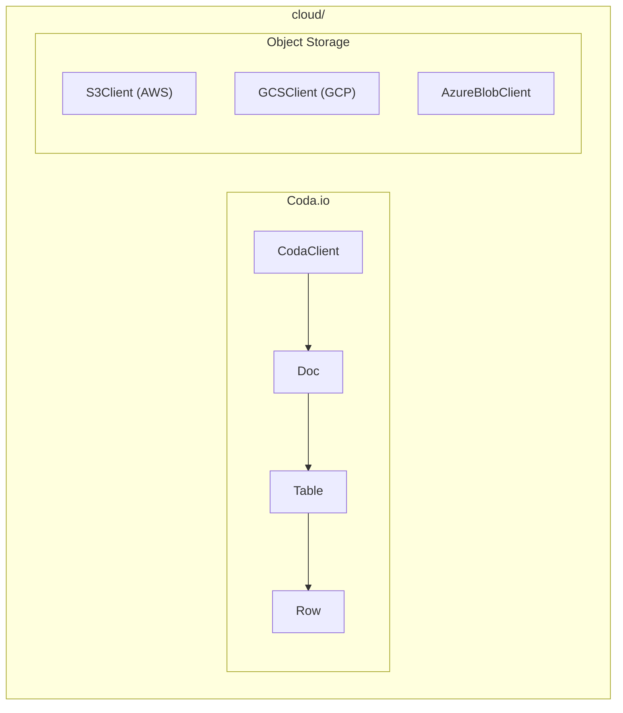

# Cloud Module

**Version**: v0.1.0 | **Status**: Active | **Last Updated**: January 2026

## Overview

The Cloud module provides integrations with various cloud service APIs including Coda.io, AWS S3, Google Cloud Storage, and Azure Blob Storage for the Codomyrmex platform.

## Architecture



## Key Classes

### Coda.io Integration

| Class | Purpose |
|-------|---------|
| `CodaClient` | Coda.io API client |
| `Doc`, `DocList` | Document management |
| `Page`, `PageList` | Page management |
| `Table`, `TableList` | Table operations |
| `Row`, `RowList`, `RowEdit` | Row CRUD |
| `Column`, `ColumnList` | Column definitions |
| `Formula`, `Control` | Formulas and controls |
| `Permission`, `SharingMetadata` | Access control |

### Object Storage

| Class | Purpose |
|-------|---------|
| `S3Client` | AWS S3 operations (optional) |
| `GCSClient` | Google Cloud Storage (optional) |
| `AzureBlobClient` | Azure Blob Storage (optional) |

## Quick Start

### Coda.io

```python
from codomyrmex.cloud import CodaClient

client = CodaClient(api_token="your-api-token")

# List all docs
docs = client.list_docs()
for doc in docs.items:
    print(f"{doc.name}: {doc.id}")

# Get a specific doc
doc = client.get_doc("doc-id")

# List tables in doc
tables = client.list_tables(doc.id)

# Query rows
rows = client.list_rows(
    doc_id=doc.id,
    table_id="grid-xxx",
    query='Status = "Active"'
)
```

### AWS S3

```python
from codomyrmex.cloud import S3Client

s3 = S3Client(region="us-east-1")

# Upload file
s3.upload("my-bucket", "path/to/file.txt", local_path="./file.txt")

# Download file
s3.download("my-bucket", "path/to/file.txt", local_path="./downloaded.txt")

# List objects
objects = s3.list_objects("my-bucket", prefix="data/")
```

### Google Cloud Storage

```python
from codomyrmex.cloud import GCSClient

gcs = GCSClient(project="my-project")

# Upload
gcs.upload("my-bucket", "data/file.json", data=json.dumps(data))

# Download
content = gcs.download("my-bucket", "data/file.json")
```

### Azure Blob Storage

```python
from codomyrmex.cloud import AzureBlobClient

azure = AzureBlobClient(connection_string="...")

# Upload
azure.upload("container", "blob-name", data=content)

# Download
data = azure.download("container", "blob-name")
```

## Coda.io Exceptions

| Exception | When Raised |
|-----------|-------------|
| `CodaAPIError` | General API error |
| `CodaAuthenticationError` | Invalid token |
| `CodaForbiddenError` | Insufficient permissions |
| `CodaNotFoundError` | Resource not found |
| `CodaRateLimitError` | Rate limit exceeded |
| `CodaValidationError` | Invalid request |
| `CodaGoneError` | Resource deleted |

## Optional Dependencies

| Client | Package Required |
|--------|------------------|
| `S3Client` | `boto3` |
| `GCSClient` | `google-cloud-storage` |
| `AzureBlobClient` | `azure-storage-blob` |

## Integration Points

- **config_management**: Cloud config storage
- **database_management**: Cloud database backups
- **documents**: Cloud document sync

## Navigation

- **Parent**: [../README.md](../README.md)
- **Siblings**: [networking](../networking/), [api](../api/)
- **Spec**: [SPEC.md](SPEC.md)
