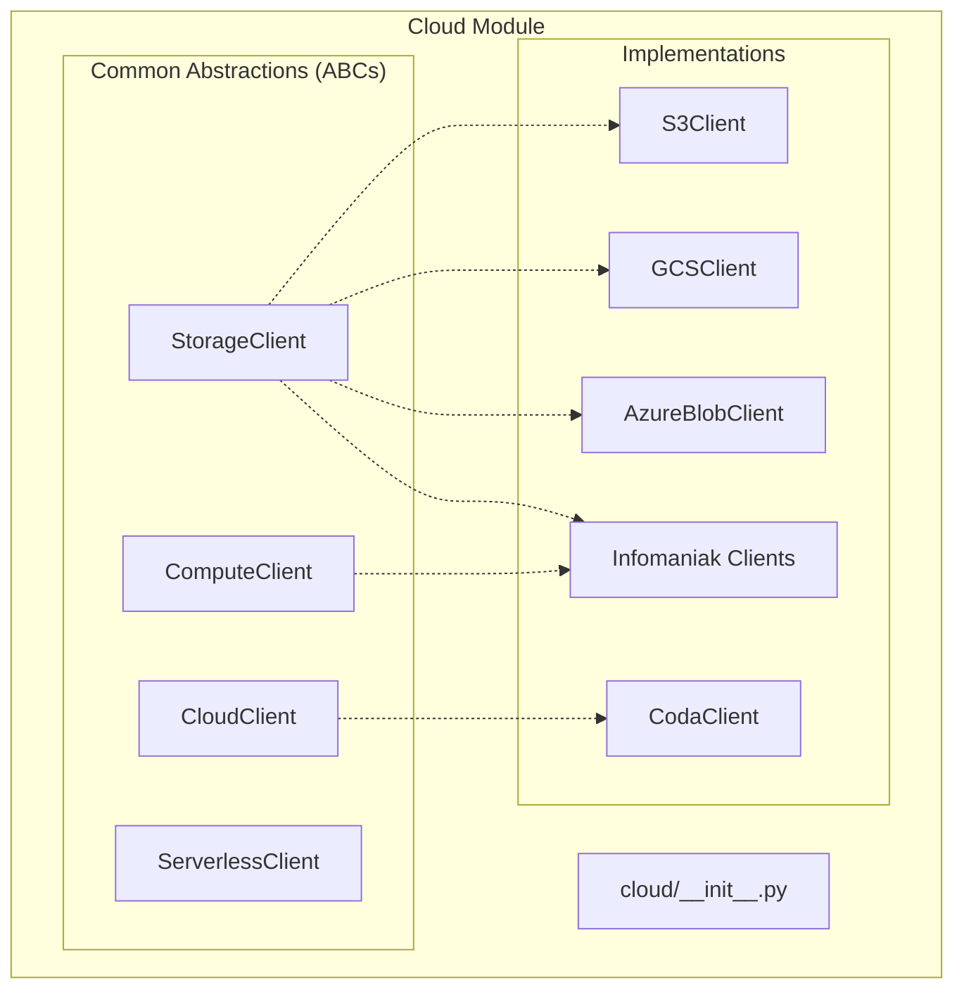

# Cloud Module

**Version**: v1.1.4 | **Status**: Active | **Last Updated**: March 2026

## Overview

The Cloud Services module provides unified, provider-agnostic interfaces for interacting with cloud platforms. It abstracts common operations for storage, compute, and serverless across multiple providers.

### Supported Providers

| Provider | Components | Description |
|----------|-----------|-------------|
| **AWS** | `S3Client` | Amazon S3 object storage |
| **GCP** | `GCSClient` | Google Cloud Storage |
| **Azure** | `AzureBlobClient` | Azure Blob Storage |
| **Coda.io** | `CodaClient` | Document and database API |
| **Infomaniak** | `InfomaniakComputeClient`, `InfomaniakVolumeClient`, `InfomaniakNetworkClient`, `InfomaniakObjectStorageClient`, `InfomaniakS3Client`, `InfomaniakIdentityClient`, `InfomaniakDNSClient`, `InfomaniakHeatClient`, `InfomaniakMeteringClient`, `InfomaniakNewsletterClient` | Swiss-hosted OpenStack cloud (9 services) + Newsletter API |

## Design Principles

1.  **Unified Interfaces**: All storage clients implement the `StorageClient` ABC. Compute and serverless clients follow similar patterns.
2.  **Provider Agnosticism**: Switch between providers with minimal code changes.
3.  **Strict Typing**: Full Python type hinting and `py.typed` marker.
4.  **Resilient Error Handling**: Centralized error mapping and structured logging.
5.  **Optional Dependencies**: Each provider's requirements are isolated.

## PAI Integration

| Algorithm Phase | Role | Tools Used |
|----------------|------|-----------|
| **OBSERVE** | Infrastructure inventory | `list_cloud_instances`, `list_s3_buckets`, `list_resources` |
| **EXECUTE** | Artifact deployment | `upload_file_to_s3`, `upload_file`, `create_resource` |
| **VERIFY** | Resource confirmation | `list_s3_buckets`, `list_cloud_instances`, `get_resource` |

## Architecture

The module uses Abstract Base Classes (ABCs) in `common/` to define contracts for different cloud service types.


```mermaid
graph TB
    subgraph "Cloud Module"
        Init[cloud/__init__.py]
        
        subgraph "Common Abstractions (ABCs)"
            ABC[CloudClient]
            Storage[StorageClient]
            Compute[ComputeClient]
            Serverless[ServerlessClient]
        end
        
        subgraph "Implementations"
            AWS[S3Client]
            GCP[GCSClient]
            Azure[AzureBlobClient]
            Coda[CodaClient]
            IK[Infomaniak Clients]
        end
    end

    Storage -.-> AWS & GCP & Azure & IK
    Compute -.-> IK
    ABC -.-> Coda
```

## Quick Start

### Installation

```bash
# Core (Coda.io only)
uv add requests

# AWS support
uv add boto3

# GCP support
uv add google-cloud-storage

# Azure support
uv add azure-storage-blob azure-identity

# Infomaniak support
uv add openstacksdk
```

### Usage Examples

#### Unified Storage (AWS S3)

```python
from codomyrmex.cloud import S3Client

s3 = S3Client(region_name="us-west-2")
s3.create_bucket("my-app-data")
s3.upload_file("my-app-data", "configs/v1.json", "local_config.json")
objects = s3.list_objects("my-app-data")
```

#### Multi-Cloud Resource Listing (via Common Config)

```python
from codomyrmex.cloud.common import CloudConfig, CloudProvider
from codomyrmex.cloud import CodaClient

config = CloudConfig.from_env()
if config.has_provider(CloudProvider.CODA):
    creds = config.get_credentials(CloudProvider.CODA)
    client = CodaClient(api_token=creds.access_key)
    docs = client.list_resources()
    for doc in docs:
        print(f"Doc: {doc.name} ({doc.id})")
```

## Directory Structure

| Path | Description |
|------|-------------|
| [`common/`](common/README.md) | **Core Abstractions**: ABCs for Storage, Compute, Serverless |
| [`aws/`](aws/README.md) | **AWS**: S3Client implementation |
| [`gcp/`](gcp/README.md) | **GCP**: GCSClient implementation |
| [`azure/`](azure/README.md) | **Azure**: AzureBlobClient implementation |
| [`coda_io/`](coda_io/README.md) | **Coda.io**: CodaClient and document management |
| [`infomaniak/`](infomaniak/README.md) | **Infomaniak**: OpenStack-based cloud services |
| [`cost_management/`](cost_management/README.md) | **Cost Tracking**: Resource and API cost monitoring |

## Documentation

| Document | Purpose |
|----------|---------|
| [README.md](README.md) | This file - overview and quick start |
| [SPEC.md](SPEC.md) | Functional specification and requirements |
| [AGENTS.md](AGENTS.md) | AI agent integration guide |
| [PAI.md](PAI.md) | Personal AI infrastructure context |
| [API_SPECIFICATION.md](API_SPECIFICATION.md) | Complete API reference |

## Testing

```bash
# Requires optional cloud SDK dependencies
uv sync --extra cloud
uv run pytest src/codomyrmex/tests/unit/cloud/ -m "not network"
```

## Navigation

- **Full Documentation**: [docs/modules/cloud/](../../../docs/modules/cloud/)
- **Parent Directory**: [codomyrmex](../README.md)
- **Project Root**: [../../../README.md](../../../README.md)
