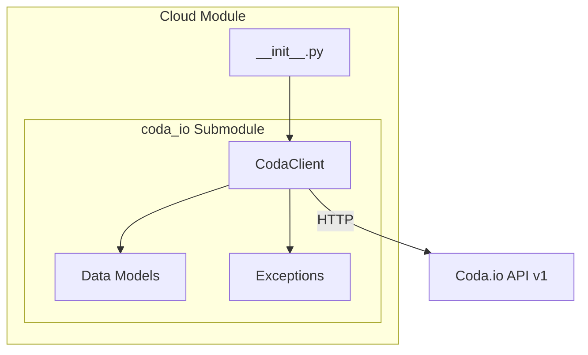

# cloud - Functional Specification

**Version**: v0.1.0 | **Status**: Active | **Last Updated**: January 2026

## Purpose

Cloud services integration module providing standardized Python clients for interacting with cloud-based platforms and APIs. Enables seamless integration with document management, collaboration, and data services.

## Design Principles

### Modularity
- Each cloud service has its own submodule
- Shared utilities extracted to common components
- Clear separation of concerns between services

### Consistency
- Uniform interface patterns across all cloud clients
- Standardized error handling and exceptions
- Common data model patterns using dataclasses

### Reliability
- Proper error handling with typed exceptions
- Rate limit awareness and handling
- Pagination support for list endpoints

## Architecture

## Functional Requirements

### Coda.io Integration

#### Authentication
- Bearer token authentication via API token
- Token passed in Authorization header

#### API Coverage
The client must support all major Coda API v1 endpoints:

| Category | Endpoints |
|----------|-----------|
| Docs | list, create, get, update, delete |
| Pages | list, create, get, update, delete, content, export |
| Tables | list, get |
| Columns | list, get |
| Rows | list, insert, upsert, get, update, delete, push button |
| Permissions | metadata, list, add, delete, search principals, ACL settings |
| Publishing | categories, publish, unpublish |
| Formulas | list, get |
| Controls | list, get |
| Automations | trigger webhook |
| Analytics | doc analytics, page analytics, pack analytics |
| Miscellaneous | whoami, resolve browser link, mutation status |

#### Error Handling
- Map HTTP status codes to typed exceptions
- Preserve error messages from API responses
- Support for rate limit detection (429)

#### Pagination
- Support `pageToken` and `limit` parameters
- Provide iterator helpers for automatic pagination

## Technical Constraints

### Dependencies
- `requests` library for HTTP
- Python 3.10+ for modern type hints

### API Versioning
- Target Coda API v1 (base URL: `https://coda.io/apis/v1`)
- API version included in base URL

### Rate Limits
Per Coda documentation:
- Reading: 100 requests / 6 seconds
- Writing: 10 requests / 6 seconds
- Listing docs: 4 requests / 6 seconds

## Navigation Links

- **Human Documentation**: [README.md](README.md)
- **Technical Documentation**: [AGENTS.md](AGENTS.md)
- **Parent**: [codomyrmex](../README.md)
