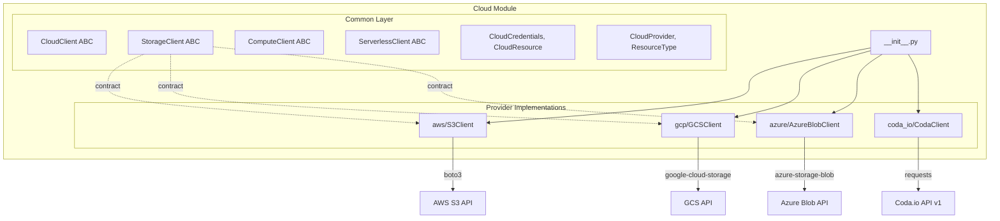

# cloud - Functional Specification

**Version**: v0.2.0 | **Status**: Active | **Last Updated**: February 2026

## Purpose

Cloud services integration module providing standardized Python clients for interacting with cloud-based platforms and APIs. Enables seamless integration with object storage, compute, serverless, and document management services across AWS, GCP, Azure, and Coda.io.

## Design Principles

### 1. Modularity

- Each cloud service has its own submodule
- Shared utilities extracted to `common/` components
- Clear separation of concerns between services
- Optional dependencies per provider

### 2. Consistency

- Uniform interface patterns across all cloud clients
- Standardized error handling and exceptions
- Common data model patterns using dataclasses
- Abstract base classes in `common/` define contracts

### 3. Reliability

- Proper error handling with typed exceptions
- Rate limit awareness and handling
- Pagination support for list endpoints
- Graceful degradation for optional dependencies

### 4. Provider Agnosticism

- Common abstractions enable provider-swapping
- Consistent method signatures across providers
- Unified credential management patterns

## Architecture

## Functional Requirements

### FR-1: Object Storage Operations

All storage clients must implement:

| Method | Signature | Description |
|--------|-----------|-------------|
| `upload_file` | `(local_path, bucket, object_name) -> bool` | Upload local file to storage |
| `download_file` | `(bucket, object_name, local_path) -> bool` | Download object to local file |
| `list_objects` | `(bucket) -> list[str]` | List all objects in bucket |
| `get_metadata` | `(bucket, object_name) -> dict` | Get object metadata |
| `ensure_bucket` | `(bucket) -> bool` | Create bucket if not exists |

### FR-2: Authentication

| Provider | Method |
|----------|--------|
| **AWS** | boto3 default credential chain (env, config, IAM role) |
| **GCP** | Application Default Credentials or service account JSON |
| **Azure** | DefaultAzureCredential from azure-identity |
| **Coda.io** | Bearer token authentication via API token |

### FR-3: Coda.io API Coverage

The Coda client must support all major API v1 endpoints:

| Category | Endpoints |
|----------|-----------|
| Docs | list, create, get, update, delete |
| Pages | list, create, get, update, delete, content, export |
| Tables | list, get |
| Columns | list, get |
| Rows | list, insert, upsert, get, update, delete, push button |
| Permissions | metadata, list, add, delete, search principals, ACL settings |
| Publishing | categories, publish, unpublish |
| Formulas | list, get |
| Controls | list, get |
| Automations | trigger webhook |
| Analytics | doc analytics, page analytics, pack analytics |
| Miscellaneous | whoami, resolve browser link, mutation status |

### FR-4: Error Handling

- Map HTTP status codes to typed exceptions
- Preserve error messages from API responses
- Support for rate limit detection (429)
- Graceful handling of missing optional dependencies

## Technical Constraints

### Dependencies

| Provider | Required Package | Optional |
|----------|-----------------|----------|
| Core | `requests` | No |
| AWS | `boto3` | Yes |
| GCP | `google-cloud-storage` | Yes |
| Azure | `azure-storage-blob`, `azure-identity` | Yes |

### Python Version

- Python 3.10+ for modern type hints
- Full typing with `py.typed` marker

### Rate Limits (Coda.io)

| Operation | Limit |
|-----------|-------|
| Reading | 100 requests / 6 seconds |
| Writing | 10 requests / 6 seconds |
| Listing docs | 4 requests / 6 seconds |

## Non-Functional Requirements

### NFR-1: Performance

- Connection pooling via requests.Session
- Lazy initialization of provider clients
- Streaming for large file transfers

### NFR-2: Observability

- Structured logging via `codomyrmex.logging_monitoring`
- Error classification and metrics

### NFR-3: Testing

- Unit tests with mocked provider APIs
- Integration tests for local development

## Navigation Links

- **Human Documentation**: [README.md](README.md)
- **Technical Documentation**: [AGENTS.md](AGENTS.md)
- **API Reference**: [API_SPECIFICATION.md](API_SPECIFICATION.md)
- **Parent**: [codomyrmex](../README.md)
