# cloud - Functional Specification

**Version**: v1.0.0 | **Status**: Active | **Last Updated**: February 2026

## Purpose

Cloud services integration module providing standardized Python clients for interacting with cloud-based platforms and APIs. Enables seamless integration with object storage, compute, serverless, and document management services across AWS, GCP, Azure, Coda.io, and Infomaniak (OpenStack + Newsletter).

## Design Principles

### 1. Modularity

- Each cloud service has its own submodule
- Shared utilities extracted to `common/` components
- Clear separation of concerns between services
- Optional dependencies per provider

### 2. Consistency

- Uniform interface patterns across all cloud clients
- Standardized error handling and exceptions
- Common data model patterns using dataclasses
- Abstract base classes in `common/` define contracts

### 3. Reliability

- Proper error handling with typed exceptions
- Rate limit awareness and handling
- Pagination support for list endpoints
- Graceful degradation for optional dependencies

### 4. Provider Agnosticism

- Common abstractions enable provider-swapping
- Consistent method signatures across providers
- Unified credential management patterns

## Architecture

```mermaid
graph TD
    subgraph "Cloud Module"
        Init[__init__.py]
        
        subgraph "Common Layer"
            CloudClient[CloudClient ABC]
            StorageClient[StorageClient ABC]
            ComputeClient[ComputeClient ABC]
            ServerlessClient[ServerlessClient ABC]
            Models[CloudCredentials, CloudResource]
            Enums[CloudProvider, ResourceType]
        end
        
        subgraph "Provider Implementations"
            AWS[aws/S3Client]
            GCP[gcp/GCSClient]
            Azure[azure/AzureBlobClient]
            Coda[coda_io/CodaClient]
        end

        subgraph "Infomaniak Provider"
            IKCompute[InfomaniakComputeClient]
            IKVolume[InfomaniakVolumeClient]
            IKNetwork[InfomaniakNetworkClient]
            IKObj[InfomaniakObjectStorageClient]
            IKS3[InfomaniakS3Client]
            IKIdentity[InfomaniakIdentityClient]
            IKDNS[InfomaniakDNSClient]
            IKHeat[InfomaniakHeatClient]
            IKMeter[InfomaniakMeteringClient]
            IKNewsletter[InfomaniakNewsletterClient]
        end
    end

    Init --> AWS & GCP & Azure & Coda & IKCompute
    StorageClient -.->|contract| AWS & GCP & Azure
    AWS --> |boto3| S3[AWS S3 API]
    GCP --> |google-cloud-storage| GCS[GCS API]
    Azure --> |azure-storage-blob| Blob[Azure Blob API]
    Coda --> |requests| CodaAPI[Coda.io API v1]
    IKCompute & IKVolume & IKNetwork & IKObj & IKIdentity & IKDNS & IKHeat & IKMeter --> |openstacksdk| OpenStackAPI[Infomaniak OpenStack API]
    IKS3 --> |boto3| IKS3API[Infomaniak S3 API]
    IKNewsletter --> |requests| IKNewsAPI[Infomaniak Newsletter API]
```



## Functional Requirements

### Interface Contracts

#### Base Client (`cloud.common`)

```python
class CloudClient(ABC):
    def list_resources(resource_type: ResourceType = None) -> List[CloudResource]
    def get_resource(resource_id: str) -> Optional[CloudResource]
    def create_resource(name: str, resource_type: ResourceType, config: dict) -> CloudResource
    def delete_resource(resource_id: str) -> bool
```

#### Object Storage (`cloud.common`)

```python
class StorageClient(ABC):
    def list_buckets() -> List[str]
    def create_bucket(name: str) -> bool
    def upload_file(bucket: str, key: str, data: bytes, ...) -> str
    def download_file(bucket: str, key: str) -> bytes
    def delete_file(bucket: str, key: str) -> bool
```

#### Compute & Serverless (`cloud.common`)

```python
class ComputeClient(ABC):
    def list_instances() -> List[dict]
    def start_instance(instance_id: str) -> bool
    def stop_instance(instance_id: str) -> bool
    def create_instance(name: str, instance_type: str, image_id: str, ...) -> dict

class ServerlessClient(ABC):
    def list_functions() -> List[dict]
    def invoke_function(function_name: str, payload: dict) -> dict
    def create_function(name: str, runtime: str, handler: str, code_path: str, ...) -> dict
```

### FR-4: Error Handling

- Map HTTP status codes to typed exceptions
- Preserve error messages from API responses
- Support for rate limit detection (429)
- Graceful handling of missing optional dependencies

## Technical Constraints

### Dependencies

| Provider | Required Package | Optional |
|----------|-----------------|----------|
| Core | `requests` | No |
| AWS | `boto3` | Yes |
| GCP | `google-cloud-storage` | Yes |
| Azure | `azure-storage-blob`, `azure-identity` | Yes |
| Infomaniak | `openstacksdk` | Yes |
| Infomaniak S3 | `boto3` | Yes |

### Python Version

- Python 3.10+ for modern type hints
- Full typing with `py.typed` marker

### Rate Limits (Coda.io)

| Operation | Limit |
|-----------|-------|
| Reading | 100 requests / 6 seconds |
| Writing | 10 requests / 6 seconds |
| Listing docs | 4 requests / 6 seconds |

## Non-Functional Requirements

### NFR-1: Performance

- Connection pooling via requests.Session
- Lazy initialization of provider clients
- Streaming for large file transfers

### NFR-2: Observability

- Structured logging via `codomyrmex.logging_monitoring`
- Error classification and metrics

### NFR-3: Testing

- Unit tests with mocked provider APIs
- Integration tests for local development

## Navigation Links

- **Human Documentation**: [README.md](README.md)
- **Technical Documentation**: [AGENTS.md](AGENTS.md)
- **API Reference**: [API_SPECIFICATION.md](API_SPECIFICATION.md)
- **Parent**: [codomyrmex](../README.md)
