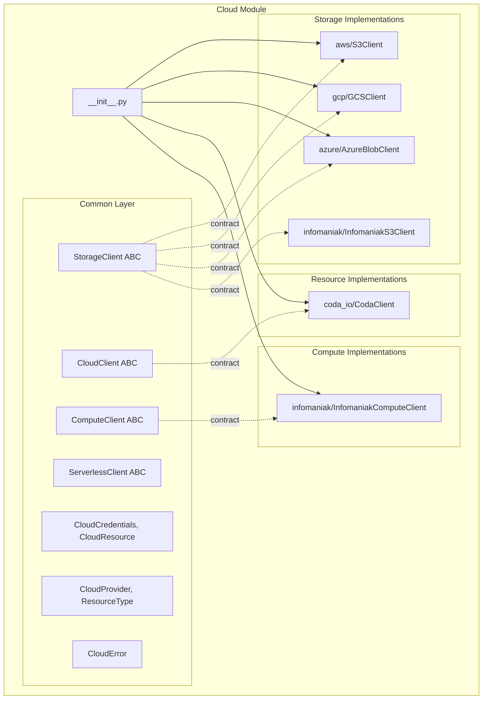

# cloud - Functional Specification

**Version**: v1.1.9 | **Status**: Active | **Last Updated**: March 2026

## Purpose

Cloud services integration module providing standardized Python clients for interacting with cloud-based platforms and APIs. Enables seamless integration with object storage, compute, serverless, and document management services across AWS, GCP, Azure, Coda.io, and Infomaniak (OpenStack + Newsletter).

## Design Principles

### 1. Unified Storage Interface

The `StorageClient` ABC provides a consistent interface for all object storage providers (AWS S3, GCS, Azure Blob, Infomaniak S3):

- `list_buckets()`
- `create_bucket(name, region=None)`
- `delete_bucket(name)`
- `bucket_exists(name)`
- `upload_file(bucket, key, file_path, content_type=None)`
- `download_file(bucket, key, file_path)`
- `list_objects(bucket, prefix=None)`
- `delete_object(bucket, key)`
- `get_object_metadata(bucket, key)`
- `generate_presigned_url(bucket, key, expires_in=3600, operation="get_object")`

### 2. Standardized Resource Management

The `CloudClient` ABC defines operations for general cloud resources (compute, databases, etc.):

- `list_resources(resource_type=None)`
- `get_resource(resource_id)`
- `create_resource(name, resource_type, config)`
- `delete_resource(resource_id)`

### 3. Consistency and Robustness

- Unified error mapping via `CloudError`.
- Type-safe models for credentials and resources.
- Lazy-loaded dependencies for provider submodules.
- Standardized logging and monitoring.

## Architecture

```mermaid
graph TD
    subgraph "Cloud Module"
        Init[__init__.py]
        
        subgraph "Common Layer"
            CloudClient[CloudClient ABC]
            StorageClient[StorageClient ABC]
            ComputeClient[ComputeClient ABC]
            ServerlessClient[ServerlessClient ABC]
            Models[CloudCredentials, CloudResource]
            Enums[CloudProvider, ResourceType]
            Errors[CloudError]
        end
        
        subgraph "Storage Implementations"
            AWS[aws/S3Client]
            GCP[gcp/GCSClient]
            Azure[azure/AzureBlobClient]
            IKS3[infomaniak/InfomaniakS3Client]
        end

        subgraph "Compute Implementations"
            IKComp[infomaniak/InfomaniakComputeClient]
        end

        subgraph "Resource Implementations"
            Coda[coda_io/CodaClient]
        end
    end

    Init --> AWS & GCP & Azure & Coda & IKComp
    StorageClient -.->|contract| AWS & GCP & Azure & IKS3
    CloudClient -.->|contract| Coda
    ComputeClient -.->|contract| IKComp
```

## Functional Requirements

### FR-1: Storage Abstraction

All implementations must provide the full set of `StorageClient` methods. Error mapping should translate provider-specific exceptions into a unified format where possible.

### FR-2: Resource Abstraction

Providers with heterogeneous resources (like Coda.io) should implement `CloudClient` to provide a uniform view of their primary objects (e.g., documents).

### FR-3: Dependency Management

Clients should check for their specific requirements upon initialization or use, raising clear errors if mandatory libraries are missing.

### FR-4: Error Handling

- Status codes from REST APIs should be mapped to `CloudError` or its subclasses.
- Authentication errors should be consistently handled across providers.
- Rate limiting should be managed with backoffs or clear exceptions.

## Technical Constraints

### Dependencies

- AWS: `boto3`
- GCP: `google-cloud-storage`
- Azure: `azure-storage-blob`, `azure-identity`
- Infomaniak: `openstacksdk`, `boto3`
- Coda.io: `requests`

### Python Version

- Python 3.11+
- Full typing with `py.typed` marker

## Navigation Links

- **Human Documentation**: [README.md](README.md)
- **Technical Documentation**: [AGENTS.md](AGENTS.md)
- **API Reference**: [API_SPECIFICATION.md](API_SPECIFICATION.md)
- **Parent**: [codomyrmex](../README.md)
