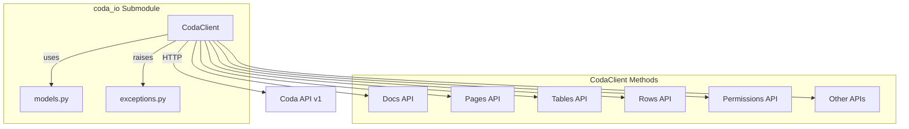

# coda_io - Functional Specification

**Version**: v0.1.7 | **Status**: Active | **Last Updated**: February 2026

## Purpose

Python client for the Coda.io REST API v1, providing type-safe access to all Coda API endpoints including docs, pages, tables, rows, permissions, formulas, controls, automations, and analytics.

## Design Principles

### Type Safety

- All API responses are deserialized into typed dataclass models
- Function signatures include complete type hints
- Editors provide autocomplete for all methods and models

### Pythonic Interface

- Methods follow Python naming conventions (snake_case)
- Optional parameters use keyword arguments with defaults
- Lists return iterable objects with pagination support

### Error Handling

- HTTP status codes mapped to typed exceptions
- Error messages preserved from API responses
- Easy to catch specific error types

### Minimal Dependencies

- Only requires `requests` library
- No heavy frameworks or complex dependencies
- Works with Python 3.10+

## Architecture



## Functional Requirements

### Authentication

- Bearer token authentication via Authorization header
- Token passed at client initialization
- Token stored in requests.Session for all calls

### API Endpoint Coverage

| Category | Endpoints | Status |
|----------|-----------|--------|
| Docs | list, create, get, update, delete | ✅ |
| Pages | list, create, get, update, delete, content, export | ✅ |
| Tables | list, get | ✅ |
| Columns | list, get | ✅ |
| Rows | list, insert/upsert, get, update, delete, push button | ✅ |
| Permissions | metadata, list, add, delete, search, ACL settings | ✅ |
| Publishing | categories, publish, unpublish | ✅ |
| Formulas | list, get | ✅ |
| Controls | list, get | ✅ |
| Automations | trigger webhook | ✅ |
| Analytics | doc, page, pack analytics | ✅ |
| Misc | whoami, resolve link, mutation status | ✅ |

### Data Models

All API resources are represented as dataclasses with:
- `from_dict()` class method for deserialization
- Optional `to_dict()` method for request serialization
- Proper type hints including Optional fields
- Automatic datetime parsing

### Exception Hierarchy

```
CodaAPIError (base)
├── CodaAuthenticationError (401)
├── CodaForbiddenError (403)
├── CodaNotFoundError (404)
├── CodaGoneError (410)
├── CodaValidationError (400)
├── CodaUnprocessableError (422)
└── CodaRateLimitError (429)
```

### Pagination

List endpoints return objects with:
- `items`: List of resources
- `next_page_token`: Token for next page
- `next_page_link`: URL for next page

## Technical Constraints

### Rate Limits

| Operation | Limit |
|-----------|-------|
| Reading | 100 req / 6 sec |
| Writing | 10 req / 6 sec |
| Doc listing | 4 req / 6 sec |

### API Consistency

- Mutations return HTTP 202 (accepted, queued)
- Use `get_mutation_status()` to verify completion
- Data may take seconds to propagate

### ID vs Name

- IDs are stable, names can change
- Methods accept both but IDs are recommended
- Names are URL-encoded when used

## Navigation Links

- **Human Documentation**: [README.md](README.md)
- **Technical Documentation**: [AGENTS.md](AGENTS.md)
- **Parent**: [cloud](../README.md)
