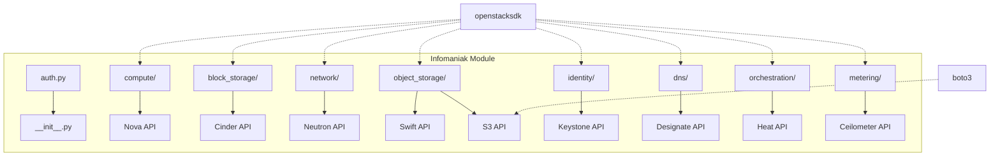

# infomaniak - Functional Specification

**Version**: v0.1.0 | **Status**: Active | **Last Updated**: February 2026

## Purpose

Integration with Infomaniak Public Cloud, an OpenStack-based infrastructure providing compute, storage, networking, and supporting services in Swiss data centers.

## Design Principles

### 1. OpenStack Native

- Uses standard OpenStack APIs (Nova, Cinder, Neutron, Swift, Keystone, Designate, Heat)
- Compatible with upstream OpenStack tooling and Terraform providers
- Application Credentials for secure, scoped authentication

### 2. Dual Object Storage

- Swift API via openstacksdk for native OpenStack operations
- S3-compatible API via boto3 for broad tooling compatibility

### 3. Consistency

- Follows existing cloud module patterns (AWS, GCP, Azure)
- Uniform error handling and logging
- Optional dependency handling with graceful degradation

## Architecture

## Functional Requirements

### FR-1: Compute Operations

- List, create, start, stop, delete instances
- List images, flavors, availability zones
- Key pair management

### FR-2: Block Storage

- Volume CRUD operations
- Attach/detach volumes to instances
- Backup and restore

### FR-3: Networking

- Network and subnet management
- Router operations with external gateway
- Security groups and rules
- Load balancer (Octavia) operations

### FR-4: Object Storage

- Swift container and object management
- S3-compatible bucket and object operations
- ACL management
- Presigned URL generation

### FR-5: Identity

- Application credential management
- EC2 credential management (for S3 access)
- User and project info retrieval

### FR-6: DNS

- Zone management (Designate)
- Record set CRUD
- Reverse DNS (PTR record) management

### FR-7: Orchestration

- Heat stack CRUD
- Template validation
- Stack event and resource listing

### FR-8: Metering

- Usage data retrieval
- Billing summary

### FR-9: Newsletter Operations

- Campaign CRUD (create, read, update, delete)
- Send test emails and live campaigns
- Schedule and unschedule campaigns
- Campaign statistics (opens, clicks, bounces)
- Mailing list management (CRUD)
- Contact import, subscribe/unsubscribe
- Credit balance retrieval
- Async task status checking

## Technical Constraints

### Dependencies

| Package | Purpose | Required |
|---------|---------|----------|
| `openstacksdk` | OpenStack services | Optional |
| `boto3` | S3-compatible storage | Optional |
| `requests` | Newsletter API (core dep) | No |

### Endpoints

| Service | URL |
|---------|-----|
| Identity | `https://api.pub1.infomaniak.cloud/identity/v3/` |
| S3 | `https://s3.pub1.infomaniak.cloud/` |

### Python Version

- Python 3.10+ for modern type hints
- Full typing with `py.typed` marker

## Navigation

- **Human Documentation**: [README.md](README.md)
- **Technical Documentation**: [AGENTS.md](AGENTS.md)
- **Parent**: [cloud/](../README.md)
