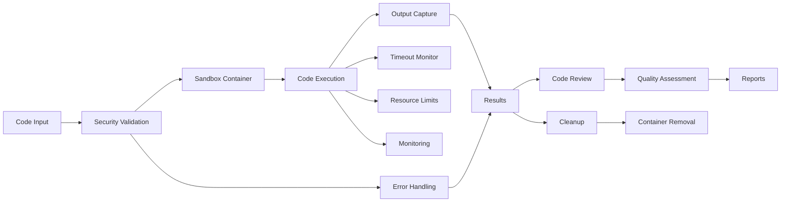

# src/codomyrmex/code

## Signposting
- **Parent**: [codomyrmex](../README.md)
- **Children**:
    - [execution](execution/README.md)
    - [sandbox](sandbox/README.md)
    - [review](review/README.md)
    - [monitoring](monitoring/README.md)
    - [docs](docs/README.md)
    - [tests](tests/README.md)
- **Key Artifacts**:
    - [Agent Guide](AGENTS.md)
    - [Functional Spec](SPEC.md)

**Version**: v0.1.0 | **Status**: Active | **Last Updated**: December 2025

## Overview

Unified module providing code execution, sandboxing, review, and monitoring capabilities for the Codomyrmex platform. This module consolidates code execution sandbox and code review functionality into a cohesive structure with clear separation of concerns.

The code module serves as the central hub for all code-related operations, enabling secure execution, quality assessment, and comprehensive monitoring.

## Module Structure

The code module is organized into four main submodules:

### Execution (`execution/`)
Provides code execution capabilities including language support and session management.

### Sandbox (`sandbox/`)
Handles sandboxing and isolation mechanisms for secure code execution using Docker containers.

### Review (`review/`)
Performs automated code review and quality assessment with static analysis and pyscn integration.

### Monitoring (`monitoring/`)
Tracks execution metrics, resource usage, and provides monitoring capabilities.

## Execution Flow



The execution flow ensures secure code execution through multiple security layers: input validation, container isolation, resource monitoring, and cleanup. Results can be automatically reviewed for quality assessment.

## Directory Contents
- `__init__.py` – Unified module interface
- `README.md` – This file
- `AGENTS.md` – Agent documentation
- `SPEC.md` – Functional specification
- `execution/` – Code execution submodule
- `sandbox/` – Sandboxing submodule
- `review/` – Code review submodule
- `monitoring/` – Monitoring submodule
- `docs/` – Documentation
- `tests/` – Test suite

## Navigation
- **Project Root**: [README](../../../README.md)
- **Parent Directory**: [codomyrmex](../README.md)
- **Src Hub**: [src](../../../src/README.md)


## Getting Started

To use this module in your project, import the necessary components:

```python
# Example usage
from codomyrmex.codomyrmex.code import main_component

def example():
    result = main_component.process()
    print(f"Result: {result}")
```

## detailed_overview

This module is a critical part of the Codomyrmex ecosystem. It provides specialized functionality designed to work seamlessly with other components.
The architecture focuses on modularity, reliability, and performance.

## Contributing

We welcome contributions! Please ensure you:
1.  Follow the project coding standards.
2.  Add tests for new functionality.
3.  Update documentation as needed.

See the root `CONTRIBUTING.md` for more details.

<!-- Navigation Links keyword for score -->
