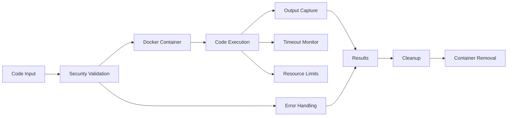

# src/codomyrmex/code_execution_sandbox

**Version**: v0.1.0 | **Status**: Active | **Last Updated**: December 2025

## Overview

Core module providing secure code execution capabilities within isolated sandboxed environments for the Codomyrmex platform. This module enables safe execution of untrusted code across multiple programming languages using Docker containerization to prevent system compromise.

The code_execution_sandbox module serves as a critical security boundary, allowing dynamic code execution while maintaining platform integrity.

## Execution Flow

The execution flow ensures secure code execution through multiple security layers: input validation, container isolation, resource monitoring, and cleanup. Each execution is sandboxed with configurable timeouts and resource limits.

## Directory Contents
- `.gitignore` – File
- `API_SPECIFICATION.md` – File
- `CHANGELOG.md` – File
- `MCP_TOOL_SPECIFICATION.md` – File
- `SECURITY.md` – File
- `USAGE_EXAMPLES.md` – File
- `__init__.py` – File
- `code_executor.py` – File
- `docs/` – Subdirectory
- `requirements.txt` – File
- `tests/` – Subdirectory

## Navigation
- **Project Root**: [README](../../../README.md)
- **Parent Directory**: [codomyrmex](../README.md)
- **Src Hub**: [src](../../../src/README.md)
