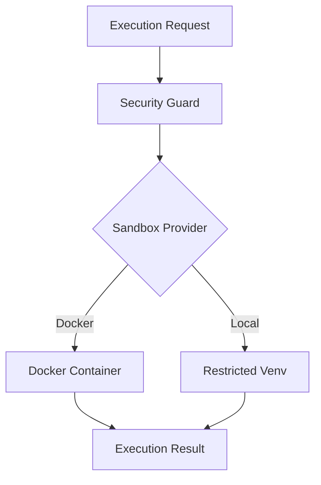

# code_execution_sandbox - Functional Specification

**Version**: v0.1.0 | **Status**: Active | **Last Updated**: January 2026

## Purpose

The `code_execution_sandbox` module provides a secure, isolated environment for executing untrusted or generated code. It is critical for the "Verification" phase of the AI coding loop, allowing the system to test its own code without risking the host environment.

## Design Principles

### Modularity
- **Isolation Providers**: Abstract the sandbox mechanism (Docker, gVisor, or simple `venv` for trusted mode).
- **Execution Interface**: Standard API (`run_code(script)`) regardless of backend.

### Internal Coherence
- **Result Standardization**: All executions return a standard `ExecutionResult` (stdout, stderr, exit_code, duration).

### Parsimony
- **Dependencies**: Should rely on `containerization` module for heavy lifting if using Docker.

### Functionality
- **Timeouts**: derived from `CodeExecutionConfig`.
- **Resource Limits**: prevent fork bombs or memory exhaustion.

## Architecture

## Functional Requirements

### Core Capabilities
1.  **Run Python**: Execute arbitrary python snippets.
2.  **File Access**: Mount specific directories as read-only or read-write.
3.  **Network Control**: Block or allow network access (default block).

### Quality Standards
- **Security**: "Secure by Design". Default to least privilege.
- **Cleanup**: Ephemeral containers/envs must be destroyed after use.

## Interface Contracts

### Public API
- `execute_code(code: str, language: str = "python") -> ExecutionResult`
- `execute_file(path: Path) -> ExecutionResult`

### Dependencies
- **Modules**: `containerization`, `logging_monitoring`.
- **System**: Docker (optional but recommended).

## Implementation Guidelines

### Usage Patterns
- Always check `SecureToAutoRun` before executing real code unless in a totally isolated sandbox.

## Navigation

- **Human Documentation**: [README.md](README.md)
- **Technical Documentation**: [AGENTS.md](AGENTS.md)
- **Package SPEC**: [../SPEC.md](../SPEC.md)
