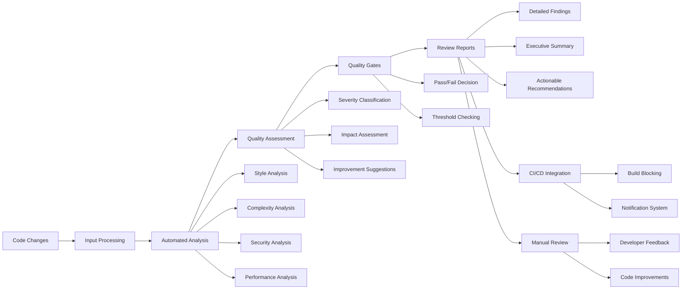

# src/codomyrmex/code_review

**Version**: v0.1.0 | **Status**: Active | **Last Updated**: December 2025

## Overview

Core module providing automated code review and quality assessment capabilities for the Codomyrmex platform. This module performs intelligent analysis of code changes, provides actionable feedback, and supports both automated and human-in-the-loop code review workflows.

The code_review module serves as the quality assurance backbone, enabling consistent and intelligent code review processes throughout the platform.

## Code Review Process

The code review process provides comprehensive automated analysis with quality gates, detailed reporting, and integration with development workflows for continuous code quality improvement.

## Directory Contents
- `API_SPECIFICATION.md` – File
- `CHANGELOG.md` – File
- `MCP_TOOL_SPECIFICATION.md` – File
- `SECURITY.md` – File
- `USAGE_EXAMPLES.md` – File
- `__init__.py` – File
- `code_review.py` – File
- `demo_review.py` – File
- `docs/` – Subdirectory
- `requirements.txt` – File
- `test_simple.py` – File
- `tests/` – Subdirectory

## Navigation
- **Project Root**: [README](../../../README.md)
- **Parent Directory**: [codomyrmex](../README.md)
- **Src Hub**: [src](../../../src/README.md)
