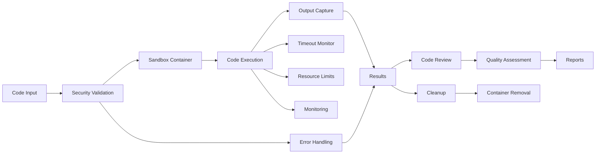

# src/codomyrmex/coding

## Signposting
- **Parent**: [codomyrmex](../README.md)
- **Children**:
    - [execution](execution/README.md)
    - [sandbox](sandbox/README.md)
    - [review](review/README.md)
    - [monitoring](monitoring/README.md)
    - [docs](../../../docs/README.md)
    - [tests](tests/README.md)
- **Key Artifacts**:
    - [Agent Guide](AGENTS.md)
    - [Functional Spec](SPEC.md)

**Version**: v0.1.0 | **Status**: Active | **Last Updated**: December 2025

## Overview

Unified module providing code execution, sandboxing, review, and monitoring capabilities for the Codomyrmex platform. This module consolidates code execution sandbox and code review functionality into a cohesive structure with clear separation of concerns.

The code module serves as the central hub for all code-related operations, enabling secure execution, quality assessment, and comprehensive monitoring.

## Module Structure

The code module is organized into four main submodules:

### Execution (`execution/`)
Provides code execution capabilities including language support and session management.

### Sandbox (`sandbox/`)
Handles sandboxing and isolation mechanisms for secure code execution using Docker containers.

### Review (`review/`)
Performs automated code review and quality assessment with static analysis and pyscn integration.

### Monitoring (`monitoring/`)
Tracks execution metrics, resource usage, and provides monitoring capabilities.

## Execution Flow



The execution flow ensures secure code execution through multiple security layers: input validation, container isolation, resource monitoring, and cleanup. Results can be automatically reviewed for quality assessment.

## Directory Contents
- `__init__.py` – Unified module interface
- `README.md` – This file
- `AGENTS.md` – Agent documentation
- `SPEC.md` – Functional specification
- `execution/` – Code execution submodule
- `sandbox/` – Sandboxing submodule
- `review/` – Code review submodule
- `monitoring/` – Monitoring submodule
- `docs/` – Documentation
- `tests/` – Test suite

## Navigation
- **Technical Documentation**: [AGENTS.md](AGENTS.md)
- **Functional Specification**: [SPEC.md](SPEC.md)
- **Project Root**: [README](../../../README.md)
- **Parent Directory**: [codomyrmex](../README.md)
- **Src Hub**: [src](../../../src/README.md)

## Getting Started

### Code Execution

```python
from codomyrmex.coding.execution import execute_code

# Execute Python code
result = execute_code(
    language="python",
    code="print('Hello, World!')",
    timeout=30
)

if result.success:
    print(result.stdout)
else:
    print(f"Error: {result.stderr}")
```

### Sandboxed Execution

```python
from codomyrmex.coding.sandbox import SandboxExecutor

executor = SandboxExecutor()
result = executor.execute(
    code="import os; print(os.getcwd())",
    language="python",
    timeout=10
)
```

### Code Review

```python
from codomyrmex.coding.review import CodeReviewer

reviewer = CodeReviewer()
results = reviewer.analyze_file("path/to/file.py")

for issue in results.issues:
    print(f"{issue.severity}: {issue.message} at line {issue.line}")
```

## Submodule Documentation

- **[Execution](execution/README.md)** - Code execution capabilities
- **[Sandbox](sandbox/README.md)** - Secure sandboxing
- **[Review](review/README.md)** - Code review and analysis
- **[Monitoring](monitoring/README.md)** - Execution monitoring

## Related Documentation

- **[Agent Guide](AGENTS.md)** - Technical documentation
- **[Functional Spec](SPEC.md)** - Module specification
