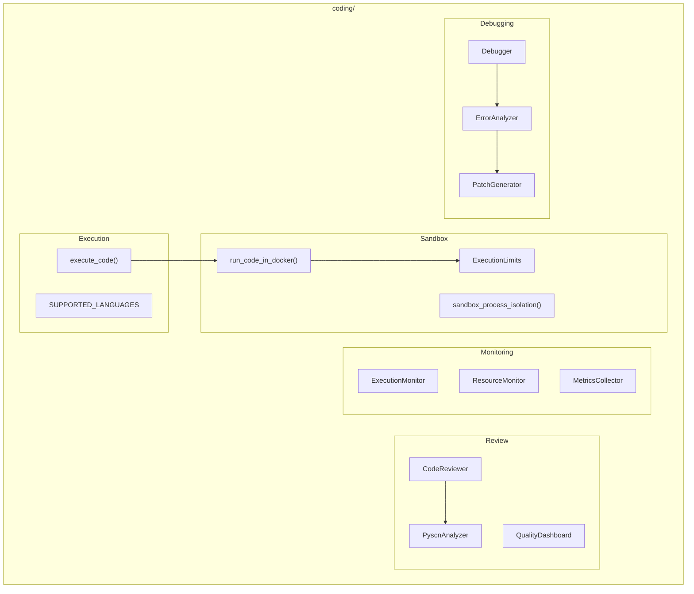

# Coding Module

**Version**: v0.1.0 | **Status**: Active | **Last Updated**: January 2026

## Overview

The Coding module provides a comprehensive toolkit for code execution, sandboxing, review, monitoring, and debugging. It enables running, analyzing, and fixing code programmatically with multi-language support.

## Architecture



## Key Classes

### Execution

| Class | Purpose |
|-------|---------|
| `execute_code()` | Execute code in sandboxed environment |
| `SUPPORTED_LANGUAGES` | List of supported languages |

### Sandbox

| Class | Purpose |
|-------|---------|
| `ExecutionLimits` | Resource limits configuration |
| `run_code_in_docker()` | Docker-based execution |
| `sandbox_process_isolation()` | Process isolation |

### Review

| Class | Purpose |
|-------|---------|
| `CodeReviewer` | Code quality review |
| `PyscnAnalyzer` | Pyscn analysis |
| `QualityDashboard` | Quality metrics dashboard |
| `CodeMetrics` | Code metrics |

### Debugging

| Class | Purpose |
|-------|---------|
| `Debugger` | Automated debugging |
| `ErrorAnalyzer` | Error analysis |
| `ErrorDiagnosis` | Diagnosis result |
| `PatchGenerator` | Generate fixes |
| `Patch` | Code patch |
| `FixVerifier` | Verify fixes |

## Quick Start

### Execute Code

```python
from codomyrmex.coding import execute_code, SUPPORTED_LANGUAGES

print(f"Supported: {SUPPORTED_LANGUAGES}")

result = execute_code("python", """
def fibonacci(n):
    if n <= 1:
        return n
    return fibonacci(n-1) + fibonacci(n-2)

print(fibonacci(10))
""")

print(f"Output: {result.stdout}")
print(f"Exit code: {result.exit_code}")
```

### Sandboxed Execution

```python
from codomyrmex.coding import (
    run_code_in_docker,
    ExecutionLimits,
    execute_with_limits
)

limits = ExecutionLimits(
    max_time_seconds=10,
    max_memory_mb=256,
    max_output_bytes=10000
)

result = execute_with_limits(
    language="python",
    code="print('Hello!')",
    limits=limits
)
```

### Code Review

```python
from codomyrmex.coding import (
    CodeReviewer,
    analyze_file,
    analyze_project,
    check_quality_gates
)

reviewer = CodeReviewer("./src")
issues = reviewer.analyze_file("module.py")

# Project-wide analysis
summary = analyze_project("./src")
print(f"Issues: {summary.total_issues}")

# Quality gates
passed = check_quality_gates(summary, max_critical=0, max_warnings=10)
```

### Automated Debugging

```python
from codomyrmex.coding import Debugger, ErrorAnalyzer

debugger = Debugger()

# Analyze and fix failures
diagnosis = debugger.debug(
    code=buggy_code,
    stdout=result.stdout,
    stderr=result.stderr,
    exit_code=result.exit_code
)

if diagnosis.has_fix:
    print(f"Fix: {diagnosis.patch.diff}")
```

### Execution Monitoring

```python
from codomyrmex.coding import ExecutionMonitor, ResourceMonitor

monitor = ExecutionMonitor()

with monitor.track("my_execution"):
    result = execute_code("python", code)

print(f"Duration: {monitor.duration}s")
print(f"Memory peak: {monitor.memory_peak_mb}MB")
```

## Supported Languages

Python, JavaScript, TypeScript, Go, Rust, C, C++, Java, Ruby, and more.

## Integration Points

- **static_analysis**: Additional code analysis
- **ide**: IDE integration
- **agents**: Agent code execution

## Navigation

- **Parent**: [../README.md](../README.md)
- **Siblings**: [static_analysis](../static_analysis/), [ide](../ide/)
- **Spec**: [SPEC.md](SPEC.md)
