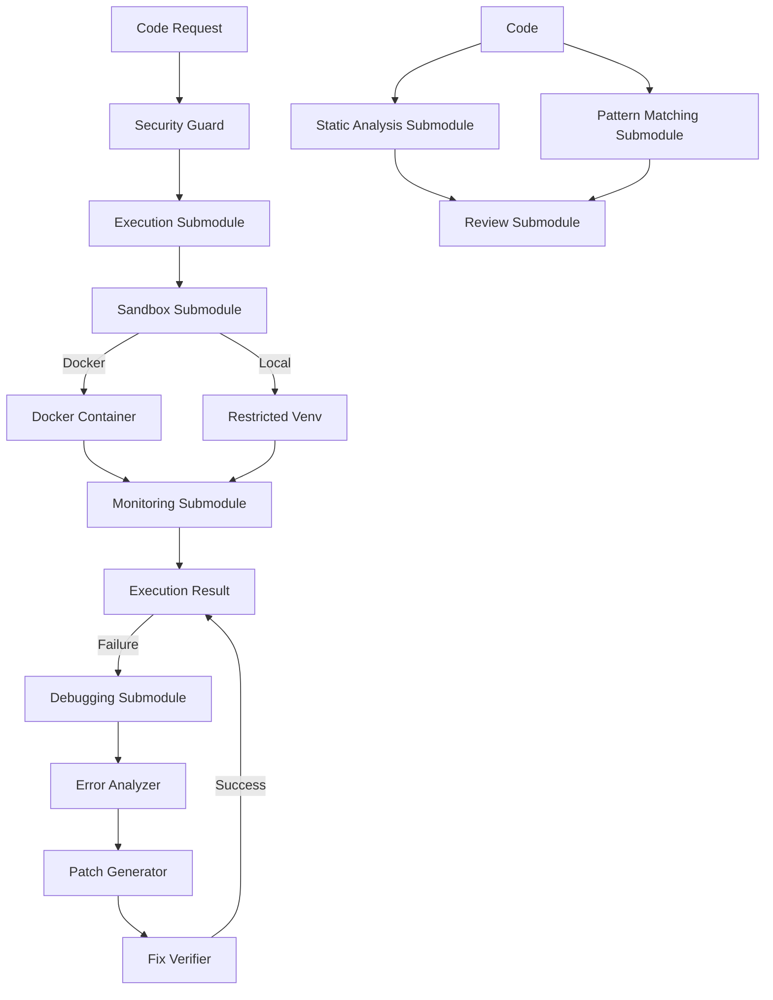

# Coding — Functional Specification

**Version**: v0.1.0 | **Status**: Active | **Last Updated**: February 2026

## Purpose

The `coding` module provides a unified interface for code execution, sandboxing, review, monitoring, static analysis, pattern matching, and debugging. It consolidates secure code execution and automated code analysis capabilities into a cohesive structure.

This module is critical for the "Verification" phase of the AI coding loop, allowing the system to test its own code without risking the host environment, and for continuous quality assessment through automated code review.

## Design Principles

### Modularity

- **Submodule Separation**: Clear separation between execution, sandboxing, review, and monitoring concerns
- **Isolation Providers**: Abstract the sandbox mechanism (Docker, gVisor, or simple `venv` for trusted mode)
- **Execution Interface**: Standard API (`execute_code()`) regardless of backend
- **Analyzer Interface**: Unified API for `static_analysis` and `pattern_matching` backends
- **Review Interface**: Integrated review API that leverages various analysis sub-modules

### Internal Coherence

- **Result Standardization**: All executions return a standard `ExecutionResult` (stdout, stderr, exit_code, duration, status)
- **Review Standardization**: All reviews return standardized `AnalysisResult` objects
- **Consistent Error Handling**: Unified error types and handling across submodules

### Parsimony

- **Dependencies**: Should rely on `containerization` module for heavy lifting if using Docker
- **Shared Infrastructure**: Common logging and monitoring infrastructure

### Functionality

- **Timeouts**: Derived from configuration with sensible defaults
- **Resource Limits**: Prevent fork bombs or memory exhaustion
- **Quality Gates**: Configurable thresholds for code quality enforcement
- **Comprehensive Analysis**: Multiple analysis types (quality, security, performance, etc.)

## Architecture



## Functional Requirements

### Execution & Sandboxing

1. **Run Multiple Languages**: Execute code in Python, JavaScript, Java, C/C++, Go, Rust, Bash
2. **File Access**: Mount specific directories as read-only or read-write
3. **Network Control**: Block or allow network access (default block)
4. **Resource Limits**: Enforce CPU, memory, and time constraints
5. **Session Management**: Support persistent execution environments

### Static Analysis (Consolidated)

1. **Linting**: Automated code style and error checking
2. **Complexity Analysis**: Measuring cyclomatic complexity and maintainability
3. **Security Scanning**: Searching for common security patterns and vulnerabilities
4. **Metrics**: Logical lines of code, comment density, etc.

### Pattern Matching (Consolidated)

1. **Structural Search**: Find code patterns based on AST nodes
2. **Clones Detection**: Identify duplicated or near-duplicate code blocks
3. **Refactoring detection**: Identify common refactoring patterns across versions
4. **AST-based transformations**: Perform safe code modifications based on patterns

### Monitoring

1. **Resource Tracking**: Monitor CPU, memory, execution time
2. **Execution Monitoring**: Track execution status and completion
3. **Metrics Collection**: Aggregate metrics for analysis

### Autonomous Debugging

1. **Error Analysis**: Parse execution outputs to identify error types and locations
2. **Patch Generation**: Generate potential fixes for identified errors
3. **Fix Verification**: Verify patches in a sandboxed environment
4. **Closed Loop**: Orchestrate the cycle of execution -> failure -> diagnosis -> patch -> verify

### Quality Standards

- **Security**: "Secure by Design". Default to least privilege
- **Cleanup**: Ephemeral containers/envs must be destroyed after use
- **Actionable Feedback**: Review feedback must identify location (line number) and suggestion

## Interface Contracts

### Public API

**Execution:**

- `execute_code(language: str, code: str, stdin: Optional[str] = None, timeout: Optional[int] = None, session_id: Optional[str] = None) -> dict[str, Any]`

**Review:**

- `analyze_file(file_path: str, analysis_types: list[str] = None) -> list[AnalysisResult]`
- `analyze_project(project_root: str, target_paths: list[str] = None, analysis_types: list[str] = None) -> AnalysisSummary`
- `check_quality_gates(project_root: str, thresholds: dict[str, int] = None) -> QualityGateResult`
- `generate_report(project_root: str, output_path: str, format: str = "html") -> bool`

**Monitoring:**

- `ResourceMonitor` - Track resource usage
- `ExecutionMonitor` - Monitor execution status
- `MetricsCollector` - Collect and aggregate metrics

**Static Analysis:**

- `StaticAnalyzer` - Perform advanced linting and complexity checks
- `SecurityScanner` - Scan for vulnerabilities
- `MetricCollector` - Gather code statistics

**Pattern Matching:**

- `PatternMatcher` - Search for structural code patterns
- `CloneDetector` - Find duplicate code
- `ASTTransformer` - Pattern-based refactorings

**Debugging:**

- `Debugger` - Main orchestration for the debug loop
- `ErrorAnalyzer` - Parse and diagnose errors
- `PatchGenerator` - Generate code patches
- `FixVerifier` - Verify patches in sandbox

### Dependencies

- **Modules**: `containerization`, `logging_monitoring`
- **System**: Docker (optional but recommended for sandboxing)
- **Tools**: pyscn (for advanced code analysis)

## Implementation Guidelines

### Usage Patterns

- Always check Docker availability before executing code
- Use resource limits for all executions
- Validate inputs before processing
- Always clean up temporary files and containers
- Use monitoring to track execution metrics

## Navigation

- **Human Documentation**: [README.md](README.md)
- **Technical Documentation**: [AGENTS.md](AGENTS.md)
- **Package SPEC**: [../SPEC.md](../SPEC.md)

<!-- Navigation Links keyword for score -->
```markdown
```
