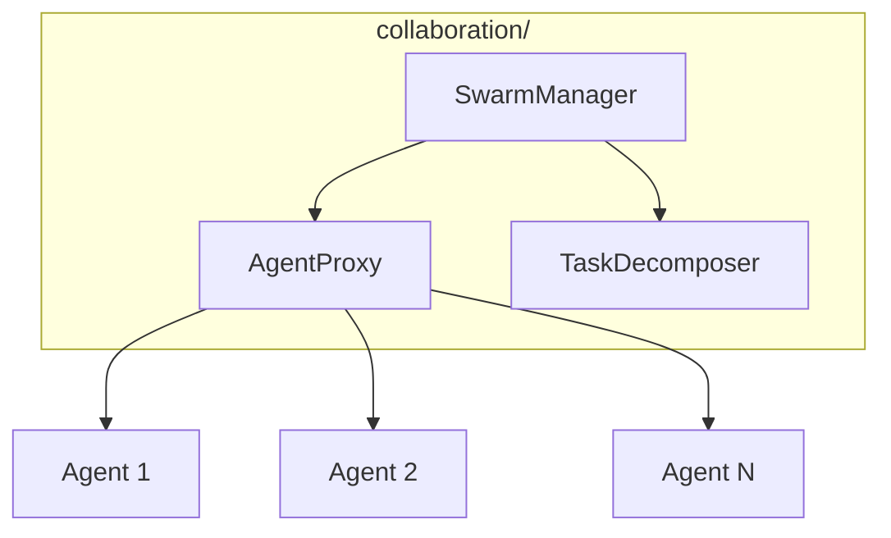

# Collaboration Module

**Version**: v0.1.0 | **Status**: Active | **Last Updated**: January 2026

## Overview

The Collaboration module provides multi-agent collaboration capabilities for the Codomyrmex platform, enabling swarm intelligence, agent coordination, and task decomposition.

## Architecture



## Key Classes

| Class | Purpose |
|-------|---------|
| `SwarmManager` | Coordinate agent swarms |
| `AgentProxy` | Proxy for remote agents |
| `TaskDecomposer` | Decompose complex tasks |

## Quick Start

### Swarm Management

```python
from codomyrmex.collaboration import SwarmManager

swarm = SwarmManager()

# Add agents to swarm
swarm.add_agent("coder", capabilities=["code", "review"])
swarm.add_agent("tester", capabilities=["test", "validate"])
swarm.add_agent("researcher", capabilities=["search", "summarize"])

# Execute task with swarm
result = swarm.execute(
    task="Build a REST API",
    strategy="parallel"
)
```

### Agent Proxy

```python
from codomyrmex.collaboration import AgentProxy

# Create proxy to remote agent
agent = AgentProxy(
    agent_id="claude-coder",
    endpoint="http://localhost:8000"
)

# Send task to agent
response = agent.execute(
    task="Implement authentication"
)

print(response.result)
```

### Task Decomposition

```python
from codomyrmex.collaboration import TaskDecomposer

decomposer = TaskDecomposer()

# Decompose complex task
subtasks = decomposer.decompose(
    "Build a web application with user authentication"
)

for subtask in subtasks:
    print(f"- {subtask.name}: {subtask.description}")
    print(f"  Dependencies: {subtask.dependencies}")
    print(f"  Estimated: {subtask.estimated_time}")
```

### Collaborative Workflow

```python
from codomyrmex.collaboration import SwarmManager, TaskDecomposer

swarm = SwarmManager()
decomposer = TaskDecomposer()

# Decompose task
subtasks = decomposer.decompose("Create data pipeline")

# Assign to agents
for subtask in subtasks:
    best_agent = swarm.find_agent(
        capabilities=subtask.required_capabilities
    )
    swarm.assign(subtask, best_agent)

# Run all in parallel
results = swarm.run_all()
```

## Integration Points

- **agents**: Agent infrastructure
- **orchestrator**: Workflow coordination
- **events**: Agent communication

## Navigation

- **Parent**: [../README.md](../README.md)
- **Siblings**: [agents](../agents/), [orchestrator](../orchestrator/)
- **Spec**: [SPEC.md](SPEC.md)
