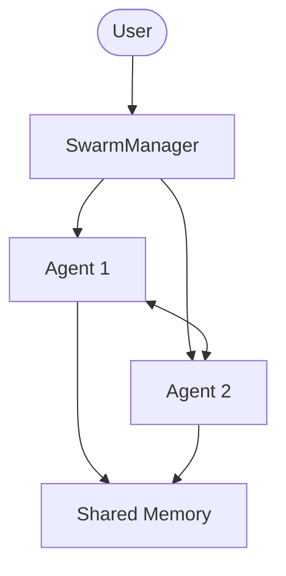

# collaboration - Functional Specification

## Purpose

To multiply the effectiveness of individual Codomyrmex agents by enabling them to collaborate, specialize, and reach consensus on complex tasks.

## Design Principles

- **Decentralization**: Avoid single points of failure in agent coordination.
- **Interoperability**: Agents should be able to collaborate regardless of their underlying model or architecture.
- **Transparency**: Every step of the collaboration should be traceable.
- **Feedback Loops**: Constant evaluation and adjustment based on agent feedback.

## Architecture



## Functional Requirements

- Broadcast messages to an entire swarm or specific groups.
- Elect a 'Leader' or 'Orchestrator' agent for a specific mission.
- Implement 'Peer Review' patterns where one agent verifies another's output.
- Provide a 'Wall' or 'Log' of the collaborative process.

## Interface Contracts

### `TaskDecomposer`

- `decompose(mission: str) -> List[str]`

### `SwarmManager`

- `add_agents(agents: List[AgentProxy])`
- `consensus_vote(proposal: Any) -> Any`
- `execute(mission: str)`

## Technical Constraints

- Large swarms may face coordination overhead and messaging latency.
- Requires robust serialization for transferring state between agents.

## Testing

```bash
uv run python -m pytest src/codomyrmex/tests/ -k collaboration -v
```
