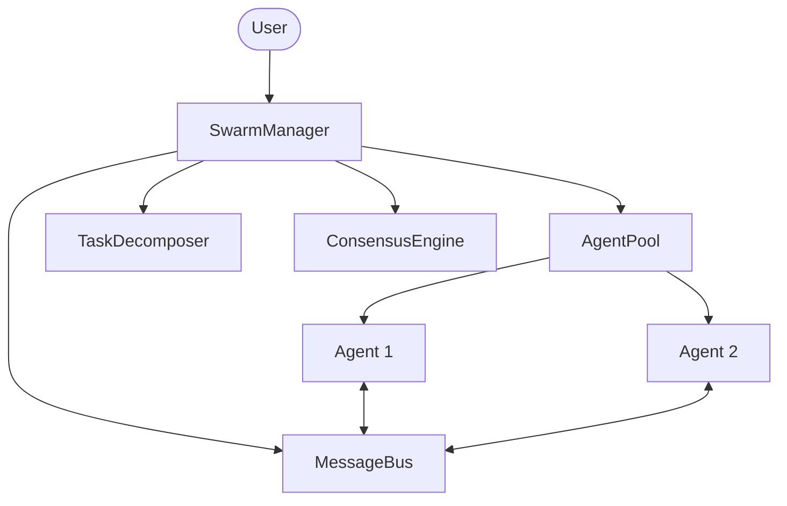

# collaboration - Functional Specification

**Version**: v1.1.0 | **Status**: Active | **Last Updated**: March 2026

## Purpose

To multiply the effectiveness of individual Codomyrmex agents by enabling them to collaborate, specialize, and reach consensus on complex tasks.

## Design Principles

- **Consolidation**: Unified swarm management through a robust `SwarmManager`.
- **Asynchronous Orchestration**: Non-blocking task distribution and result aggregation using `asyncio`.
- **Interoperability**: Modern and legacy interfaces supported for cross-module compatibility.
- **Transparency**: Every step of the collaboration is traceable through the `MessageBus`.

## Architecture


```mermaid
graph TD
    User([User]) --> SM[SwarmManager]
    SM --> Pool[AgentPool]
    SM --> Bus[MessageBus]
    SM --> Decomp[TaskDecomposer]
    SM --> Cons[ConsensusEngine]
    
    Pool --> A1[Agent 1]
    Pool --> A2[Agent 2]
    
    A1 <--> Bus
    A2 <--> Bus
```

## Functional Requirements

- **Task Decomposition**: Split high-level missions into role-based sub-tasks with dependency tracking.
- **Role-based Routing**: Assign tasks based on ARCHITECT, CODER, TESTER, etc.
- **Load Balancing**: Distribute work to least-busy agents in the pool.
- **Pub/Sub Messaging**: Topic-routed in-process communication with wildcards (`*`, `#`).
- **Multi-strategy Consensus**: Support majority, weighted, and veto voting.
- **Async Result Waiting**: `SwarmManager` waits for task completion with configurable timeouts.

## Interface Contracts

### Swarm Management (`collaboration.swarm`)

```python
class SwarmManager:
    def register_agent(agent: SwarmAgent) -> None
    async def execute_task(description: str, role: AgentRole, timeout: float) -> dict[str, Any]
    async def execute_mission(mission: str) -> list[dict[str, Any]]
    async def request_consensus(proposal: str, votes: list[Vote], strategy: str) -> ConsensusResult
```

### Communication (`collaboration.swarm.message_bus`)

```python
class MessageBus:
    def subscribe(subscriber_id: str, topic: str, handler: MessageHandler) -> None
    async def publish(topic: str, message: SwarmMessage) -> int
    def unsubscribe(subscriber_id: str, topic: str | None) -> int
```

## Technical Constraints

- Swarm size limited by in-process messaging overhead and event loop capacity.
- Results must be published back to `results.agent.{agent_id}` for the `SwarmManager` to aggregate them.

## Testing

```bash
uv run pytest src/codomyrmex/tests/unit/collaboration/
```
