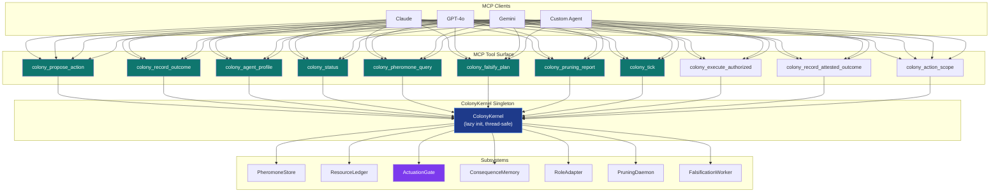

# Colony Kernel — MCP Tool Specification

**Version**: v1.4.0 | **Status**: Active | **Last Updated**: July 2026

All tools route through a module-level `ColonyKernel` singleton (`_kernel` in
`mcp_tools.py`). Advisory mode preserves caller-reported audit behavior. A
strictly configured singleton additionally exposes a governed action scope,
single-use signed authorizations, receipt-linked execution, and quarantine for
unattested outcome reports. The singleton is lazily initialised on first call.



**Category**: `colony_kernel` (all tools)

---

## colony_propose_action

**Description**: Submit an action proposal to the Colony advisory gate. Runs adversarial falsification, budget check, and trust evaluation before returning a gate verdict. On REFUSE, deposits a POLICY_REJECTION audit signal at the target location; it does not claim an observed execution failure.

### Input Schema

```json
{
  "type": "object",
  "required": ["agent_id", "action_type", "target", "rationale", "rollback_plan"],
  "properties": {
    "agent_id": {
      "type": "string",
      "description": "Unique identifier of the proposing agent (e.g. 'engineer-1')."
    },
    "action_type": {
      "type": "string",
      "description": "Type of action being proposed. Examples: 'patch_file', 'archive_module', 'run_tests', 'exec_code', 'merge_pr'."
    },
    "target": {
      "type": "string",
      "description": "Dotted module path or file path the action will affect (e.g. 'codomyrmex.git_operations.core')."
    },
    "rationale": {
      "type": "string",
      "description": "Explanation of why this action is necessary. Must be at least 20 characters to avoid a LOW falsification finding."
    },
    "rollback_plan": {
      "type": "string",
      "description": "Concrete description of how to undo the action. Required (non-empty) for destructive action types to avoid a HIGH falsification finding."
    },
    "evidence": {
      "type": "string",
      "default": "{}",
      "description": "JSON-serialised dict of supporting evidence (test IDs, PR URLs, error logs). Defaults to '{}'."
    }
  }
}
```

### Output Schema

```json
{
  "type": "object",
  "properties": {
    "decision": {
      "type": "string",
      "enum": ["execute", "hold", "refuse"],
      "description": "Gate verdict."
    },
    "gate_score": {
      "type": "number",
      "description": "Composite gate score in [0.0, 1.0]. Higher is better."
    },
    "reason": {
      "type": "string",
      "description": "Human-readable explanation of the decision."
    },
    "required_evidence": {
      "type": "array",
      "items": {"type": "string"},
      "description": "Actions the agent should take before re-submitting (present on HOLD)."
    },
    "budget_approved": {
      "type": "boolean",
      "description": "Whether the ResourceLedger cleared the budget estimate."
    },
    "falsification_severity": {
      "type": "number",
      "description": "Maximum falsification penalty weight in [0.0, 1.0]. 0.0 = no findings."
    },
    "error": {
      "type": "string",
      "description": "Present only if an exception occurred; all other fields absent."
    }
  }
}
```

### Example Invocation

```json
{
  "agent_id": "repair-agent-42",
  "action_type": "patch_file",
  "target": "codomyrmex.git_operations.core",
  "rationale": "Fix off-by-one error in branch name parser identified in test_branch_names.py test suite",
  "rollback_plan": "git revert HEAD~1 and re-run pytest to confirm regression is cleared",
  "evidence": "{\"test_ids\": [\"test_branch_names.py::test_slash_in_name\"], \"error\": \"IndexError at line 47\"}"
}
```

```json
{
  "decision": "refuse",
  "gate_score": 0.0,
  "reason": "SANDBOX role: no write-path gate passes",
  "required_evidence": [
    "earn_higher_role_via_trust_growth",
    "accumulate_accepted_proposals"
  ],
  "budget_approved": true,
  "falsification_severity": 0.45
}
```

---

## colony_record_outcome

**Description**: Record a caller-reported, unattested consequence of an action.
Advisory mode updates the trust profile and signal field with the explicit
`caller_reported_unattested` grade. Strict mode quarantines the report and
returns an error; it cannot update trust, budget, or FAILURE evidence. Use
`colony_record_attested_outcome` after `colony_execute_authorized` for enforced
actions.

### Input Schema

```json
{
  "type": "object",
  "required": ["agent_id", "action_type", "target", "actual_outcome", "tests_passed"],
  "properties": {
    "agent_id": {
      "type": "string",
      "description": "Agent identifier associated with the submitted report."
    },
    "action_type": {
      "type": "string",
      "description": "Action type claimed by the report; linkage to an original proposal is not attested."
    },
    "target": {
      "type": "string",
      "description": "Target claimed by the submitted report."
    },
    "actual_outcome": {
      "type": "string",
      "description": "Human-readable caller description of what happened."
    },
    "tests_passed": {
      "type": "boolean",
      "description": "Caller-supplied post-action test status."
    },
    "human_feedback": {
      "type": "number",
      "default": 0.0,
      "minimum": -1.0,
      "maximum": 1.0,
      "description": "Operator feedback in [-1.0, 1.0]. 0.0 = no feedback, +1.0 = approved, -1.0 = rejected."
    }
  }
}
```

### Output Schema

```json
{
  "type": "object",
  "properties": {
    "status": {
      "type": "string",
      "enum": ["recorded"],
      "description": "Always 'recorded' on success."
    },
    "consequence_id": {
      "type": "string",
      "description": "UUID of the newly created ConsequenceRecord."
    },
    "trust_score": {
      "type": "number",
      "description": "Agent's updated trust_score after applying the delta."
    },
    "role": {
      "type": "string",
      "enum": ["sandbox", "repair_ant", "memory_ant", "dispatcher", "guard_ant"],
      "description": "Agent's current role (may have changed after trust update)."
    },
    "error": {
      "type": "string",
      "description": "Present only if an exception occurred."
    }
  }
}
```

### Example Invocation

```json
{
  "agent_id": "repair-agent-42",
  "action_type": "patch_file",
  "target": "codomyrmex.git_operations.core",
  "actual_outcome": "Patch applied; all 42 git_operations tests pass; no regressions detected",
  "tests_passed": true,
  "human_feedback": 1.0
}
```

```json
{
  "status": "recorded",
  "consequence_id": "c3d4e5f6-7890-abcd-ef01-234567890abc",
  "trust_score": 0.173,
  "role": "sandbox"
}
```

---

## colony_execute_authorized

**Description**: Strict-profile execution adapter. It consumes a signed,
scope-bound `ExecutionAuthorization` atomically, invokes a service-registered
real handler, and returns the handler result plus one signed
`ExecutionReceipt`. It rejects missing, expired, altered, replayed,
cross-agent, cross-target, cross-action, HOLD, REFUSE, and unknown tokens.

### Input Schema

```json
{
  "type": "object",
  "required": ["authorization_json", "agent_id", "action_type", "target"],
  "properties": {
    "authorization_json": {"type": "string", "description": "Serialized signed capability."},
    "agent_id": {"type": "string"},
    "action_type": {"type": "string", "description": "Must match the capability and registered scope."},
    "target": {"type": "string"},
    "payload": {"type": "string", "default": "{}", "description": "JSON object passed to the registered handler; when the proposal contains evidence.action_payload, it must be identical to that signed payload."}
  }
}
```

The receipt is not an outcome oracle. It attests that a trusted executor
consumed the capability and records the handler's exit status and result digest.

## colony_record_attested_outcome

**Description**: Convert one consumed authorization and one executor-signed
receipt into an `attested_execution` consequence. The proposal ID, agent, action,
and target are reconstructed from the capability and must match the submitted
fields. Duplicate reports are idempotent and cannot create a second lifecycle.

## colony_action_scope

**Description**: Return the configured enforcement mode, explicit action-scope
map, and bypass behavior. In strict mode unregistered mutating paths are
refused and cannot receive a capability. In advisory mode the map is descriptive
only and callers must not infer an enforcement boundary.

## colony_agent_profile

**Description**: Return the current trust profile for an agent. If the agent is unknown, a SANDBOX profile with `trust_score=0.1` is created on demand.

### Input Schema

```json
{
  "type": "object",
  "required": ["agent_id"],
  "properties": {
    "agent_id": {
      "type": "string",
      "description": "Unique identifier of the agent to look up."
    }
  }
}
```

### Output Schema

```json
{
  "type": "object",
  "properties": {
    "agent_id": {"type": "string"},
    "role": {
      "type": "string",
      "enum": ["sandbox", "repair_ant", "memory_ant", "dispatcher", "guard_ant"]
    },
    "trust_score": {
      "type": "number",
      "description": "Current trust score in [0.0, 1.0]."
    },
    "total_proposals": {
      "type": "integer",
      "description": "Total proposals submitted (accepted + rejected + held)."
    },
    "accepted_proposals": {
      "type": "integer",
      "description": "Proposals that passed all checks (tests_passed=True, repair_needed=False)."
    },
    "consequence_history": {
      "type": "array",
      "items": {"type": "string"},
      "description": "Consequence UUIDs in chronological order (most recent last); max 200 entries."
    },
    "last_updated": {
      "type": "number",
      "description": "Unix timestamp of last trust score update."
    },
    "error": {"type": "string"}
  }
}
```

### Example Invocation

```json
{"agent_id": "repair-agent-42"}
```

```json
{
  "agent_id": "repair-agent-42",
  "role": "sandbox",
  "trust_score": 0.173,
  "total_proposals": 3,
  "accepted_proposals": 1,
  "consequence_history": ["c3d4e5f6-..."],
  "last_updated": 1751234567.0
}
```

---

## colony_status

**Description**: Return a dashboard snapshot of the colony's current state including pheromone summary, budget usage, role distribution, recent consequences, and pruning candidate count.

### Input Schema

```json
{
  "type": "object",
  "properties": {},
  "description": "No inputs required."
}
```

### Output Schema

```json
{
  "type": "object",
  "properties": {
    "pheromone_summary": {
      "type": "object",
      "description": "Snapshot of the pheromone field.",
      "properties": {
        "total_signals": {"type": "integer", "description": "Total live traces in the field."},
        "top_signals": {
          "type": "array",
          "description": "Top-10 signals by strength.",
          "items": {
            "type": "object",
            "properties": {
              "key": {"type": "string", "description": "Compound key '{location}:{signal_type}'."},
              "location": {"type": "string"},
              "signal_type": {"type": "string"},
              "strength": {"type": "number"},
              "updated_at": {"type": "number", "description": "Unix timestamp."}
            }
          }
        }
      }
    },
    "budget_usage": {
      "type": "object",
      "description": "Current period resource consumption vs budget ceiling per dimension."
    },
    "role_distribution": {
      "type": "object",
      "description": "Map of role name to agent count (e.g. {'sandbox': 3, 'repair_ant': 1})."
    },
    "recent_consequences": {
      "type": "array",
      "description": "Last 10 consequence records (most recent first).",
      "items": {"type": "object"}
    },
    "pruning_candidates_count": {
      "type": "integer",
      "description": "Number of stale modules flagged by the pruning daemon (0 unless scan() was called externally)."
    },
    "error": {"type": "string"}
  }
}
```

### Example Invocation

```json
{}
```

```json
{
  "pheromone_summary": {
    "total_signals": 2,
    "top_signals": [
      {"key": "codomyrmex.git_operations.core:success", "location": "codomyrmex.git_operations.core", "signal_type": "success", "strength": 3.8, "updated_at": 1751234500.0},
      {"key": "codomyrmex.crypto.hmac:failure", "location": "codomyrmex.crypto.hmac", "signal_type": "failure", "strength": 2.1, "updated_at": 1751234400.0}
    ]
  },
  "budget_usage": {
    "llm_calls": {"used": 9, "max": 500},
    "runtime_seconds": {"used": 47.2, "max": 3600.0}
  },
  "role_distribution": {"sandbox": 3},
  "recent_consequences": [],
  "pruning_candidates_count": 0
}
```

---

## colony_pheromone_query

**Description**: Sense pheromone pressure at a specific location for a given signal type. Returns the matching `ColonySignal` objects (typically zero or one per location/type pair).

### Input Schema

```json
{
  "type": "object",
  "required": ["location", "signal_type"],
  "properties": {
    "location": {
      "type": "string",
      "description": "Dotted module path or file path to query (e.g. 'codomyrmex.git_operations.core')."
    },
    "signal_type": {
      "type": "string",
      "enum": ["failure", "success", "risk", "need", "dependency", "human_priority"],
      "description": "The type of signal to sense."
    }
  }
}
```

### Output Schema

```json
{
  "type": "array",
  "description": "List of matching ColonySignal dicts; empty list if none present.",
  "items": {
    "type": "object",
    "properties": {
      "location": {"type": "string"},
      "signal_type": {"type": "string"},
      "strength": {"type": "number", "description": "Current pheromone strength ≥ 0.0."},
      "decay_rate": {
        "type": "number",
        "description": "Evaporation multiplier (FAST=3.0, NORMAL=1.0, SLOW=0.2)."
      },
      "source": {
        "type": "string",
        "enum": ["test", "human", "agent", "security", "runtime"]
      },
      "evidence": {"type": "object"},
      "last_reinforced": {"type": "number", "description": "Unix timestamp."},
      "error": {"type": "string"}
    }
  }
}
```

### Example Invocation

```json
{
  "location": "codomyrmex.git_operations.core",
  "signal_type": "failure"
}
```

```json
[
  {
    "location": "codomyrmex.git_operations.core",
    "signal_type": "failure",
    "strength": 2.1,
    "decay_rate": 1.0,
    "source": "test",
    "evidence": {"proposal_id": "a1b2c3d4-...", "action_type": "patch_file"},
    "last_reinforced": 1751234400.0
  }
]
```

---

## colony_falsify_plan

**Description**: Adversarially evaluate a plan dict without running the full gate. Applies ten attack vectors and returns findings, a composite severity score, and a recommendation. Safe to call as a pre-flight check before submitting a formal proposal.

### Input Schema

```json
{
  "type": "object",
  "required": ["plan_json"],
  "properties": {
    "plan_json": {
      "type": "string",
      "description": "JSON-serialised plan dict. Recognised keys: 'action_type', 'target', 'rationale', 'evidence', 'rollback_plan', 'budget_estimate' (nested dict), 'agent_id'. Unknown keys are silently ignored."
    }
  }
}
```

### Output Schema

```json
{
  "type": "object",
  "properties": {
    "findings": {
      "type": "array",
      "description": "List of FalsificationFinding dicts.",
      "items": {
        "type": "object",
        "properties": {
          "claim": {"type": "string", "description": "The specific assumption being attacked."},
          "attack_vector": {
            "type": "string",
            "enum": [
              "dependency_risk",
              "security_risk",
              "circular_architecture",
              "false_metric",
              "over_broad_module",
              "hidden_maintenance_cost",
              "no_rollback",
              "no_test_value",
              "scope_creep",
              "premature_abstraction"
            ]
          },
          "severity": {
            "type": "string",
            "enum": ["low", "medium", "high", "critical"]
          },
          "evidence": {"type": "object"},
          "remediation": {"type": "string", "description": "Concrete suggestion to address the finding."}
        }
      }
    },
    "severity_score": {
      "type": "number",
      "description": "Maximum numeric severity weight in [0.0, 1.0]. Weights are low=0.05, medium=0.20, high=0.45, critical=1.0; 0.0 = no findings."
    },
    "recommendation": {
      "type": "string",
      "enum": ["execute", "hold", "refuse"],
      "description": "refuse for CRITICAL, hold for HIGH, and execute for LOW or MEDIUM findings; no averaging dilution."
    },
    "error": {"type": "string"}
  }
}
```

### Example Invocation

```json
{
  "plan_json": "{\"action_type\": \"delete\", \"target\": \"codomyrmex.dark\", \"rationale\": \"Unused\", \"rollback_plan\": \"\", \"budget_estimate\": {\"llm_calls\": 0, \"runtime_seconds\": 0}}"
}
```

```json
{
  "findings": [
    {
      "claim": "plan specifies a safe rollback path",
      "attack_vector": "no_rollback",
      "severity": "high",
      "evidence": {"rollback_plan": ""},
      "remediation": "Provide a concrete rollback_plan describing how to undo the action."
    },
    {
      "claim": "The plan includes automated test coverage.",
      "attack_vector": "no_test_value",
      "severity": "high",
      "evidence": {"tests": "<key absent>"},
      "remediation": "Add a `tests` key listing the test file paths or test IDs that will exercise the changed behaviour."
    },
    {
      "claim": "action blast radius is bounded and reversible",
      "attack_vector": "scope_creep",
      "severity": "high",
      "evidence": {"action_type": "delete", "target": "codomyrmex.dark"},
      "remediation": "Destructive actions require a `scope` field enumerating all affected files, callers, and dependent modules."
    }
  ],
  "severity_score": 0.45,
  "recommendation": "hold"
}
```

---

## colony_pruning_report

**Description**: Derive a minimal module registry from current DEPENDENCY traces and
return any low-usage entries nominated by `PruningDaemon.scan()`. A fresh field normally
returns no candidates. This report path is read-only and advisory.

### Input Schema

```json
{
  "type": "object",
  "properties": {},
  "description": "No inputs required."
}
```

### Output Schema

```json
{
  "type": "object",
  "properties": {
    "candidates": {
      "type": "array",
      "description": "PruningCandidate dicts sorted by confidence descending.",
      "items": {
        "type": "object",
        "properties": {
          "module_path": {"type": "string", "description": "Location derived from a DEPENDENCY trace."},
          "last_used": {"type": "number", "description": "Unix timestamp of the latest DEPENDENCY trace update."},
          "call_count": {"type": "integer", "description": "Minimal derived registry uses 1 for traced locations."},
          "duplicate_of": {"type": ["string", "null"], "description": "Always null in the MCP-derived registry."},
          "reason": {"type": "string", "description": "Metadata-rule nomination reason emitted by PruningDaemon.scan()."},
          "confidence": {"type": "number", "description": "Confidence score in [0.0, 1.0]. Only candidates ≥ 0.50 are reported."}
        }
      }
    },
    "total_candidates": {
      "type": "integer",
      "description": "Number of candidates returned."
    },
    "generated_at": {
      "type": "number",
      "description": "Unix timestamp when the report was generated."
    },
    "error": {"type": "string"}
  }
}
```

### Example Invocation

```json
{}
```

```json
{
  "candidates": [],
  "total_candidates": 0,
  "generated_at": 1751234700.0
}
```

---

## colony_tick

**Description**: Advance the Colony one time-step. Evaporates all pheromone traces according to their decay rate and the `StigmergyConfig.evaporation_per_tick` setting. Traces that fall to or below `min_strength` are removed from the field. Returns the post-tick colony status (same shape as `colony_status` output).

### Input Schema

```json
{
  "type": "object",
  "properties": {},
  "description": "No inputs required."
}
```

### Output Schema

```json
{
  "type": "object",
  "description": "Colony status dict (same shape as colony_status output).",
  "properties": {
    "pheromone_summary": {"type": "object", "description": "Snapshot of the pheromone field after evaporation."},
    "budget_usage": {"type": "object"},
    "role_distribution": {"type": "object"},
    "recent_consequences": {"type": "array"},
    "pruning_candidates_count": {"type": "integer"},
    "error": {"type": "string"}
  }
}
```

### Example Invocation

```json
{}
```

```json
{
  "pheromone_summary": {
    "total_signals": 1,
    "top_signals": [
      {"key": "codomyrmex.git_operations.core:success", "location": "codomyrmex.git_operations.core", "signal_type": "success", "strength": 3.42, "updated_at": 1751234500.0}
    ]
  },
  "budget_usage": {
    "llm_calls": {"used": 9, "max": 500},
    "runtime_seconds": {"used": 47.2, "max": 3600.0}
  },
  "role_distribution": {"sandbox": 3},
  "recent_consequences": [],
  "pruning_candidates_count": 0
}
```

---

## Navigation Links

- **Module Overview**: [README.md](README.md)
- **Agents Reference**: [AGENTS.md](AGENTS.md)
- **Formal Specification**: [SPEC.md](SPEC.md)
- **Source (MCP tools)**: [mcp_tools.py](mcp_tools.py)
- **Source (kernel)**: [kernel.py](kernel.py)
- **Source (models)**: [models.py](models.py)
