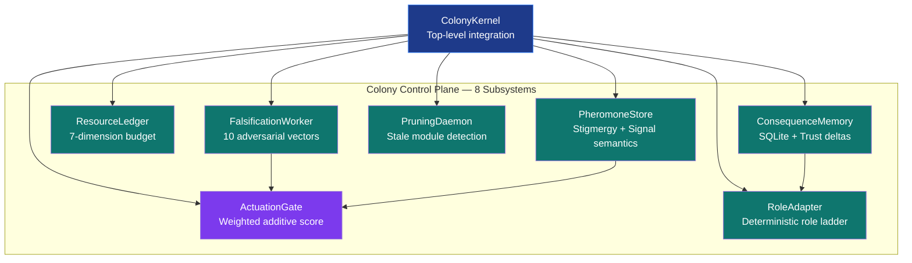
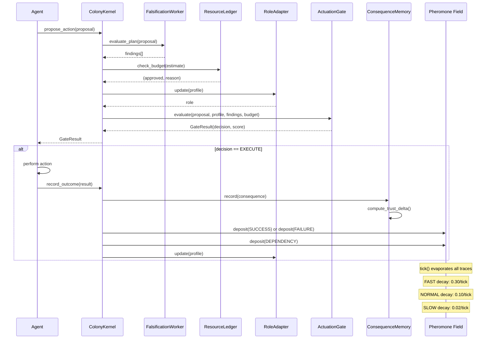

# colony_kernel

**Version**: v1.3.0 | **Status**: Active | **Last Updated**: July 2026

## Purpose

The Colony Kernel is a proposal-evaluation control plane for codomyrmex's artificial ecology thesis: a codebase is treated as a colony in which agents, modules, and human operators interact through a signal field. The default profile remains advisory and process-local, while the strict profile adds a governed action-scope boundary: only explicitly registered targets can receive an Ed25519-signed, single-use execution authorization, and only a consumed authorization plus executor receipt can update enforced trust and outcome state. Unregistered mutating paths remain outside scope and fail closed in strict mode. Caller-reported, policy-rejected, prospective-RISK, and attested-execution evidence remain separate grades; none is a general truth oracle or production-safety claim.

## Architecture

The kernel wires eight cooperating responsibilities plus the strict authorization and executor surfaces. `models.py` supplies shared value objects, while `ColonyKernel` explicitly sequences falsification, budget, role, gate, consequence, signal, pruning, authorization, and receipt operations. Cross-subsystem dependencies are documented rather than hidden.

The falsification surface has **ten attack-vector categories** represented by
`AttackVector` and **eleven check functions** in the worker. These counts are
different by design: one category can contain more than one concrete check.



## Quick Start

```python
from codomyrmex.colony_kernel.kernel import ColonyKernel
from codomyrmex.colony_kernel.models import ActionProposal, ResourceCost

# Instantiate once per process — all subsystem state lives here.
kernel = ColonyKernel()

# Propose an action: falsification, budget, and trust checks run automatically.
proposal = ActionProposal(
    agent_id="engineer-1",
    agent_type="repair_agent",
    action_type="patch_file",
    target="codomyrmex.git_operations.core",
    rationale="Fix off-by-one error in branch name parser identified in test_branch_names.py",
    expected_outcome="All 42 git_operations tests pass with no regressions",
    budget_estimate=ResourceCost(llm_calls=3, runtime_seconds=12.0, risk_level=0.1),
    rollback_plan="git revert HEAD~1 if tests fail post-merge",
    evidence={"test_ids": ["test_branch_names.py::test_slash_in_name"]},
)

result = kernel.propose_action(proposal)
print(result.decision)   # GateDecision.REFUSE for a brand-new SANDBOX agent
print(result.gate_score) # 0.0 on the SANDBOX hard-override path

# Outcome reporting is a separate, caller-driven operation. This demonstrates the
# advisory interface; it does not prove that the action was authorized or executed.
record = kernel.record_outcome(
    proposal=proposal,
    outcome={"summary": "patch applied; git rebase succeeded", "repair_needed": False},
    tests_passed=True,
    human_feedback="good",
)
print(record.trust_delta)  # positive delta added to engineer-1's profile

# Inspect colony state.
status = kernel.colony_status()
print(status["budget_usage"]["llm_calls"])  # {"used": 3, "max": 500}

# Advance one tick — evaporates pheromone traces.
kernel.tick()
```

### Strict enforcement profile

Services that require an execution boundary must explicitly provision an
`Ed25519Authority` from an external secret store and construct
`ColonyKernelConfig(enforcement_mode="strict", authorization_signer=...)`. A
successful `propose_action` then returns a signed `ExecutionAuthorization` only
for the configured action-scope map. If a proposal supplies an explicit
`evidence["action_payload"]` object, its canonical digest is signed as part of
the capability and the executor must receive the same object. A registered
`RegisteredActionExecutor` consumes that capability atomically and returns one
signed `ExecutionReceipt` carrying the same request digest.
`record_attested_outcome` verifies the receipt before updating trust, budgets, or
signals. `record_outcome` remains available for audit input, but strict mode
quarantines it and applies no learning or failure pressure.

The strict profile persists authorization, signal, resource, consequence, and
receipt state when a file-backed SQLite path is configured. `:memory:` is an
explicit isolated-test mode and is not durable. Key IDs and public-key metadata
may be recorded in a release manifest; private keys must remain outside
repository state. Key rotation is explicit through the authorization ledger's
trusted public-key registry.

## The Core Loop

The colony runs a continuous seven-phase cycle:



## Integration

The colony kernel depends on exactly one external codomyrmex module: `agentic_memory.stigmergy`.

- `agentic_memory.stigmergy.field.TraceField` — the backing store for pheromone traces. `PheromoneStore` wraps it with colony-specific compound keys (`"{location}:{signal_type.value}"`), source trust multipliers, and `ColonySignal`-aware deposit logic.
- `agentic_memory.stigmergy.models.StigmergyConfig` — passed through to `TraceField` to configure evaporation rate, minimum strength floor, and maximum trace count.

`ConsequenceMemory` uses the Python standard library `sqlite3` directly. No ORM or third-party persistence library is required.

Other colony-kernel imports are explicit: subsystem classes share `models.py`, and the integration layer coordinates them. `ActuationGate` may query both the pheromone store and consequence memory; `PruningDaemon` may query the pheromone store.

## MCP Tools

The MCP surface exposes the advisory read/evaluation tools plus strict execution
and evidence tools. All calls route through a module-level `ColonyKernel`
singleton; a service must configure that singleton with a strict profile before
the enforcement tools can execute anything.

| Tool | Purpose |
|------|---------|
| `colony_propose_action` | Submit an action proposal; returns the full `GateResult` |
| `colony_record_outcome` | Record a caller-reported, unattested consequence report |
| `colony_execute_authorized` | Consume a signed authorization and return a signed executor receipt |
| `colony_record_attested_outcome` | Link one consumed receipt to one accepted outcome |
| `colony_action_scope` | Inspect the governed action scope and bypass behavior |
| `colony_agent_profile` | Read an agent's current trust profile and role |
| `colony_status` | Dashboard snapshot: signals, budget usage, role distribution, recent consequences |
| `colony_pheromone_query` | Sense pheromone strength at a specific location and signal type |
| `colony_falsify_plan` | Adversarially evaluate any plan dict without running the full gate |
| `colony_pruning_report` | List stale or broken module locations identified by the pruning daemon |
| `colony_tick` | Advance the colony one time-step and evaporate pheromone traces |

See [`MCP_TOOL_SPECIFICATION.md`](MCP_TOOL_SPECIFICATION.md) for full JSON schemas and examples.

## Health Check

Run the Colony Kernel health check via the Codomyrmex CLI doctor:

```bash
# Colony Kernel only
codomyrmex doctor --colony

# All checks (includes Colony Kernel)
codomyrmex doctor --all

# Programmatic access
from codomyrmex.cli.doctor import check_colony_kernel
results = check_colony_kernel()
```

The doctor verifies: imports, kernel instantiation, propose→record lifecycle, and status output.

## Tests

Tests live in `tests/unit/colony_kernel/`. Run with:

```bash
uv run pytest tests/unit/colony_kernel/ -v
```

The test suite follows the zero-mock policy: all tests use real `ColonyKernel` instances with `db_path=":memory:"`. No `unittest.mock`, no `MagicMock`. Coverage target: ≥ 60% (the executable `pyproject.toml` release floor).

Key test modules:

- `test_models.py` — data contract validation for all dataclasses and enums
- `test_kernel.py` — full propose/record/tick round-trips
- `test_gate.py` — gate score calculations and threshold routing
- `test_consequence_memory.py` — SQLite persistence and trust delta computation
- `test_falsification_worker.py` — each attack vector in isolation
- `test_pruning_daemon.py` — staleness detection via pheromone field state
- `test_mcp_tools.py` — all eleven MCP tool round-trips, including strict lifecycle tools

## Navigation Links

- **Parent Directory**: [codomyrmex](../README.md)
- **Project Root**: [../../../README.md](../../../README.md)
- **Agents Reference**: [AGENTS.md](AGENTS.md)
- **Formal Specification**: [SPEC.md](SPEC.md)
- **MCP Tools**: [MCP_TOOL_SPECIFICATION.md](MCP_TOOL_SPECIFICATION.md)
- **Stigmergy Integration**: [agentic_memory/stigmergy](../agentic_memory/)
