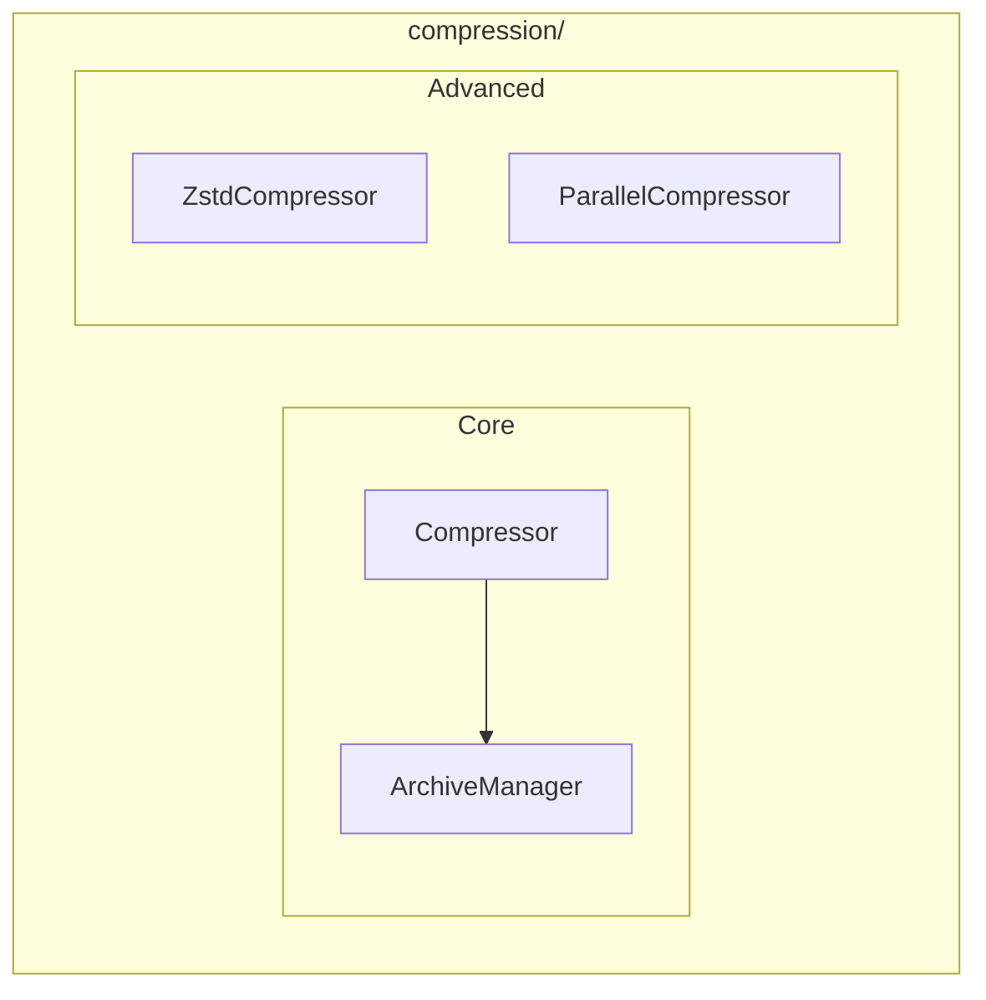

# Compression Module

**Version**: v0.1.0 | **Status**: Active | **Last Updated**: January 2026

## Overview

The Compression module provides data compression utilities and archive handling for the Codomyrmex platform. It supports gzip, zlib, ZIP, and Zstandard with configurable compression levels and parallel processing.

## Architecture



## Key Classes

| Class | Purpose |
|-------|---------|
| `Compressor` | Standard compression |
| `ArchiveManager` | Archive operations |
| `ZstdCompressor` | Zstandard compression |
| `ParallelCompressor` | Parallel compression |

## Functions

| Function | Purpose |
|----------|---------|
| `compress()` | Compress data |
| `decompress()` | Decompress data |
| `compress_data()` | Compress bytes |
| `decompress_data()` | Decompress bytes |
| `auto_decompress()` | Auto-detect format |
| `compress_file()` | Compress file |
| `decompress_file()` | Decompress file |
| `get_compressor()` | Get compressor instance |

## Quick Start

### Basic Compression

```python
from codomyrmex.compression import compress, decompress

data = b"Hello, World!" * 1000

# Compress with gzip
compressed = compress(data, level=9, format="gzip")
print(f"Ratio: {len(data) / len(compressed):.1f}x")

# Decompress
original = decompress(compressed)
```

### File Compression

```python
from codomyrmex.compression import compress_file, decompress_file

# Compress file
compress_file("data.json", "data.json.gz")

# Decompress file  
decompress_file("data.json.gz", "data.json")
```

### Archive Management

```python
from codomyrmex.compression import ArchiveManager

archive = ArchiveManager()

# Create ZIP archive
archive.create_zip("output.zip", ["file1.txt", "file2.txt", "dir/"])

# Extract archive
archive.extract("archive.tar.gz", "output/")
```

### Parallel Compression

```python
from codomyrmex.compression import ParallelCompressor

compressor = ParallelCompressor(workers=4)

# Compress multiple files in parallel
compressor.compress_files(["a.txt", "b.txt", "c.txt"])
```

### Zstandard Compression

```python
from codomyrmex.compression import ZstdCompressor

zstd = ZstdCompressor()

# High compression ratio
compressed = zstd.compress(data, level=22)
```

## Supported Formats

| Format | Extension | Notes |
|--------|-----------|-------|
| gzip | `.gz` | Default format |
| zlib | `.zlib` | Raw deflate |
| zip | `.zip` | Archive format |
| zstd | `.zst` | Fast compression |

## Integration Points

- **serialization**: Compress serialized data
- **networking**: Compress transfers
- **cache**: Compress cached data

## Navigation

- **Parent**: [../README.md](../README.md)
- **Siblings**: [serialization](../serialization/), [cache](../cache/)
- **Spec**: [SPEC.md](SPEC.md)
