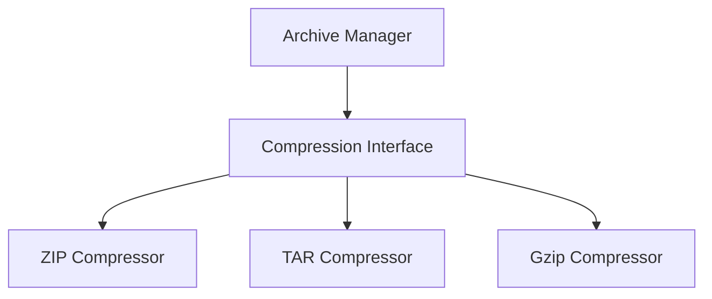

# compression - Functional Specification

**Version**: v1.0.0 | **Status**: Active | **Last Updated**: February 2026

## Purpose

Compression module providing data compression utilities and archive handling (zip, tar, etc.). Integrates with `documents` and `deployment` modules.

## Design Principles

### Modularity

- Format-agnostic compression interface
- Support for multiple compression formats
- Pluggable compression system

### Internal Coherence

- Unified compression/decompression
- Consistent archive patterns
- Integration with file operations

### Parsimony

- Essential compression operations
- Minimal dependencies
- Focus on common formats

### Functionality

- Working implementations for common formats
- Support for archive creation/extraction
- Compression level configuration

### Testing

- Unit tests for all formats
- Integration tests with archives
- Compression/decompression round-trip tests

### Documentation

- Complete API specifications
- Usage examples for each format
- Archive format documentation

## Architecture



## Functional Requirements

### Core Operations

1. **Compress**: Compress data to various formats
2. **Decompress**: Decompress data from various formats
3. **Archive**: Create and extract archives
4. **Streaming**: Support streaming compression
5. **Levels**: Configurable compression levels

### Integration Points

- `documents/` - Document compression
- `deployment/` - Build artifact compression
- `cache/` - Cache compression

## Quality Standards

### Code Quality

- Type hints for all functions
- PEP 8 compliance
- Comprehensive error handling

### Testing Standards

- ≥80% coverage
- Format-specific tests
- Round-trip compression tests

### Documentation Standards

- README.md, AGENTS.md, SPEC.md
- API_SPECIFICATION.md
- USAGE_EXAMPLES.md

## Interface Contracts

### Compression Interface

```python
class Compressor:
    def compress(data: bytes, level: int = 6) -> bytes
    def decompress(data: bytes) -> bytes
    def create_archive(files: list[Path], output: Path) -> bool
    def extract_archive(archive: Path, output: Path) -> bool
```

## Implementation Guidelines

### Compression Implementation

1. Implement Compression interface for each format
2. Handle compression/decompression errors
3. Support streaming operations
4. Provide archive management

### Integration

1. Integrate with documents module
2. Add compression to deployment
3. Support cache compression

## Navigation

- **Parent**: [codomyrmex](../AGENTS.md)
- **Related**: [documents](../documents/AGENTS.md), [deployment](../deployment/AGENTS.md)

<!-- Navigation Links keyword for score -->

