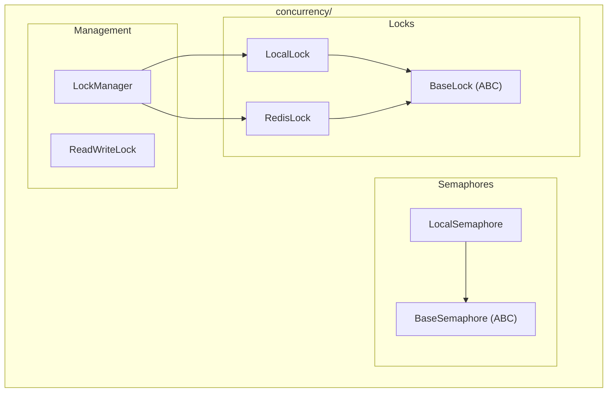

# Concurrency Module

**Version**: v0.1.0 | **Status**: Active | **Last Updated**: January 2026

## Overview

The Concurrency module provides distributed locks, semaphores, and synchronization primitives for the Codomyrmex platform. It supports both local (in-process) and distributed (Redis-backed) coordination.

## Architecture



## Key Classes

| Class | Purpose |
|-------|---------|
| `BaseLock` | Abstract base for lock implementations |
| `LocalLock` | In-process threading lock |
| `RedisLock` | Distributed lock via Redis |
| `BaseSemaphore` | Abstract base for semaphores |
| `LocalSemaphore` | In-process counting semaphore |
| `LockManager` | Lock factory and lifecycle management |
| `ReadWriteLock` | Multiple readers, single writer lock |

## Quick Start

### Basic Locking

```python
from codomyrmex.concurrency import LocalLock

lock = LocalLock("my_resource")

with lock:
    # Critical section
    do_exclusive_work()
```

### Distributed Locking (Redis)

```python
from codomyrmex.concurrency import RedisLock

# Distributed lock across processes/servers
lock = RedisLock("shared_resource", redis_url="redis://localhost:6379")

with lock:
    # Only one process can execute this
    update_shared_state()
```

### Lock Manager

```python
from codomyrmex.concurrency import LockManager

manager = LockManager()

# Get or create a lock
lock = manager.get_lock("resource_a")

with lock:
    process_resource()
    
# Check lock status
stats = manager.stats
print(f"Active locks: {stats['active']}")
```

### Read-Write Lock

```python
from codomyrmex.concurrency import ReadWriteLock

rwlock = ReadWriteLock()

# Multiple readers allowed
with rwlock.read():
    data = read_shared_data()

# Single writer, exclusive
with rwlock.write():
    update_shared_data()
```

### Semaphore

```python
from codomyrmex.concurrency import LocalSemaphore

# Limit concurrent access to 5
semaphore = LocalSemaphore(5)

with semaphore:
    # At most 5 threads here
    access_limited_resource()
```

## Use Cases

| Scenario | Primitive |
|----------|-----------|
| Single process exclusion | `LocalLock` |
| Multi-process/server exclusion | `RedisLock` |
| Rate limiting | `LocalSemaphore` |
| Cache reads vs writes | `ReadWriteLock` |
| Database connection pools | `LocalSemaphore` |

## Integration Points

- **database_management**: Connection pool limits
- **cache**: Cache update synchronization
- **orchestrator**: Task execution coordination
- **agents**: Agent action serialization

## Navigation

- **Parent**: [../README.md](../README.md)
- **Siblings**: [database_management](../database_management/), [cache](../cache/)
- **Spec**: [SPEC.md](SPEC.md)
