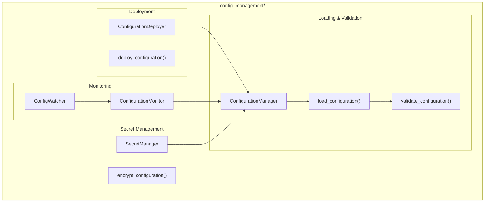

# Configuration Management Module

**Version**: v0.1.0 | **Status**: Active | **Last Updated**: January 2026

## Overview

The Configuration Management module provides comprehensive configuration management, validation, deployment, and monitoring capabilities for the Codomyrmex ecosystem. It supports multi-source configuration loading, schema validation, secret management, and configuration drift detection.

## Architecture



## Key Classes

| Class | Purpose |
|-------|---------|
| `ConfigurationManager` | Main configuration orchestrator |
| `Configuration` | Configuration object with metadata |
| `ConfigSchema` | JSON schema for validation |
| `ConfigurationDeployer` | Deploy configs to environments |
| `ConfigDeployment` | Deployment tracking |
| `ConfigurationMonitor` | Monitor config changes |
| `ConfigWatcher` | File system watcher for changes |
| `ConfigAudit` | Audit and compliance results |
| `SecretManager` | Secure secret storage (optional) |

## Functions

| Function | Purpose |
|----------|---------|
| `load_configuration()` | Load and merge configs |
| `validate_configuration()` | Validate against schema |
| `deploy_configuration()` | Deploy to environment |
| `monitor_config_changes()` | Track changes and drift |
| `manage_secrets()` | Manage secrets (if available) |
| `encrypt_configuration()` | Encrypt sensitive values |

## Quick Start

### Load Configuration

```python
from codomyrmex.config_management import load_configuration

# Load from multiple sources (merged in order)
config = load_configuration(
    sources=[
        "config/defaults.yaml",
        "config/production.yaml",
        "env:MYAPP_"  # Environment variables with prefix
    ]
)

print(config.database.host)
print(config.api.port)
```

### Validate Configuration

```python
from codomyrmex.config_management import load_configuration, validate_configuration

config = load_configuration("config/app.yaml")

# Validate against schema
result = validate_configuration(config, schema="config/schema.json")

if not result.is_valid:
    for error in result.errors:
        print(f"Validation error: {error}")
```

### Configuration Manager

```python
from codomyrmex.config_management import ConfigurationManager

manager = ConfigurationManager()

# Load with environment-specific overrides
config = manager.load(
    base="config/base.yaml",
    overrides=["config/prod.yaml"],
    environment="production"
)

# Watch for changes
manager.watch(callback=on_config_change)
```

### Deploy Configuration

```python
from codomyrmex.config_management import (
    ConfigurationDeployer,
    deploy_configuration
)

deployer = ConfigurationDeployer()

# Deploy to target
result = deploy_configuration(
    config_path="config/app.yaml",
    target="production",
    validate=True,
    backup=True
)

print(f"Deployed: {result.success}")
```

### Secret Management

```python
from codomyrmex.config_management import SecretManager, manage_secrets

# Only available if cryptography is installed
secrets = SecretManager(key_file=".encryption_key")

# Store a secret
secrets.set("database_password", "super_secret")

# Retrieve a secret
password = secrets.get("database_password")

# Encrypt sensitive config values
encrypted_config = manage_secrets(config, secrets)
```

### Monitor Configuration

```python
from codomyrmex.config_management import ConfigurationMonitor, ConfigWatcher

monitor = ConfigurationMonitor()

# Detect drift from expected state
drift = monitor.check_drift(
    current="config/current.yaml",
    expected="config/expected.yaml"
)

# File system watcher
watcher = ConfigWatcher("config/")
watcher.on_change(handle_config_change)
watcher.start()
```

## Integration Points

- **logging_monitoring**: Configuration logging
- **security**: Secure configuration handling
- **environment_setup**: Environment-specific configs
- **encryption**: Secret encryption

## Navigation

- **Parent**: [../README.md](../README.md)
- **Siblings**: [environment_setup](../environment_setup/), [security](../security/)
- **Spec**: [SPEC.md](SPEC.md)
