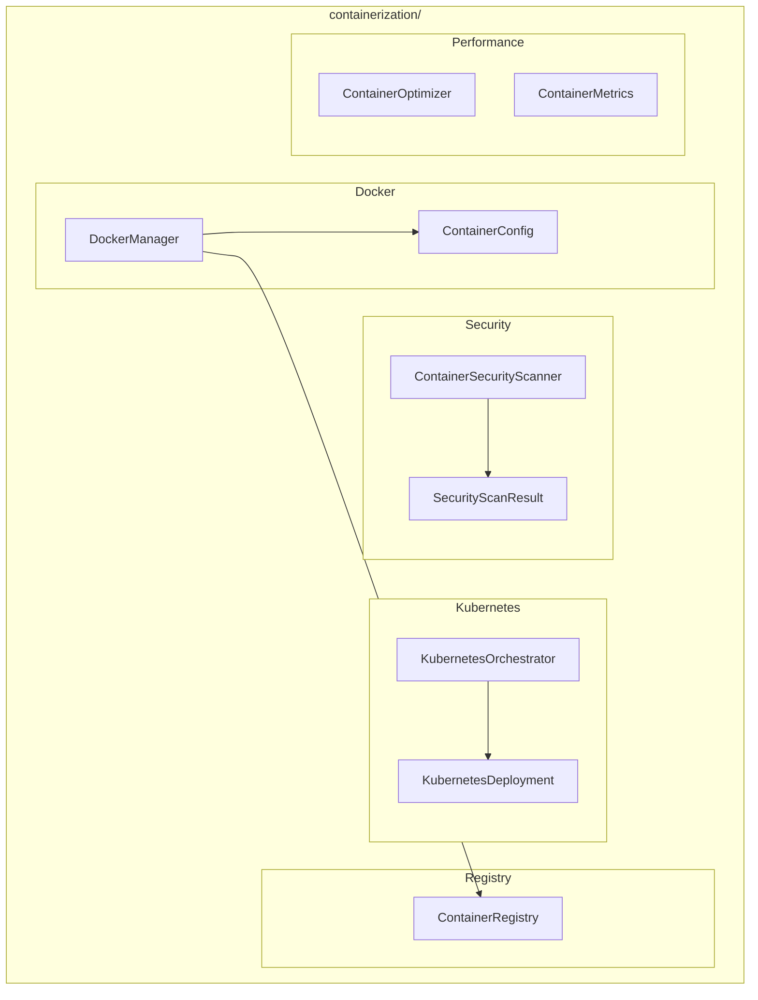

# Containerization Module

**Version**: v0.1.0 | **Status**: Active | **Last Updated**: January 2026

## Overview

The Containerization module provides container management, orchestration, and deployment capabilities for the Codomyrmex ecosystem. It supports Docker, Kubernetes, container registries, security scanning, and performance optimization.

## Architecture



## Key Classes

| Class | Purpose |
|-------|---------|
| `DockerManager` | Docker container lifecycle |
| `ContainerConfig` | Container configuration |
| `KubernetesOrchestrator` | K8s cluster management |
| `KubernetesDeployment` | K8s deployment config |
| `ContainerRegistry` | Registry operations |
| `ContainerSecurityScanner` | Vulnerability scanning |
| `SecurityScanResult` | Scan results |
| `ContainerOptimizer` | Performance tuning |
| `ContainerMetrics` | Resource metrics |

## Quick Start

### Docker Management

```python
from codomyrmex.containerization import DockerManager, build_containers

manager = DockerManager()

# Build container
build_containers("./Dockerfile", tag="myapp:latest")

# Run container
container = manager.run("myapp:latest", ports={"8080": "8080"})

# Stop and remove
manager.stop(container.id)
```

### Kubernetes

```python
from codomyrmex.containerization import (
    KubernetesOrchestrator,
    KubernetesDeployment,
    orchestrate_kubernetes
)

k8s = KubernetesOrchestrator(context="production")

deployment = KubernetesDeployment(
    name="myapp",
    image="myapp:latest",
    replicas=3
)

k8s.apply(deployment)
k8s.wait_for_ready("myapp")
```

### Security Scanning

```python
from codomyrmex.containerization import (
    scan_container_security,
    ContainerSecurityScanner
)

result = scan_container_security("myapp:latest")

for vuln in result.vulnerabilities:
    print(f"[{vuln.severity}] {vuln.cve}: {vuln.description}")
```

### Container Registry

```python
from codomyrmex.containerization import ContainerRegistry

registry = ContainerRegistry("registry.example.com")
registry.login(username, password)

registry.push("myapp:latest")
registry.pull("nginx:alpine")
```

## Exceptions

| Exception | When Raised |
|-----------|-------------|
| `ContainerError` | General container error |
| `ImageBuildError` | Build failure |
| `NetworkError` | Network issues |
| `VolumeError` | Volume issues |
| `RegistryError` | Registry operations |
| `KubernetesError` | K8s operations |

## Integration Points

- **ci_cd_automation**: Automated container builds
- **security**: Container security scanning
- **deployment**: Container deployment

## Navigation

- **Parent**: [../README.md](../README.md)
- **Siblings**: [ci_cd_automation](../ci_cd_automation/), [deployment](../deployment/)
- **Spec**: [SPEC.md](SPEC.md)
