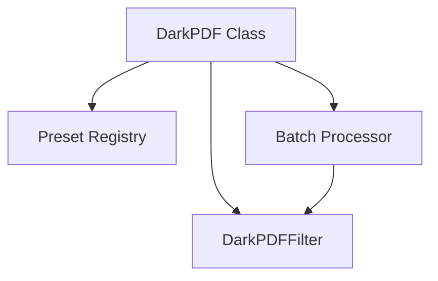

# dark - Functional Specification

**Version**: v0.1.0 | **Status**: Proposed | **Last Updated**: February 2026

## Purpose

Dark mode utilities providing domain-specific visual transformation for PDFs, network interfaces, hardware displays, and software UIs. The PDF submodule is the primary implemented component, offering page-level filter pipelines for inversion, brightness, contrast, and sepia adjustments.

## Design Principles

### Modularity

- Submodule-per-domain architecture (pdf, network, hardware, software)
- Each submodule is independently installable via extras
- Shared filter interface across domains

### Internal Coherence

- Consistent preset system across all submodules
- Unified parameter naming (inversion, brightness, contrast, sepia)
- Integration with logging and monitoring

### Parsimony

- Minimal dependencies per submodule (PyMuPDF + Pillow for PDF only)
- Simple one-call API for common use cases
- Preset-based configuration for zero-config usage

### Functionality

- Working PDF dark mode with multiple presets (dark, sepia, high_contrast, low_light)
- Batch processing support for multi-file operations
- Custom filter parameter overrides

### Testing

- Unit tests for filter parameter validation
- Integration tests with sample PDFs
- Visual regression tests for preset outputs

### Documentation

- Complete API specifications
- Usage examples for each preset
- Filter parameter reference

## Architecture



## Functional Requirements

### Core Operations

1. **Single-File Processing**: Apply dark mode filters to individual PDFs via `DarkPDF`
2. **Batch Processing**: Process multiple files via `DarkPDF.batch()`
3. **Preset Selection**: Choose from predefined filter combinations (dark, sepia, high_contrast, low_light)
4. **Custom Filters**: Override individual parameters (inversion, brightness, contrast, sepia)
5. **Output Management**: Save processed files to specified paths or directories

### Integration Points

- `logging_monitoring/` - Operation logging
- `config_management/` - Preset configuration
- `performance/` - Processing time metrics

## Quality Standards

### Code Quality

- Type hints for all functions
- PEP 8 compliance
- Comprehensive error handling for file I/O

### Testing Standards

- ≥80% coverage
- Preset-specific tests
- File format validation tests

### Documentation Standards

- README.md, AGENTS.md, SPEC.md
- Preset reference table
- Quick start examples

## Interface Contracts

### DarkPDF API

```python
class DarkPDF:
    def __init__(path: str, preset: str = "dark") -> None
    def save(output_path: str) -> None
    @staticmethod
    def batch(paths: List[str], output_dir: str, preset: str = "dark") -> None

def apply_dark_mode(
    input_path: str,
    output_path: str,
    inversion: float = 0.90,
    brightness: float = 0.90,
    contrast: float = 0.90,
    sepia: float = 0.10,
) -> None
```

## Implementation Guidelines

### PDF Submodule

1. Use PyMuPDF for PDF page rendering
2. Apply Pillow-based image filters per page
3. Reconstruct PDF from processed pages
4. Support preset and custom parameter modes

### Future Submodules

1. Network: Dark mode for terminal/TUI network tools
2. Hardware: Display brightness/color temperature control
3. Software: Application theme switching

## Navigation

- **Parent**: [codomyrmex](../AGENTS.md)
- **Related**: [performance](../performance/AGENTS.md), [config_management](../config_management/AGENTS.md)

<!-- Navigation Links keyword for score -->
