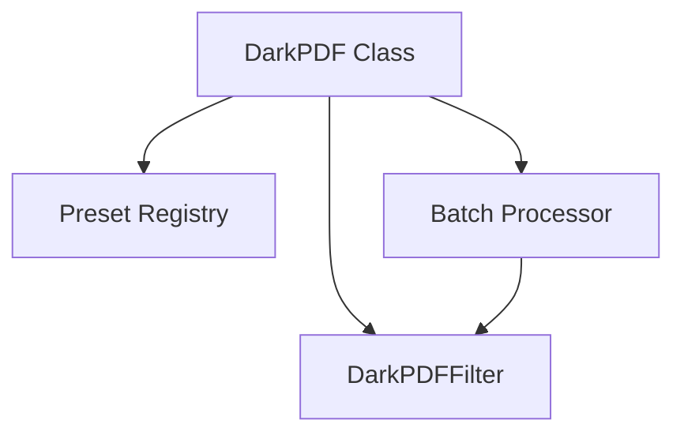

# dark - Functional Specification

**Version**: v1.1.9 | **Status**: Active | **Last Updated**: March 2026

## Purpose

Dark mode utilities providing domain-specific visual transformation for PDFs. The PDF submodule offers page-level filter pipelines for inversion, brightness, contrast, and sepia adjustments, accessible via a high-level fluent API.

## Design Principles

### Modularity

- Submodule-per-domain architecture (pdf currently implemented).
- Each submodule is independently installable via extras (`uv sync --extra dark`).
- Shared filter interface across domains.

### Internal Coherence

- Consistent preset system (dark, sepia, high_contrast, low_light).
- Unified parameter naming (inversion, brightness, contrast, sepia).
- Integration with logging and monitoring.

### Parsimony

- Minimal dependencies: PyMuPDF + Pillow for PDF only.
- Fluent API for clear, chainable configuration.
- Preset-based configuration for zero-config usage.

### Testing

- **Strict Zero-Mock Policy**: All tests use real functional implementations and authentic PDF fixtures.
- Unit tests for filter parameter validation.
- Integration tests with sample PDFs.

## Architecture


```mermaid
graph TD
    DarkPDF[DarkPDF Class]
    Filter[DarkPDFFilter]
    Presets[Preset Registry]
    BatchProc[Batch Processor]

    DarkPDF --> Filter
    DarkPDF --> Presets
    DarkPDF --> BatchProc
    BatchProc --> Filter
```

## Functional Requirements

### Core Operations

1. **Fluent PDF Processing**: Apply filters via chainable methods: `set_inversion()`, `set_brightness()`, `set_contrast()`, `set_sepia()`.
2. **Preset Management**: Support for `dark`, `sepia`, `high_contrast`, and `low_light` presets.
3. **Batch Processing**: Process multiple files via `DarkPDF.batch()`.
4. **Convenience API**: Single-call conversion via `apply_dark_mode()`.
5. **Quality Assurance**: DPI-controlled rendering for high-quality outputs.

## Interface Contracts

### DarkPDF API

```python
class DarkPDF:
    def __init__(path: str, preset: str = "dark", **kwargs) -> None
    def set_filter(preset: Union[str, DarkPDFFilter]) -> DarkPDF
    def set_brightness(value: float) -> DarkPDF
    def set_contrast(value: float) -> DarkPDF
    def set_inversion(value: float) -> DarkPDF
    def set_sepia(value: float) -> DarkPDF
    def save(output_path: str) -> Path
    @property
    def page_count(self) -> int
    @staticmethod
    def batch(paths: List[str], output_dir: str, preset: str = "dark") -> List[Path]

def apply_dark_mode(
    input_path: str,
    output_path: Optional[str] = None,
    **kwargs
) -> Optional[DarkPDF]
```

## Navigation

- **Parent**: [codomyrmex](../AGENTS.md)
- **Related**: [performance](../performance/AGENTS.md), [config_management](../config_management/AGENTS.md)
