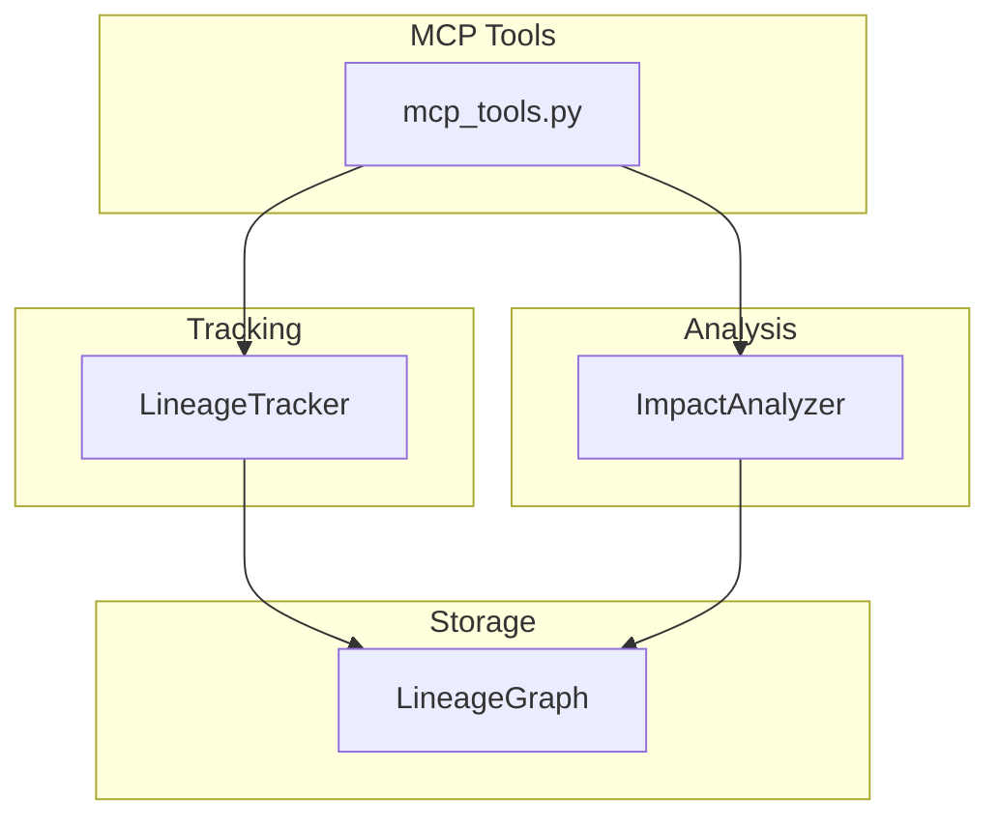

# Data Lineage - Functional Specification

**Version**: v0.1.0 | **Status**: Active | **Last Updated**: March 2026

## Purpose

The `data_lineage` module formally defines and tracks the flow of data across the Codomyrmex ecosystem. It provides the necessary abstractions to understand data provenance and dependency chains.

## Design Principles

### Modularity
- Decouples graph storage (`LineageGraph`) from tracking logic (`LineageTracker`).
- Models are defined as lightweight dataclasses for easy serialization.

### Real Execution
- All lineage operations are performed on real graph structures without mocks.
- Cycle detection and path finding use standard graph algorithms.

### Parsimony
- Minimal set of node and edge types to cover most data engineering use cases.
- Simple API for registration and querying.

## Architecture

## Functional Requirements

### Core Capabilities

1. **Node Management**: Create and store nodes representing datasets, transformations, and models.
2. **Edge Management**: Define directed relationships between nodes.
3. **Traversal**: Efficiently find upstream (ancestors) and downstream (descendants) nodes.
4. **Impact Assessment**: Quantify the impact of a change to a specific node on the rest of the ecosystem.
5. **Validation**: Detect and prevent circular dependencies in the lineage graph.

### Interface Contracts

#### LineageGraph
- `add_node(node: LineageNode)`: Adds node.
- `add_edge(edge: LineageEdge)`: Adds edge (must have existing nodes).
- `get_upstream(node_id: str)`: Returns list of ancestors.
- `get_downstream(node_id: str)`: Returns list of descendants.
- `validate_graph()`: Returns nodes involved in cycles.

#### LineageTracker
- `register_dataset(id, name, ...)`: Helper to create dataset nodes.
- `register_transformation(id, name, inputs, outputs)`: Links multiple nodes via a transformation.

#### MCP Tools
- `data_lineage_track_event(event_type, event_id, ...)`: Tracks a dataset or transformation event.
- `data_lineage_analyze_impact(node_id)`: Analyzes downstream nodes affected by the change.
- `data_lineage_get_origin(node_id)`: Returns upstream root dependencies.

## Quality Standards

- **Consistency**: The graph must always be in a valid state (no dangling edges).
- **Performance**: Traversal should be efficient for graphs up to 10,000 nodes.
- **Traceability**: Every edge must have a timestamp and type.

## Navigation

- **Human Documentation**: [README.md](README.md)
- **Technical Documentation**: [AGENTS.md](AGENTS.md)
