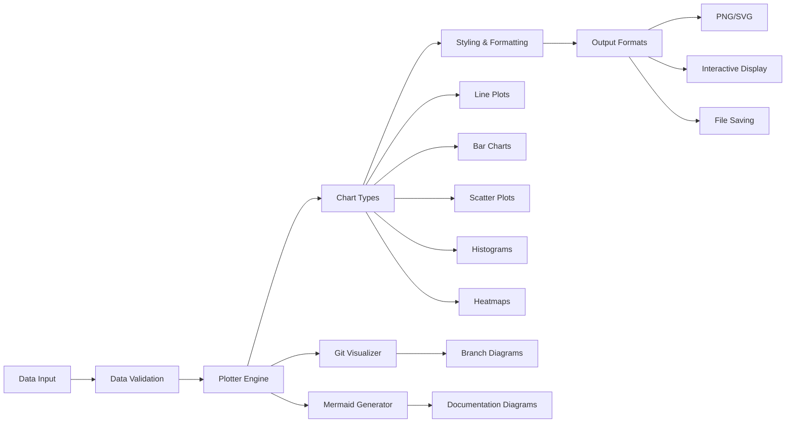

# src/codomyrmex/data_visualization

## Signposting
- **Parent**: [Parent](../README.md)
- **Children**:
    - [docs](docs/README.md)
    - [tests](tests/README.md)
- **Key Artifacts**:
    - [Agent Guide](AGENTS.md)
    - [Functional Spec](SPEC.md)

**Version**: v0.1.0 | **Status**: Active | **Last Updated**: December 2025

## Overview

Core module providing comprehensive data visualization capabilities for the Codomyrmex platform. This module enables the creation of various chart types, plots, and visual representations using Matplotlib and Seaborn backends, supporting both programmatic generation and interactive display.

The data_visualization module serves as the primary interface for converting data into visual insights across the entire platform.

## Visualization Pipeline

The visualization pipeline processes data through validation, chart generation, styling, and multiple output formats. Specialized visualizers handle Git repository analysis and documentation diagram generation.

## Directory Contents
- `.gitignore` – File
- `API_SPECIFICATION.md` – File
- `CHANGELOG.md` – File
- `MCP_TOOL_SPECIFICATION.md` – File
- `SECURITY.md` – File
- `USAGE_EXAMPLES.md` – File
- `__init__.py` – File
- `advanced_plotter.py` – File
- `bar_chart.py` – File
- `docs/` – Subdirectory
- `git_visualizer.py` – File
- `histogram.py` – File
- `line_plot.py` – File
- `mermaid_generator.py` – File
- `pie_chart.py` – File
- `plot_utils.py` – File
- `plotter.py` – File
- `requirements.txt` – File
- `scatter_plot.py` – File
- `tests/` – Subdirectory

## Navigation
- **Project Root**: [README](../../../README.md)
- **Parent Directory**: [codomyrmex](../README.md)
- **Src Hub**: [src](../../../src/README.md)