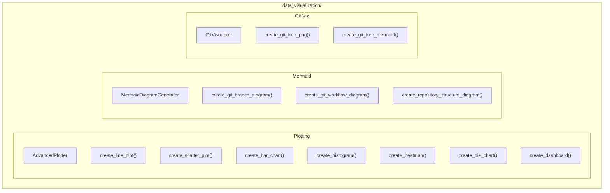

# Data Visualization Module

**Version**: v0.1.0 | **Status**: Active | **Last Updated**: January 2026

## Overview

The Data Visualization module provides utilities for generating various types of plots, visualizations, Mermaid diagrams, and interactive dashboards for the Codomyrmex platform.

## Architecture



## Key Classes

| Class | Purpose |
|-------|---------|
| `AdvancedPlotter` | Main plotting class |
| `PlotConfig` | Plot configuration |
| `DataPoint` | Data point |
| `Dataset` | Dataset container |
| `PlotType` | Plot type enum |
| `ChartStyle` | Style options |
| `ColorPalette` | Color palettes |
| `MermaidDiagramGenerator` | Mermaid diagrams |
| `GitVisualizer` | Git visualization |

## Plotting Functions

| Function | Purpose |
|----------|---------|
| `create_line_plot()` | Line chart |
| `create_scatter_plot()` | Scatter plot |
| `create_bar_chart()` | Bar chart |
| `create_histogram()` | Histogram |
| `create_pie_chart()` | Pie chart |
| `create_heatmap()` | Heatmap |
| `create_dashboard()` | Multi-panel dashboard |

## Quick Start

### Basic Plots

```python
from codomyrmex.data_visualization import (
    create_line_plot,
    create_bar_chart,
    create_scatter_plot
)

# Line plot
create_line_plot(
    x=[1, 2, 3, 4, 5],
    y=[10, 20, 15, 30, 25],
    title="Trend",
    output="trend.png"
)

# Bar chart
create_bar_chart(
    categories=["A", "B", "C"],
    values=[100, 150, 80],
    title="Comparison"
)
```

### Dashboard

```python
from codomyrmex.data_visualization import create_dashboard

create_dashboard(
    plots=[
        {"type": "line", "data": line_data},
        {"type": "bar", "data": bar_data}
    ],
    layout="2x1",
    output="dashboard.html"
)
```

### Mermaid Diagrams

```python
from codomyrmex.data_visualization import (
    MermaidDiagramGenerator,
    create_git_branch_diagram,
    create_repository_structure_diagram
)

# Git branches
mermaid_code = create_git_branch_diagram("./repo")
print(mermaid_code)

# Repository structure
structure = create_repository_structure_diagram("./project")
```

### Git Visualization

```python
from codomyrmex.data_visualization import (
    GitVisualizer,
    visualize_git_repository,
    create_git_tree_png
)

viz = GitVisualizer("./repo")
viz.visualize_branches(output="branches.svg")

# Static PNG
create_git_tree_png("./repo", "tree.png")
```

### Styles and Palettes

```python
from codomyrmex.data_visualization import (
    get_available_styles,
    get_available_palettes,
    get_available_plot_types
)

print(f"Styles: {get_available_styles()}")
print(f"Palettes: {get_available_palettes()}")
print(f"Plot types: {get_available_plot_types()}")
```

## Integration Points

- **git_operations**: Git visualization
- **metrics**: Metric visualization
- **logging_monitoring**: Log visualization

## Navigation

- **Parent**: [../README.md](../README.md)
- **Siblings**: [git_operations](../git_operations/), [metrics](../metrics/)
- **Spec**: [SPEC.md](SPEC.md)
