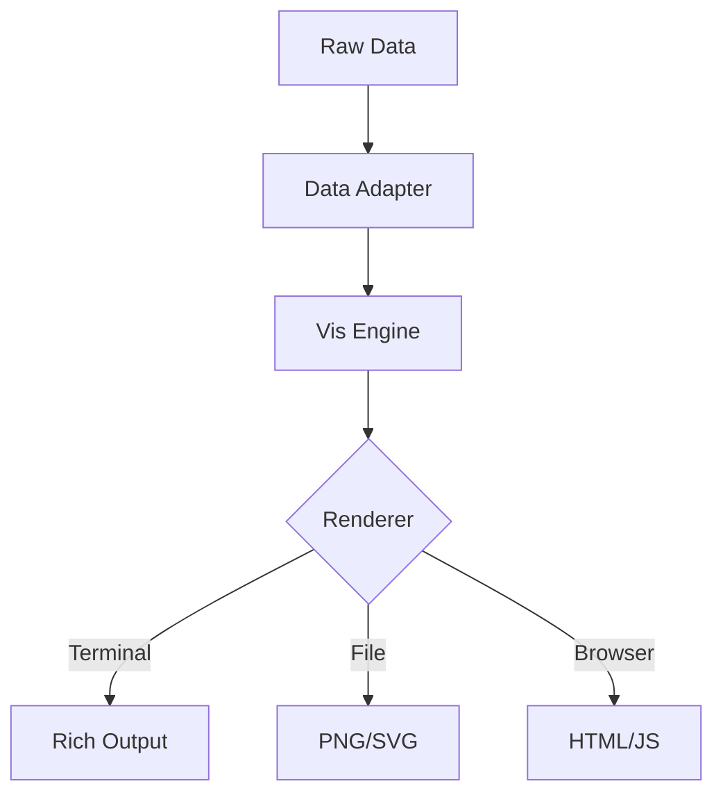

# data_visualization - Functional Specification

**Version**: v0.1.0 | **Status**: Active | **Last Updated**: January 2026

## Purpose

The `data_visualization` module provides tools to transform raw data (logs, metrics, analysis results) into human-interpretable visual formats (tables, charts, graphs). It supports both terminal-based output (ASCII/Rich) and web-based or image-based rendering for reports.

## Design Principles

### Modularity
- **Backend Agnostic**: Visualization logic should be separate from data sources.
- **Renderer Abstraction**: Support multiple renderers (Console, HTML, PNG).

### Internal Coherence
- **Consistent Styling**: All visualizations should share a common color palette and style guide (Codomyrmex branding).

### Parsimony
- **Simple API**: `plot(data, type='bar')` style ease of use.

## Architecture

## Functional Requirements

### Core Capabilities
1.  **Rich Terminal Output**: Tables, progress bars, syntax highlighting (wrapping `rich`).
2.  **Charting**: Line charts, bar graphs, scatter plots.
3.  **Report Generation**: Embed charts into Markdown or HTML reports.

### Quality Standards
- **Responsiveness**: Terminal output must respect terminal width.
- **Accessibility**: Colors should be distinguishable.

## Interface Contracts

### Public API
- `render_table(data: List[Dict], title: str) -> None`
- `render_chart(data: Any, type: str) -> Path`: Returns path to generated image/file.

### Dependencies
- **External**: `rich`, `matplotlib` (optional), `plotly` (optional).

## Implementation Guidelines

### Usage Patterns
- Use `rich` for all real-time CLI feedback.
- Use `matplotlib`/`plotly` for static artifacts generated for artifacts/reports.

## Navigation

- **Human Documentation**: [README.md](README.md)
- **Technical Documentation**: [AGENTS.md](AGENTS.md)
- **Package SPEC**: [../SPEC.md](../SPEC.md)
