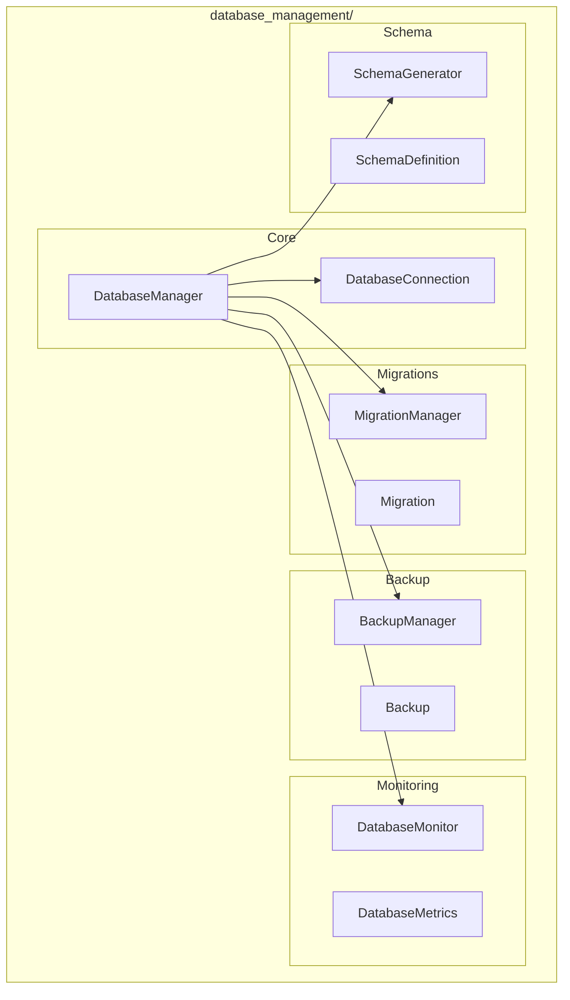

# Database Management Module

**Version**: v0.1.0 | **Status**: Active | **Last Updated**: January 2026

## Overview

The Database Management module provides comprehensive database administration, migration management, backup/recovery, performance monitoring, and schema generation for the Codomyrmex ecosystem.

## Architecture



## Key Classes

| Class | Purpose |
|-------|---------|
| `DatabaseManager` | Main database orchestrator |
| `DatabaseConnection` | Connection configuration |
| `MigrationManager` | Migration lifecycle |
| `Migration` | Individual migration definition |
| `BackupManager` | Backup operations |
| `Backup` | Backup metadata |
| `DatabaseMonitor` | Performance monitoring |
| `DatabaseMetrics` | Health metrics |
| `SchemaGenerator` | Schema generation |
| `SchemaDefinition` | Schema definition |

## Functions

| Function | Purpose |
|----------|---------|
| `manage_databases()` | Database administration |
| `run_migrations()` | Execute migrations |
| `backup_database()` | Create backup |
| `monitor_database()` | Monitor health |
| `optimize_database()` | Performance tuning |
| `generate_schema()` | Generate schema |

## Quick Start

### Database Connection

```python
from codomyrmex.database_management import DatabaseManager, DatabaseConnection

conn = DatabaseConnection(
    host="localhost",
    port=5432,
    database="myapp",
    user="admin"
)

manager = DatabaseManager(conn)
```

### Run Migrations

```python
from codomyrmex.database_management import MigrationManager, run_migrations

# Run all pending migrations
result = run_migrations(
    connection=conn,
    migrations_dir="db/migrations/"
)

print(f"Migrations applied: {result.applied_count}")
```

### Database Backup

```python
from codomyrmex.database_management import BackupManager, backup_database

backup = backup_database(
    connection=conn,
    output_path="backups/",
    compression=True
)

print(f"Backup created: {backup.path}")
print(f"Size: {backup.size_mb} MB")
```

### Performance Monitoring

```python
from codomyrmex.database_management import DatabaseMonitor, monitor_database

metrics = monitor_database(connection=conn)

print(f"Query latency: {metrics.avg_query_time_ms}ms")
print(f"Active connections: {metrics.active_connections}")
print(f"Cache hit ratio: {metrics.cache_hit_ratio:.2%}")
```

### Schema Generation

```python
from codomyrmex.database_management import generate_schema

schema = generate_schema(
    connection=conn,
    output_format="sql"
)

# Or as Python models
models = generate_schema(
    connection=conn,
    output_format="sqlalchemy"
)
```

## Integration Points

- **logging_monitoring**: Database operation logging
- **security**: Database security and compliance
- **config_management**: Database configuration
- **performance**: Performance monitoring

## Navigation

- **Parent**: [../README.md](../README.md)
- **Siblings**: [cache](../cache/), [serialization](../serialization/)
- **Spec**: [SPEC.md](SPEC.md)
