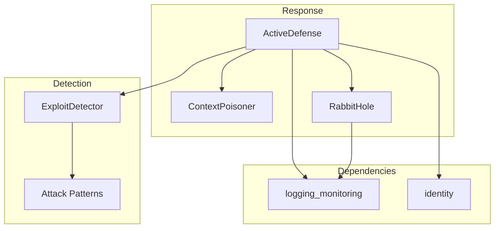

# defense - Functional Specification

**Version**: v0.1.0 | **Status**: Active | **Last Updated**: February 2026

## Purpose

The `defense` module implements "Fiduciary Defense" capabilities for Secure Cognitive Agents. It actively monitors for cognitive exploits (jailbreaks, prompt injections, social engineering) and responds with active countermeasures including context poisoning and attacker engagement via rabbit holes.

## Design Principles

### Modularity

- Pluggable detection backends (heuristic, ML-based, signature)
- Separate detection from response — countermeasures are independently configurable
- Clean interface between ExploitDetector and ActiveDefense

### Internal Coherence

- All defense activations are logged for audit
- Consistent threat-level classification across components
- Integration with identity and privacy modules for coordinated response

### Parsimony

- Detection-first approach — never respond without confirmation
- Minimal false-positive surface area
- Proportional response to threat severity

### Functionality

- Working exploit detection with pattern-based scanning
- Active countermeasures: context poisoning and rabbit hole engagement
- Configurable threat response thresholds

### Testing

- Unit tests for detection patterns
- Integration tests with simulated attack vectors
- False-positive rate benchmarks

### Documentation

- Complete API specifications
- Countermeasure response documentation
- Threat classification reference

## Architecture



## Functional Requirements

### Core Capabilities

1. **Exploit Detection**: Heuristic scanning for known attack patterns via `ActiveDefense.detect_exploit()`
2. **Context Poisoning**: Inject adversarial noise to disrupt attacker models via `ContextPoisoner`
3. **Rabbit Hole Containment**: Trap persistent attackers in simulated loops via `RabbitHole.engage()`
4. **Threat Classification**: Categorize detected threats by severity and type
5. **Audit Trail**: Log all defense activations with full context

### Integration Points

- `identity/` - Persona-aware threat assessment
- `privacy/` - Scrub defense metadata from outgoing data
- `wallet/` - Protect key operations from cognitive attacks
- `logging_monitoring/` - Defense event logging

## Quality Standards

### Code Quality

- Type hints for all functions
- PEP 8 compliance
- Comprehensive error handling

### Testing Standards

- ≥80% coverage
- Attack pattern coverage tests
- False-positive rate tracking

### Documentation Standards

- README.md, AGENTS.md, SPEC.md
- Attack pattern reference
- Response configuration guide

## Interface Contracts

### ActiveDefense API

```python
class ActiveDefense:
    def detect_exploit(input_text: str) -> bool
    def poison_context(attacker_id: str, intensity: float = 0.5) -> dict
    def classify_threat(input_text: str) -> ThreatLevel
```

### RabbitHole API

```python
class RabbitHole:
    def engage(attacker_id: str) -> str
    def is_engaged(attacker_id: str) -> bool
    def release(attacker_id: str) -> None
```

### Dependencies

- **Internal**: `codomyrmex.logging_monitoring`, `codomyrmex.identity`.

## Implementation Guidelines

### Detection

1. Maintain curated pattern database for known exploit types
2. Score inputs against multiple detection heuristics
3. Threshold-based escalation to countermeasures

### Response

1. Detection must precede any response action
2. Match countermeasure intensity to threat level
3. Log all activations for post-incident review

## Navigation

- **Human Documentation**: [README.md](README.md)
- **Technical Documentation**: [AGENTS.md](AGENTS.md)
- **Package SPEC**: [../SPEC.md](../SPEC.md)
