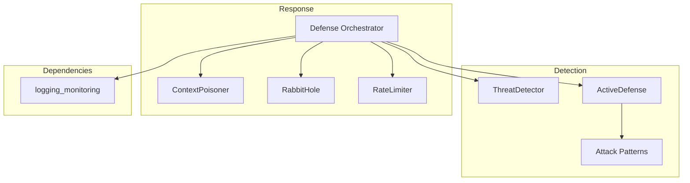

# defense - Functional Specification

**Version**: v1.1.0 | **Status**: Active | **Last Updated**: March 2026

## Purpose

The `defense` module implements "Fiduciary Defense" capabilities for Secure Cognitive Agents. It actively monitors for general and cognitive exploits (jailbreaks, prompt injections, social engineering) and responds with active countermeasures including rate limiting, context poisoning, and attacker engagement via rabbit holes.

## Design Principles

### Modularity
- Pluggable detection backends (heuristic, ML-based, signature)
- Separate detection from response — countermeasures are independently configurable
- Clean interface between `ThreatDetector`, `ActiveDefense`, and `RabbitHole`

### Internal Coherence
- All defense activations are logged for audit
- Consistent threat-level classification across components
- Integration with logging and monitoring for coordinated response

### Parsimony
- Detection-first approach — never respond without confirmation
- Minimal false-positive surface area
- Proportional response to threat severity

## Architecture


```mermaid
graph TD
    subgraph "Detection"
        TD[ThreatDetector]
        AD[ActiveDefense]
        Patterns[Attack Patterns]
    end

    subgraph "Response"
        DEF[Defense Orchestrator]
        CP[ContextPoisoner]
        RH[RabbitHole]
        RL[RateLimiter]
    end

    subgraph "Dependencies"
        LOG[logging_monitoring]
    end

    AD --> Patterns
    DEF --> AD
    DEF --> TD
    DEF --> RL
    DEF --> CP
    DEF --> RH
    DEF --> LOG
```

## Functional Requirements

### Core Capabilities
1. **General Threat Detection**: Rule-based scanning for various threats via `ThreatDetector`.
2. **Exploit Detection**: Heuristic scanning for cognitive attack patterns via `ActiveDefense.detect_exploit()`.
3. **Context Poisoning**: Inject adversarial noise to disrupt attacker models via `ActiveDefense.poison_context()`.
4. **Rabbit Hole Containment**: Trap persistent attackers in simulated loops via `RabbitHole.engage()`.
5. **Rate Limiting**: Sliding-window rate limiting per source via `RateLimiter`.
6. **Unified Orchestration**: `Defense` class coordinates detection and automated response.

### Threat Classification
- `Severity`: INFO, LOW, MEDIUM, HIGH, CRITICAL.
- `ThreatLevel`: NONE, LOW, MEDIUM, HIGH, CRITICAL (for AI safety).

### Response Actions
- `LOG`: Only record the event.
- `THROTTLE`: Apply rate limiting or delay.
- `BLOCK`: Deny access to the source.
- `RABBITHOLE`: Divert source to the containment environment.
- `POISON`: Inject adversarial context to the response.

## Interface Contracts

### Defense API
```python
class Defense:
    def add_detection_rule(rule: DetectionRule) -> None
    def process_request(source: str, request: dict) -> tuple[bool, list[ThreatEvent]]
    def block_source(source: str) -> None
    def unblock_source(source: str) -> None
```

### ActiveDefense API
```python
class ActiveDefense:
    def detect_exploit(input_text: str) -> dict
    def classify_threat(input_text: str) -> ThreatLevel
    def poison_context(attacker_id: str, intensity: float) -> dict
    def create_honeytoken(label: str, context: str) -> str
    def check_honeytoken(text: str) -> list[str]
```

### RabbitHole API
```python
class RabbitHole:
    def engage(attacker_id: str) -> str
    def is_engaged(attacker_id: str) -> bool
    def release(attacker_id: str) -> None
    def generate_response(attacker_id: str, input_text: str) -> str
    async def stall(duration: float) -> None
```

## Navigation
- **Human Documentation**: [README.md](README.md)
- **Technical Documentation**: [AGENTS.md](AGENTS.md)
