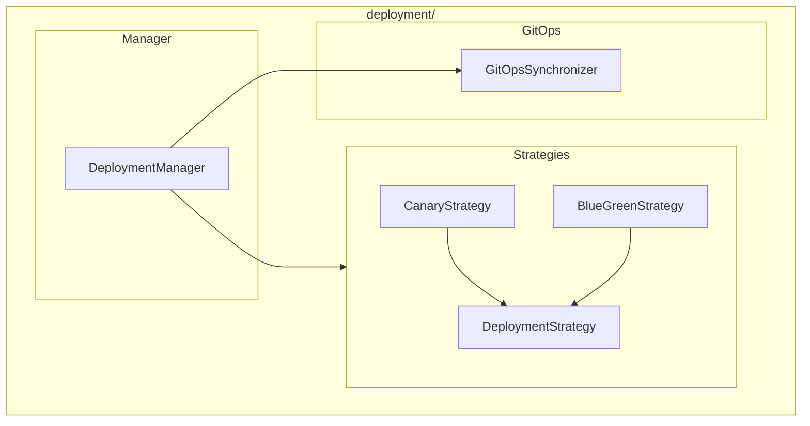

# Deployment Module

**Version**: v0.1.0 | **Status**: Active | **Last Updated**: January 2026

## Overview

The Deployment module provides deployment management, strategies, and GitOps capabilities for the Codomyrmex platform. It supports canary deployments, blue-green deployments, and GitOps synchronization.

## Architecture



## Key Classes

| Class | Purpose |
|-------|---------|
| `DeploymentManager` | Orchestrate deployments |
| `DeploymentStrategy` | Base strategy class |
| `CanaryStrategy` | Canary deployment |
| `BlueGreenStrategy` | Blue-green deployment |
| `GitOpsSynchronizer` | GitOps sync |

## Quick Start

### Canary Deployment

```python
from codomyrmex.deployment import DeploymentManager, CanaryStrategy

manager = DeploymentManager()

strategy = CanaryStrategy(
    initial_percentage=10,
    increment=20,
    interval_seconds=300
)

result = manager.deploy(
    artifact="app:v2.0",
    strategy=strategy,
    environment="production"
)
```

### Blue-Green Deployment

```python
from codomyrmex.deployment import BlueGreenStrategy

strategy = BlueGreenStrategy(
    health_check_interval=10,
    traffic_switch_delay=60
)

result = manager.deploy(
    artifact="app:v2.0",
    strategy=strategy
)
```

### GitOps Sync

```python
from codomyrmex.deployment import GitOpsSynchronizer

sync = GitOpsSynchronizer(
    repo="https://github.com/org/infra.git",
    branch="main",
    sync_interval=30
)

sync.start()
```

## Integration Points

- **ci_cd_automation**: Pipeline deployments
- **containerization**: Container deployments
- **git_operations**: GitOps integration

## Navigation

- **Parent**: [../README.md](../README.md)
- **Siblings**: [containerization](../containerization/), [ci_cd_automation](../ci_cd_automation/)
- **Spec**: [SPEC.md](SPEC.md)
