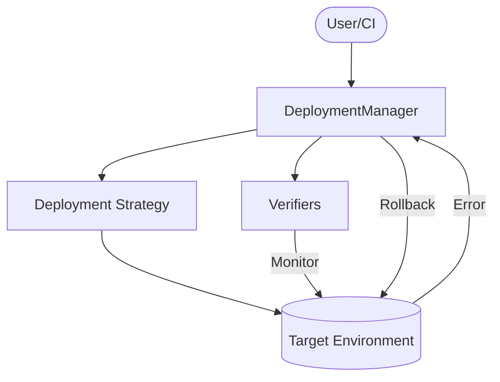

# deployment - Functional Specification

## Purpose

To enable robust, automated, and observable software and model deployments, reducing human error and downtime through standardized release strategies.

## Design Principles

- **Irreversibility Avoidance**: Every deployment action must be reversible.
- **Observability**: Real-time monitoring of deployment progress and health.
- **Automation**: Minimize manual intervention in standard release flows.
- **Provider Agnostic**: Core logic should work across different cloud/platform backends.

## Architecture

## Functional Requirements

- **Canary Releases**: Incremental traffic shifting to a new version.
- **Blue-Green**: Atomic cutover between two identical environments.
- **Rolling Updates**: Gradual replacement of instances.
- **Health Checks**: Automated verification (HTTP, metrics, logs).
- **GitOps Sync**: Automatic deployment based on repository changes via `GitOpsSynchronizer`.

## Interface Contracts

### `GitOpsSynchronizer`

- `sync(repo_url: str, branch: str, target_dir: str) -> bool`
- `get_current_revision() -> str`
- `is_synced() -> bool`

### `DeploymentManager`

- `deploy(service: str, version: str, strategy: Strategy) -> bool`
- `rollback(service: str) -> bool`
- `get_status(service: str) -> dict`

## Technical Constraints

- Requires integration with load balancers or service meshes for traffic shifting (simulated in core).
- Dependent on `networking` and `logging_monitoring` modules.
