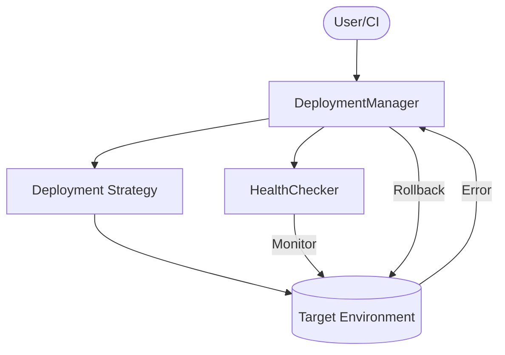

# deployment - Functional Specification

**Version**: v0.2.0 | **Status**: Active | **Last Updated**: March 2026

## Purpose

To enable robust, automated, and observable software and model deployments, reducing human error and downtime through standardized release strategies.

## Design Principles

- **Irreversibility Avoidance**: Every deployment action must be reversible via standardized `rollback()` methods.
- **Observability**: Real-time monitoring of deployment progress and health via `DeploymentResult` and health checks.
- **Automation**: Minimize manual intervention in standard release flows.
- **Provider Agnostic**: Core logic should work across different cloud/platform backends by abstracting the `deploy_fn`.

## Architecture


```mermaid
graph TD
    User([User/CI]) --> DM[DeploymentManager]
    DM --> Strat[Deployment Strategy]
    DM --> Ver[HealthChecker]
    Strat --> Env[(Target Environment)]
    Ver -->|Monitor| Env
    Env -->|Error| DM
    DM -->|Rollback| Env
```

## Functional Requirements

- **Canary Releases**: Incremental traffic shifting to a new version.
- **Blue-Green**: Atomic cutover between two identical environments.
- **Rolling Updates**: Gradual replacement of instances.
- **Health Checks**: Automated verification (HTTP, TCP, command, memory, disk).
- **GitOps Sync**: Automatic deployment based on repository changes via `GitOpsSynchronizer`.
- **Canary Analysis**: Automatic promotion/rollback decisions based on metric comparisons.

## Interface Contracts

### `GitOpsSynchronizer`

- `sync(branch: str = "main") -> bool`
- `get_version() -> str | None`
- `checkout(revision: str) -> bool`
- `is_dirty() -> bool`

### `DeploymentManager`

- `deploy(service_name: str, version: str, strategy: DeploymentStrategy | None = None, targets: list[DeploymentTarget] | None = None) -> DeploymentResult`
- `rollback(service_name: str, previous_version: str, strategy: DeploymentStrategy | None = None) -> DeploymentResult`
- `get_active_version(service_name: str) -> str | None`
- `summary() -> dict[str, Any]`

### `DeploymentStrategy` (Abstract)

- `deploy(targets: list[DeploymentTarget], version: str, deploy_fn: Callable) -> DeploymentResult`
- `rollback(targets: list[DeploymentTarget], previous_version: str, deploy_fn: Callable) -> DeploymentResult`

## Technical Constraints

- Requires integration with load balancers or service meshes for traffic shifting (simulated in core for blue-green and canary).
- Dependent on `logging_monitoring` module.

## Testing

```bash
uv run python -m pytest src/codomyrmex/tests/unit/deployment/ -v
```
