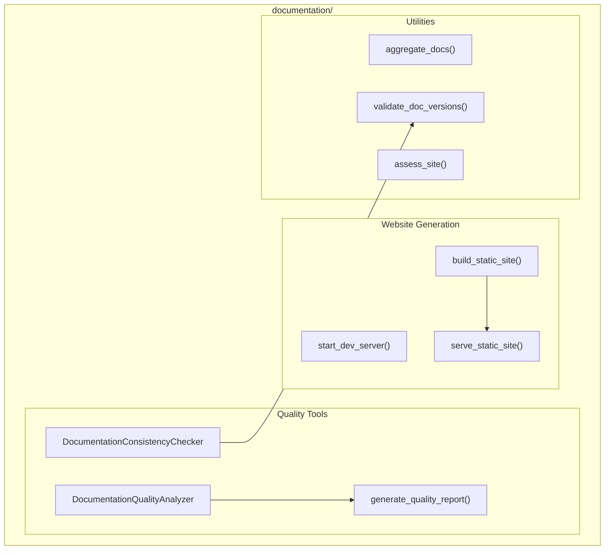

# Documentation Module

**Version**: v0.1.0 | **Status**: Active | **Last Updated**: January 2026

## Overview

The Documentation module provides documentation management, website generation, quality assessment, and consistency checking for the Codomyrmex project. It includes tools for building static documentation sites, validating documentation quality, and ensuring consistency across the codebase.

## Architecture



## Key Classes

| Class | Purpose |
|-------|---------|
| `DocumentationQualityAnalyzer` | Analyzes doc quality metrics |
| `DocumentationConsistencyChecker` | Checks for inconsistencies |

## Functions

| Function | Purpose |
|----------|---------|
| `check_doc_environment()` | Verify doc build dependencies |
| `install_dependencies()` | Install doc generation tools |
| `start_dev_server()` | Start live-reload dev server |
| `build_static_site()` | Build production static site |
| `serve_static_site()` | Serve built static site |
| `aggregate_docs()` | Collect docs from modules |
| `validate_doc_versions()` | Check version consistency |
| `assess_site()` | Run site quality assessment |
| `generate_quality_report()` | Generate quality report |
| `print_assessment_checklist()` | Print quality checklist |

## Quick Start

### Start Documentation Server

```python
from codomyrmex.documentation import check_doc_environment, start_dev_server

# Verify environment
if check_doc_environment():
    # Start live-reload development server
    start_dev_server(port=8000)
```

### Build Static Site

```python
from codomyrmex.documentation import build_static_site, serve_static_site

# Build production site
build_static_site(output_dir="docs/_build")

# Serve the built site
serve_static_site(port=8000)
```

### Quality Assessment

```python
from codomyrmex.documentation import (
    DocumentationQualityAnalyzer,
    generate_quality_report
)

analyzer = DocumentationQualityAnalyzer()
results = analyzer.analyze("docs/")

# Generate report
report = generate_quality_report(results)
print(report)
```

### Consistency Checking

```python
from codomyrmex.documentation import DocumentationConsistencyChecker

checker = DocumentationConsistencyChecker()
issues = checker.check("src/codomyrmex/")

for issue in issues:
    print(f"{issue.file}: {issue.message}")
```

### Aggregate Module Documentation

```python
from codomyrmex.documentation import aggregate_docs

# Collect all module docs into single location
aggregate_docs(
    source_dir="src/codomyrmex/",
    output_dir="docs/modules/",
    include_patterns=["README.md", "API_SPECIFICATION.md"]
)
```

## Integration Points

- **logging_monitoring**: Logging for all operations
- **environment_setup**: Dependency verification
- **templating**: Template rendering for doc generation

## Navigation

- **Parent**: [../README.md](../README.md)
- **Siblings**: [templating](../templating/), [website](../website/)
- **Spec**: [SPEC.md](SPEC.md)
