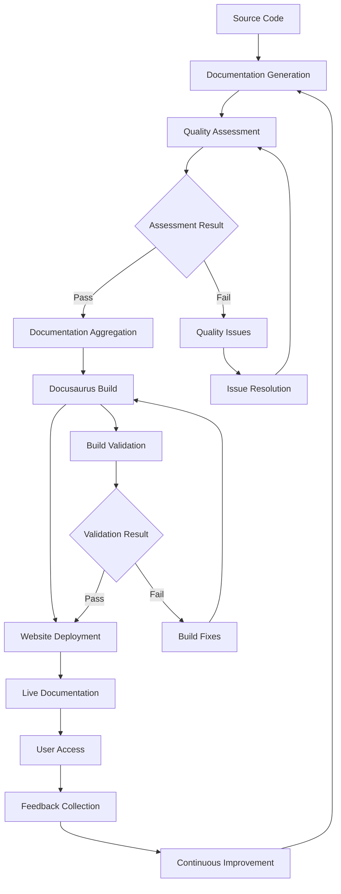
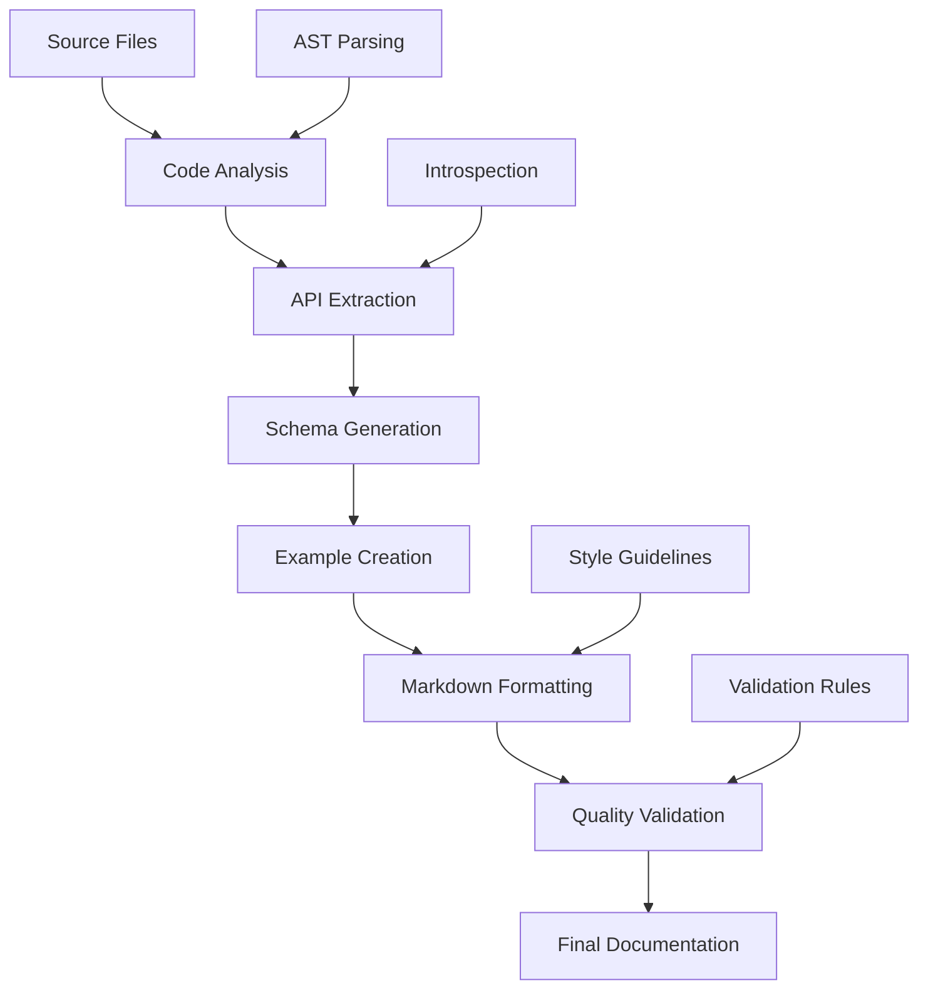
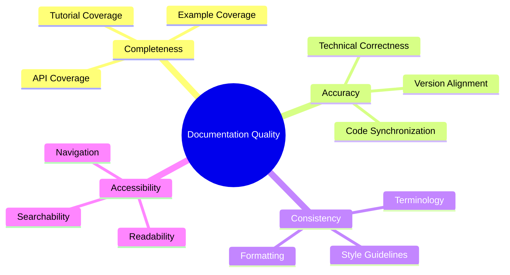
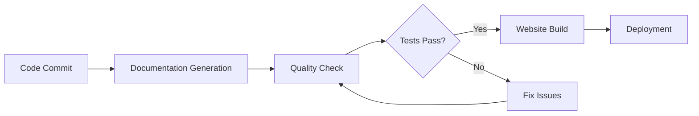

# Documentation Module

## Signposting
- **Parent**: [Parent](../README.md)
- **Children**:
    - [docs](docs/README.md)
    - [scripts](scripts/README.md)
    - [src](src/README.md)
    - [static](static/README.md)
    - [tests](tests/README.md)
- **Key Artifacts**:
    - [Agent Guide](AGENTS.md)
    - [Functional Spec](SPEC.md)

**Version**: v0.1.0 | **Status**: Active | **Last Updated**: December 2025

## Overview

Core Service Layer module providing documentation management, website generation, and quality assessment capabilities for the Codomyrmex platform. This module manages the project's documentation ecosystem, including Docusaurus-based website generation, documentation aggregation, and quality validation.

The documentation module serves as the knowledge management layer, ensuring consistent, accessible, and high-quality documentation across all platform components.

## Documentation Workflow



## Key Features

### Documentation Generation
- **Automated Extraction**: Code introspection for API documentation
- **Multi-format Support**: Markdown, HTML, and JSON output
- **Version Management**: Documentation versioning and history

### Website Management
- **Docusaurus Integration**: Modern documentation website generation
- **Responsive Design**: Mobile-friendly documentation interface
- **Search Functionality**: Full-text search across documentation

### Quality Assurance
- **Consistency Checking**: Cross-documentation consistency validation
- **Completeness Assessment**: Documentation coverage analysis
- **Link Validation**: Broken link detection and reporting

## Documentation Generation Process



## Usage Examples

### Documentation Generation
```python
from codomyrmex.documentation import generate_docs

# Generate API documentation
generate_docs(
    source_path="./src/codomyrmex/my_module",
    output_path="./docs/api",
    format="markdown"
)
```

### Documentation Aggregation
```python
from codomyrmex.documentation import aggregate_docs

# Aggregate module documentation
aggregate_docs(
    source_root="./src/codomyrmex",
    dest_root="./documentation/docs/modules"
)
```

### Quality Assessment
```python
from codomyrmex.documentation import assess_site

# Assess documentation quality
results = assess_site()
print(f"Overall quality score: {results['score']}")
for issue in results['issues']:
    print(f"- {issue['severity']}: {issue['message']}")
```

### Website Development
```python
from codomyrmex.documentation import start_dev_server, build_static_site

# Start development server
start_dev_server()

# Build for production
build_static_site()

# Serve built site
from codomyrmex.documentation import serve_static_site
serve_static_site()
```

## Module Architecture

### Core Components

#### DocumentationWebsite
Docusaurus website management and build orchestration
- Development server management
- Production build generation
- Static site serving

#### ConsistencyChecker
Documentation consistency validation and reporting
- Cross-reference validation
- Naming convention checking
- Style guide enforcement

#### QualityAssessment
Documentation quality metrics and analysis
- Completeness scoring
- Readability assessment
- Technical accuracy validation

### Documentation Structure

```
documentation/
├── docs/                    # Docusaurus content
│   ├── modules/            # Module documentation
│   ├── development/        # Development guides
│   ├── deployment/         # Deployment docs
│   └── integration/        # Integration guides
├── src/                    # Docusaurus React components
├── static/                 # Static assets
├── scripts/                # Maintenance scripts
├── documentation_website.py # Website management
├── consistency_checker.py   # Quality validation
├── quality_assessment.py    # Quality metrics
└── docusaurus.config.js    # Docusaurus configuration
```

## Quality Assessment Framework

### Documentation Quality Metrics



### Quality Gates
- **Completeness**: >90% API documentation coverage
- **Accuracy**: <5% technical errors
- **Consistency**: >95% style guideline compliance
- **Accessibility**: WCAG 2.1 AA compliance

## Integration Points

### Development Workflow


### CI/CD Integration
- **Automated Generation**: Documentation generated on each commit
- **Quality Gates**: Documentation quality checks in pipelines
- **Deployment**: Website deployment on successful builds
- **Notification**: Quality issue alerts to maintainers

## Configuration

### Docusaurus Configuration
```javascript
// docusaurus.config.js
module.exports = {
  title: 'Codomyrmex Documentation',
  tagline: 'AI-Powered Development Platform',
  url: 'https://docs.codomyrmex.dev',
  baseUrl: '/',
  onBrokenLinks: 'throw',
  onBrokenMarkdownLinks: 'warn',
  favicon: 'img/favicon.ico',
  organizationName: 'codomyrmex',
  projectName: 'codomyrmex',
  presets: [
    [
      'classic',
      {
        docs: {
          sidebarPath: require.resolve('./sidebars.js'),
          editUrl: 'https://github.com/codomyrmex/codomyrmex/edit/main/documentation/',
        },
        theme: {
          customCss: require.resolve('./src/css/custom.css'),
        },
      },
    ],
  ],
};
```

### Quality Assessment Configuration
```python
quality_config = {
    "completeness_threshold": 0.9,
    "accuracy_threshold": 0.95,
    "consistency_checks": [
        "naming_conventions",
        "terminology_consistency",
        "formatting_standards"
    ],
    "accessibility_checks": [
        "readability_score",
        "navigation_structure",
        "link_validity"
    ]
}
```

## Content Management

### Documentation Sources
- **Code Comments**: Extracted API documentation from docstrings
- **Markdown Files**: Manually written guides and tutorials
- **Generated Content**: Automatically created reference documentation
- **External Sources**: Integrated third-party documentation

### Content Organization
- **Modules**: Per-module documentation structure
- **Development**: Development workflow and contribution guides
- **Deployment**: Installation and deployment instructions
- **Integration**: Third-party integration guides

## Maintenance Scripts

### Documentation Scripts
```bash
# Generate API documentation
python -m codomyrmex.documentation generate-api-docs

# Validate documentation quality
python -m codomyrmex.documentation validate-quality

# Build and serve documentation website
python -m codomyrmex.documentation build-and-serve

# Check for broken links
python -m codomyrmex.documentation check-links
```

### Quality Assessment Scripts
```bash
# Run quality assessment
python scripts/validate_docs_quality.py

# Generate quality report
python scripts/generate_quality_report.py

# Check documentation consistency
python scripts/check_docs_consistency.py
```

## Performance Optimization

### Build Optimization
- **Incremental Builds**: Only rebuild changed documentation
- **Caching**: Cache expensive generation operations
- **Parallel Processing**: Concurrent documentation generation

### Content Delivery
- **CDN Integration**: Fast global content delivery
- **Compression**: Optimized asset compression
- **Lazy Loading**: Progressive content loading

## Security Considerations

### Content Security
- **Input Validation**: Sanitize generated documentation content
- **XSS Prevention**: Safe HTML generation and rendering
- **Access Control**: Documentation access permissions

### Build Security
- **Dependency Scanning**: Vulnerable dependency detection
- **Build Isolation**: Sandboxed documentation generation
- **Credential Protection**: Secure API key and credential handling

## Contributing

### Documentation Standards
1. **Clear Structure**: Logical organization and navigation
2. **Consistent Style**: Follow established style guidelines
3. **Complete Coverage**: Comprehensive topic coverage
4. **Regular Updates**: Keep documentation current with code changes

### Content Guidelines
- **Audience Awareness**: Write for the target audience
- **Practical Examples**: Include working code examples
- **Progressive Disclosure**: Start simple, provide additional details
- **Cross-References**: Link related documentation sections

### Review Process
1. **Technical Review**: Verify technical accuracy
2. **Style Review**: Check style and consistency
3. **Quality Assessment**: Run automated quality checks
4. **User Testing**: Validate with actual users

## Troubleshooting

### Common Issues

#### Build Failures
```
Error: Docusaurus build failed
Solution: Check Node.js version and dependencies
```

#### Link Validation Errors
```
Error: Broken internal links detected
Solution: Run link validation script and fix broken references
```

#### Quality Assessment Failures
```
Error: Documentation quality below threshold
Solution: Address quality issues and re-run assessment
```

## Related Documentation

- **[API Specification](API_SPECIFICATION.md)** - Complete API reference
- **[Usage Examples](USAGE_EXAMPLES.md)** - Practical implementation examples
- **[Quality Assessment](coverage_assessment.md)** - Quality metrics and reports
- **[Bug Taxonomy](bug_taxonomy.md)** - Documentation issue classification

## Navigation
- **Project Root**: [README](../../../README.md)
- **Parent Directory**: [codomyrmex](../README.md)
- **Src Hub**: [src](../../../src/README.md)
- **Live Documentation**: [Website](https://docs.codomyrmex.dev)