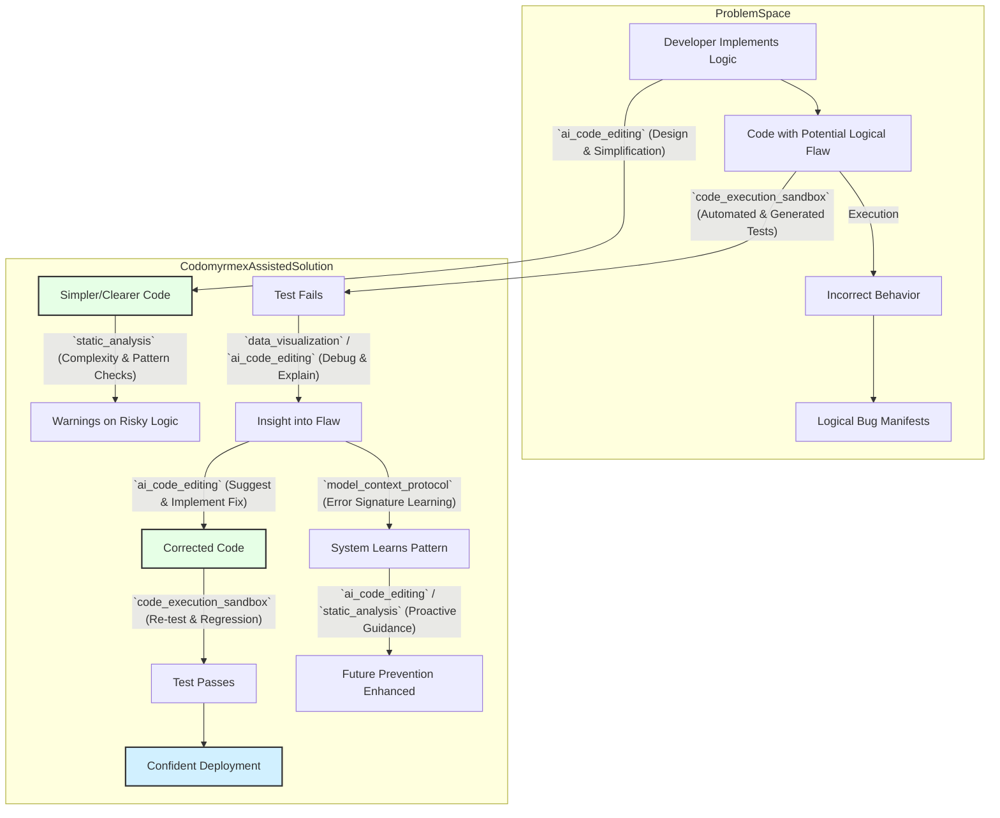
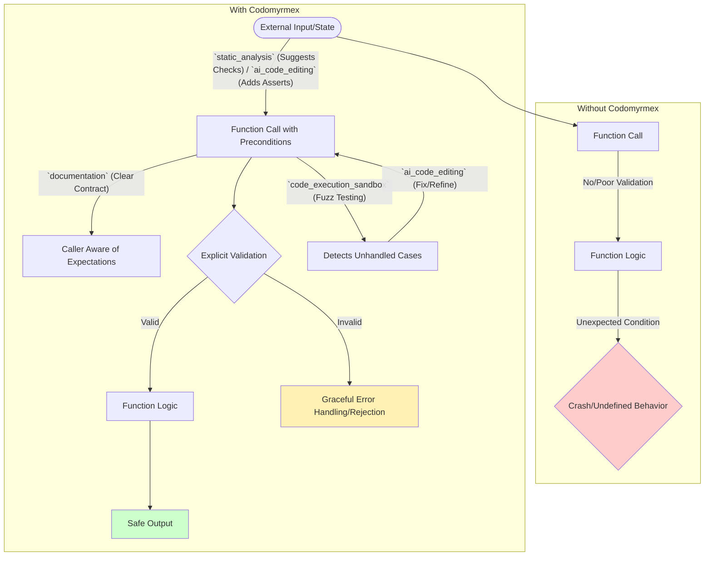
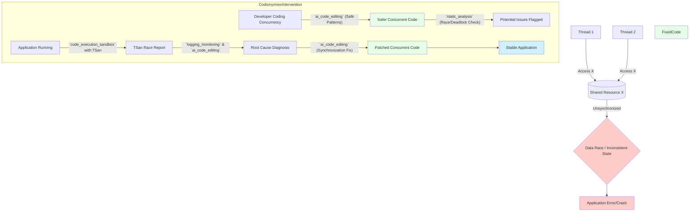

# A Taxonomy of Bugs and Codomyrmex's Comprehensive Approach

*Adapted from "A Taxonomy of Bugs" by Niklas Gray, Our Machinery, Apr 8, 2022. Original article: [https://ruby0x1.github.io/machinery_blog_archive/post/a-taxonomy-of-bugs/index.html](https://ruby0x1.github.io/machinery_blog_archive/post/a-taxonomy-of-bugs/index.html)*

This document explores common software bug categories and details how the `codomyrmex` ecosystem provides a comprehensive suite of tools and methodologies to prevent, detect, fix, and learn from these bugs, ultimately catalyzing software quality and robustness.

---

Debugging is often an undervalued skill. It's not really taught in schools (as far as I know), instead, you kind of have to pick it up as you go along. Today, I'll try to remedy that by looking at some common bugs and what to do about them.

The default strategy I use with any bug is to:

1. Try to find a way of reliably reproducing the bug so that I can
2. break into the debugger when the bug happens and
3. step through the code line by line to
4. see how what it _is_ doing differs from what I _think_ it should be doing.

Once you understand how the code's _actual_ behavior differs from your _mental model_ of its behavior, it is typically easy to identify the problem and fix it.

I know that there are some very successful programmers that don't really use debuggers but instead rely completely on `printf()` and logging. But I don't really understand _how_ they do it. Trying to understand what the code is doing by inserting one `printf()` at a time and then re-running the tests seems so much more inefficient than using a debugger. If you've never really used a debugger (I know, they don't teach these things in school), I suggest you try it! Get comfortable with stepping through the code and examining what it does.

Of course, there are some situations where you _can't_ capture the bug in the debugger and have to resort to other methods, but we'll get to that later, so let's get started.

---

## The Typo

Unlike most other bugs, the _Typo_ is not caused by any flawed reasoning. You had the right idea, you just happened to type something else. Luckily, most typos are caught by the compiler, but sometimes your boo-boos compile:

```c
if (set_x)
   pos.x = new_pos.x;
if (set_y)
   pos.x = new_pos.y;
if (set_y)
   pos.z = new_pos.z;
```

Once you _see_ them, typos are trivial to fix. The hard part is seeing them in the first place.

Typos can be hard to spot because just as when you read text with spelling errors, your brain auto-corrects the code as you read it. To be good at proofreading, you have to force your brain to go into a different mode where it focuses more on the _text itself_ than the _meaning of the text_. This can be tricky, but you get better with practice.

If you can't spot the typo just from reading the code, you can switch to our default debugging method — stepping through the code line by line and checking that each line does what you expect it to.

How can you prevent typos? It might seem that there is nothing you can do. Your brain will just glitch every once in a while and there is nothing you can do to stop it.

I don't believe in such fatalism. Instead, I subscribe to the philosophy of _continuous small improvements_. The goal is not to be perfect, the goal is to do a little better each day and over time the accumulation of all those small improvements will add up to big gains.

So let's try again. _How can you make typos a little less likely?_

First, you should enable as many compiler warnings as possible and also tell the compiler to treat warnings as errors. The goal is to have the compiler detect as many typos as possible so that you can fix them before they turn into actual bugs.

A warning that makes a big difference for me is `-Wshadow`. `-Wshadow` makes it an error to reuse a variable name in a sub-scope. This prevents stupid mistakes like:

```c
int test = x;
{
   int test = f();
   g(test); // <-- Meant to use `test` from outer scope.
}
```

Before I enabled `-Wshadow`, I made a lot of these mistakes. Mostly with very generic variable names, such as `i` or `x`.

Second, use a source code formatter and run all your source code through it. We use`clang-format` and run it automatically on _Save_ and `git commit`. The source code formatter can sometimes reveal typos. For example, if you type this:

```c
if (x > max);
  max = x;
```

the source code formatter will change it to:

```c
if (x > max)
    ;
max = x;
```

Which makes the bug more obvious.

Another thing you can do is to write things in a way that produces fewer typos. For example, I used to write for-loops like this:

```c
for (uint32_t i=0; i<tm_carray_size(items); ++i) {
   child_t *children = get_children(items[i]);
   for (uint32_t j=0; j<tm_carray_size(children); ++j)
    ...
}
```

However, I noticed that this would often result in typos where I would write `children[i]` instead of `children[j]`. So I started changing to:

```c
for (uint32_t item_i=0; item_i<tm_carray_size(items); ++item_i) {
   child_t *children = get_children(items[item_i]);
   for (uint32_t child_i=0; child_i<tm_carray_size(children); ++child_i)
    ...
}
```

With this, I'm much less likely to write `children[item_i]`. These days, I've switched to just iterating over the pointers instead:

```c
for (const item_t *i = items, *ie = tm_carray_end(items); i != ie; ++i) {
   child_t *children = get_children(*i);
    for (const child_t *c = children, *ce = tm_carray_end(children); c != ce; ++c)
      ...
}
```

Since `i` and `c` now have different types, it is impossible to confuse them. And if I would accidentally write `*ce = tm_carray_end(items)` this would also give a compile error.

Everybody makes different typos, so find defensive strategies that work with the kind of typos you usually make. A general tip is to use const for variables that don't change:

```c
const uint32_t n = tm_carray_size(items);
```

This prevents you from accidentally changing the variable later.

Finally, a pretty common source of typos for me is when I copy-paste some code but don't patch it up correctly. The first code snippet above is an example of that:

```c
if (set_x)
   pos.x = new_pos.x;
if (set_y)
   pos.x = new_pos.y;
if (set_y)
   pos.z = new_pos.z;
```

I copy-pasted the first two lines and then forgot to change one of the `x` to an `y`. But I don't want to _stop_ copy-pasting, it saves a lot of time. I'm also not sure that hand-typing repetitive code would really reduce the error rate.

I've found two things that help with this. The first is the multi-select feature that is available in many modern code editors, such as VS Code. Using that, I would first paste the code and then multi-select all three `x`s by selecting the first one and pressing `Ctrl-D` repeatedly until they all are selected and then finally change them all to `y` with a single keystroke.

The second is Copilot, the AI-assisted auto-completion technology from GitHub. Copilot is _great_ at recognizing repetitive programming patterns like this and I find that having Copilot autofill in the code is _less_ error-prone than copy-pasting and tidying it up by hand. I'm not willing to let an AI drive my car just yet, but I'm willing to have it write my repetitive code for me. If you haven't tried out Copilot yet, I suggest you do.

### Codomyrmex's Role in Addressing Typos

Codomyrmex employs a synergistic combination of its modules to proactively and reactively manage typos, enhancing code quality and developer productivity.

**Prevention:**
*   **`static_analysis` & Linting:** Codomyrmex integrates powerful static analysis tools and linters configured with strict rules (e.g., equivalent of `-Wshadow`, project-specific naming conventions). This module automatically flags potential typos, inconsistent formatting, and shadowed variables before they become bugs. It can enforce the use of code formatters like `clang-format`.
*   **`ai_code_editing`:** This module acts as an intelligent co-pilot, offering context-aware code completion and generation. It significantly reduces manual typing, thereby minimizing opportunities for typos. For repetitive patterns where copy-paste errors are common, `ai_code_editing` can generate the correct code variations, understanding the semantic differences required (e.g., changing `x` to `y` and `z` in the example `pos.x = new_pos.x; pos.x = new_pos.y; pos.x = new_pos.z;`). It can also implement multi-select-like refactoring for systematic changes.
*   **`pattern_matching`:** Codomyrmex allows defining and enforcing project-specific coding patterns and anti-patterns. This helps guide developers towards writing code that is less prone to typos, for instance, by preferring iterators with distinct types over indexed loops where index variables might be mixed up.
*   **`git_operations`:** Integrates these checks into pre-commit hooks, ensuring that code with obvious typos or formatting issues doesn't enter the main codebase.

**Detection:**
*   **Advanced Static Analysis:** Beyond simple linting, `static_analysis` can perform deeper semantic checks. For example, it might flag `pos.x = new_pos.y;` if it detects that `new_pos.y` is usually assigned to `pos.y` in similar contexts, suggesting a likely typo.
*   **`ai_code_editing` Review:** Can be invoked to review code snippets or entire files, using its understanding of common error patterns and the project's conventions to spot subtle typos that compilers might miss but still result in incorrect logic.

**Fixing:**
*   **`ai_code_editing`:** Offers intelligent, one-click suggestions to fix identified typos. If a typo is ambiguous, it can present a few likely corrections based on context. It can also automate the "patching up" process after a copy-paste, ensuring all necessary modifications are made.
*   **Automated Refactoring:** For typos that indicate a more systematic error (e.g., consistently using a wrong variable), `ai_code_editing` can suggest or perform refactoring.

**Catalyzing Improvement:**
*   **Feedback Loop to `static_analysis`:** Codomyrmex can (with user consent) learn from typos corrected by developers or `ai_code_editing`. If certain types of typos are common in a project, new custom linting rules can be suggested or automatically added to `static_analysis`.
*   **`documentation` & Style Guides:** Insights from common typos can inform the evolution of project coding standards and documentation, managed and versioned within the `documentation` module.
*   **`build_synthesis`:** Ensures that all typo detection mechanisms are consistently applied across all development and CI environments.

**Securing Against:**
*   **Reduced Error Surface:** By minimizing typos, especially those that might lead to logical flaws or incorrect data handling (e.g., assigning to the wrong variable), Codomyrmex reduces the potential attack surface that could be exploited.
*   **Enforced Best Practices:** Consistent application of formatters and linters (via `static_analysis` and `git_operations`) makes the code easier to review for security vulnerabilities, as reviewers are not distracted by superficial errors.

#### Summary Table: Codomyrmex and Typos

| Aspect                 | Codomyrmex Modules/Features                                                     | Description                                                                                                                                    |
|------------------------|---------------------------------------------------------------------------------|------------------------------------------------------------------------------------------------------------------------------------------------|
| Prevention             | `static_analysis`, `ai_code_editing`, `pattern_matching`, `git_operations`      | Automated checks, intelligent code generation, pattern enforcement, pre-commit hooks.                                                            |
| Detection              | `static_analysis`, `ai_code_editing`                                            | Advanced semantic analysis, AI-powered code review.                                                                                              |
| Fixing                 | `ai_code_editing`                                                               | Intelligent suggestions, automated corrections, refactoring support.                                                                             |
| Catalyzing Improvement | `static_analysis` (custom rules), `documentation`, `build_synthesis`, `model_context_protocol` | Learning from mistakes, evolving standards, consistent enforcement, building better code understanding.                                        |
| Securing Against       | `static_analysis`, `git_operations`, `ai_code_editing`                          | Reducing error-prone code, ensuring easier security reviews, and preventing typos in security-critical code.                                     |

#### Illustrative Diagram: Typo Lifecycle and Codomyrmex

```mermaid
graph TD
    subgraph Traditional Workflow
        A[Developer Writes Code] -->|Typing/Copy-Paste| B(Potential Typo);
        B -->|Compiler/Linter Miss| C{Typo Persists};
        C -->|Logic Error/Bug| D[Runtime Issue];
    end

    subgraph Codomyrmex Enhanced Workflow
        A1[Developer Writes Code with `ai_code_editing`] -->|AI Assistance & Auto-completion| B1(Reduced Typo Chance);
        B1 -- `static_analysis` (Linting/Formatting) --> F1{Typo Caught Early};
        F1 -- `ai_code_editing` (Auto-fix/Suggest) --> G1[Typo Fixed];
        B1 -->|If typo slips past initial generation| C1(Potential Typo in Review);
        C1 -- `static_analysis` (Deeper Semantic Checks) / `ai_code_editing` (Review Mode) --> F1;
        G1 --> H1[Clean Code];
        H1 -- `git_operations` (Pre-commit Hook) --> I1[Verified Code in VCS];
        I1 -- `build_synthesis` (CI Check) --> J1[Robust Build];
    end

    style A1 fill:#e6ffe6,stroke:#333,stroke-width:2px
    style F1 fill:#ffe6e6,stroke:#333,stroke-width:2px
    style G1 fill:#e6ffe6,stroke:#333,stroke-width:2px
    style J1 fill:#d1f0ff,stroke:#333,stroke-width:2px
```



---

## The Logical Error

The _Logical Error_ is perhaps the thing you mostly think of when you think _bug_. A logical error occurs when the code you wrote doesn't actually do the thing you meant for it to do.

A common example is the _off-by-one_ error, where you do one thing more or one thing less than you should. For example, this code for removing an item from an array:

```c
memmove(arr + i, arr + i + 1, (num_items - i) * sizeof(*arr));
--num_items;
```

The nice thing about logical errors is that once you have a repro case it tends to be 100 % reproducible because the code behaves the same every time. So you can usually figure out what's going on by stepping through the code.

To reduce the risk of logical errors, the first thing you can do is to simplify your expressions. The simpler and easier the code is to read, the smaller is the chance that you'll get confused about the logic.

Another thing that helps is to reduce the number of possible paths through the code. I.e. instead of something like this:

```c
// Fast path for removing the last item in the array.
if (i == num_items - 1)
   --num_items;
else {
   --num_items;
   memmove(arr + i, arr + i + 1, (num_items - i) * sizeof(*arr));
}
```

just call the `memmove()` every time and count on the fact that a `memmove()` of zero bytes will still be pretty fast.

Why? Well, to begin with, having less code means a smaller risk for bugs. But more importantly, if you have code paths that only occasionally get exercised, they won't get as much testing as the rest of the code. A bug could hide there and sneak past your quick tests only to blow up in production.

In general, strive for linear code — code that progresses in a logical fashion from one line to the next, that you can read as a coherent story instead of having to jump around in the code a lot to understand what is going on.

Another thing that can help is to use standard idioms. For example, if you need to erase items a lot, you can introduce a macro for it:

```c
#define array_erase_item(a, i, n) \
    (memmove((a) + (i), (a) + (i) + 1, ((n) - (i) - 1) * sizeof(*(a)), --(n))
```

Now if there is a logic error, the error will be in a single place and can be fixed more easily.

### Codomyrmex's Role in Addressing Logical Errors

Logical errors, where the code is syntactically correct but behaves incorrectly, are a prime target for Codomyrmex's advanced analysis and code intelligence capabilities.

**Prevention:**
*   **`ai_code_editing` for Clarity and Simplicity:** Guides developers towards writing simpler, more linear code by suggesting refactorings for complex expressions or convoluted control flows. It can also propose the use of well-understood standard idioms and design patterns, reducing the cognitive load and likelihood of logical missteps. For instance, it can help transform complex conditional blocks into simpler, more readable structures or suggest extracting logic into well-defined functions.
*   **`static_analysis` for Early Detection:** Identifies overly complex code sections (e.g., high cyclomatic complexity) that are prone to logical errors. It can also use pattern matching to flag common logical pitfalls, such as potential off-by-one errors in loops, incorrect boolean logic, or misuse of operators.
*   **`pattern_matching` for Idiom Enforcement:** Allows defining and enforcing project-specific idioms and design patterns that have been vetted for correctness. This ensures that common operations are performed in a consistent and logically sound manner, reducing the chance of reinventing the wheel incorrectly.
*   **`documentation` Generation & Validation:** `ai_code_editing` can assist in generating documentation (e.g., function contracts, pre/post conditions, invariants) from the code's intent. `static_analysis` can then check if the code adheres to these documented contracts, flagging discrepancies that might indicate logical flaws.

**Detection:**
*   **`code_execution_sandbox` with `data_visualization`:** Facilitates the creation and execution of comprehensive unit and integration tests. `data_visualization` tools can then be used to inspect program states, variable values, and execution paths, making it easier to pinpoint where the actual behavior diverges from the expected logic. Codomyrmex can help generate test cases that specifically target boundary conditions where logical errors often lurk.
*   **AI-Assisted Debugging (`ai_code_editing` & `model_context_protocol`):** Codomyrmex can provide an "AI debugger" that explains code execution step-by-step, predicts variable states, and highlights deviations from inferred or documented intent. The `model_context_protocol` ensures this AI has a deep understanding of the entire codebase's context, allowing it to reason about complex interactions.
*   **Symbolic Execution (`static_analysis` - advanced):** For critical sections, Codomyrmex can employ symbolic execution techniques to explore multiple execution paths without concrete inputs, potentially uncovering logical flaws that specific test cases might miss.

**Fixing:**
*   **`ai_code_editing` for Targeted Corrections:** Based on its understanding of the intended logic (derived from context, documentation, or failed tests), `ai_code_editing` can suggest specific code changes to rectify logical errors. This could range from correcting a boolean condition to refactoring a complex algorithm, or even suggesting alternative approaches.
*   **Test-Driven Refactoring:** If a logical error is caught by a test, `ai_code_editing` can assist in refactoring the code to pass the test while ensuring other functionalities remain intact, guided by the `code_execution_sandbox` for continuous validation.

**Catalyzing Improvement:**
*   **`model_context_protocol` Knowledge Base Growth:** Each identified and fixed logical error enriches Codomyrmex's understanding of common pitfalls within the project or domain. This knowledge is used by `ai_code_editing` and `static_analysis` to provide better preventative advice in the future.
*   **Automated Test Case Generation (`ai_code_editing` & `code_execution_sandbox`):** After fixing a logical bug, Codomyrmex can suggest or auto-generate new test cases that specifically target the type of error found and related edge cases, improving future regression testing.
*   **Refinement of Coding Standards (`documentation`):** Patterns of logical errors can lead to refinements in project coding standards, emphasizing clarity, simplicity, and the use of verified idioms. These updated standards are maintained and disseminated via the `documentation` module.

**Securing Against:**
*   **Validating Business Logic:** Logical errors in security-critical components (e.g., authentication, authorization, input validation, transaction processing) can lead to severe vulnerabilities. Codomyrmex's rigorous detection and fixing mechanisms help ensure this logic is sound and resilient against manipulation.
*   **Preventing Unintended State Changes:** By helping to ensure code behaves as intended, Codomyrmex reduces the risk of the system entering an unexpected and potentially insecure state that could be exploited.
*   **Formal Verification Approaches:** For highly sensitive logic, `static_analysis` in conjunction with `model_context_protocol` can explore pathways towards integrating or suggesting formal verification techniques.

#### Summary Table: Codomyrmex and Logical Errors

| Aspect                 | Codomyrmex Modules/Features                                                                 | Description                                                                                                                               |
|------------------------|---------------------------------------------------------------------------------------------|-------------------------------------------------------------------------------------------------------------------------------------------|
| Prevention             | `ai_code_editing`, `static_analysis`, `pattern_matching`, `documentation`                     | Promotes simple/clear code, detects complexity, enforces idioms, validates against contracts.                                             |
| Detection              | `code_execution_sandbox`, `data_visualization`, `ai_code_editing`, `model_context_protocol`, `static_analysis` (symbolic execution) | Comprehensive test execution, state visualization, AI-assisted debugging, symbolic analysis.                                                              |
| Fixing                 | `ai_code_editing`, `code_execution_sandbox`                                                 | Intelligent corrections, test-driven refactoring, alternative algorithmic suggestions.                                                      |
| Catalyzing Improvement | `model_context_protocol`, `ai_code_editing`, `code_execution_sandbox`, `documentation`        | Knowledge base growth, automated test generation for edge cases, refinement of coding standards.                                            |
| Securing Against       | All above, esp. in security logic; `static_analysis` (formal methods exploration)           | Ensuring correctness of critical business logic, preventing unintended states, exploring deeper verification.                                 |

#### Illustrative Diagram: Logical Error Debugging Flow with Codomyrmex



---

## The Unexpected Initial Condition

Another possibility is that your logic is flawless, but your code still fails, because the initial state of the data was one you didn't expect. I.e., if the data had been in the state you had expected, everything would have worked out fine, but since it wasn't, the algorithm failed:

```c
flag_t flags[MAX_FLAGS];
uint32_t num_flags;

void add_flag(flag_t flag) {
    flags[num_flags++] = flag;
}
```

The code above works well under the assumption that `num_flags < MAX_FLAGS`, but otherwise it will write beyond the end of the array.

Does this mean that the code should be rewritten to use dynamically allocated memory to remove the `MAX_FLAGS` limit? No, not necessarily. It is perfectly fine to have limits in what you support, in fact, all code does. If you switched to a dynamically allocated array, the code would still fail if you had more than `UINT32_MAX` flags. And if you changed `num_flags` to an `uint64_t` or some kind of "bignum" you would still eventually run out of memory at some point.

If you don't ever expect to have more than a handful of flags, it is perfectly fine to have a `MAX_FLAGS` of 32 or something similar.

The best way of dealing with unexpected initial conditions is to make your expectations explicit. Some languages have facilities for this built into the language in the form of preconditions that you can specify for a function. In C, the best way is through an `assert`:

```c
flag_t flags[MAX_FLAGS];
uint32_t num_flags;

void add_flag(flag_t flag) {
    assert(num_flags < MAX_FLAGS);
    flags[num_flags++] = flag;
}
```

Sometimes it can be unclear who is responsible for the bad initial condition. Is it the fault of the function for not handling that special case or is it the fault of the caller for sending the function bad data? Clearly documenting the acceptable initial conditions and adding asserts to detect them puts the responsibility on the caller.

### Codomyrmex's Role in Addressing Unexpected Initial Conditions

Codomyrmex helps ensure that code is resilient to or explicit about its operating conditions, preventing failures due to unhandled states.

**Prevention:**
*   **`static_analysis` for Precondition/Invariant Detection:** Analyzes code to identify implicit preconditions or invariants. It can flag functions where inputs are used without prior validation or where state assumptions are not explicitly checked (e.g., missing `asserts` or null checks).
*   **`ai_code_editing` for Assertions and Checks:** Actively suggests adding assertions, precondition checks, and null-pointer checks based on variable usage, function signatures, and common error patterns. It can also help define and implement robust error handling for states that fall outside expected norms.
*   **`documentation` for Explicit Contracts:** Assists in clearly documenting function contracts, including preconditions, postconditions, and invariants. This makes expectations explicit for both human developers and Codomyrmex's analysis tools.
*   **`pattern_matching` for Defensive Coding:** Enforces defensive coding patterns, such as always validating inputs from external sources or ensuring state consistency before operations.

**Detection:**
*   **`code_execution_sandbox` for Robustness Testing:** Facilitates fuzz testing and property-based testing, where functions are called with a wide range of inputs, including unexpected, malformed, or boundary-value data. This can trigger assertions or reveal crashes due to unhandled initial conditions.
*   **`logging_monitoring` for Runtime Anomalies:** Integrates with runtime monitoring to capture assertion failures, exceptions, and unexpected states in development, staging, and production environments. Detailed context is logged to aid diagnosis.
*   **`data_visualization` of State Space:** Can help visualize the state space explored by tests, highlighting areas that are not covered or states that lead to failures.

**Fixing:**
*   **`ai_code_editing` for Robust Error Handling:** Helps rewrite code to gracefully handle unexpected initial conditions, either by adding explicit checks and alternative code paths, or by strengthening input validation at the source.
*   **`ai_code_editing` for Contract Refinement:** If an assertion fires due to a legitimate but unhandled state, `ai_code_editing` can help update the function's contract (and code) to correctly accommodate this new scenario or clarify why it's out of scope.

**Catalyzing Improvement:**
*   **Feedback to Test Generation:** Failures due to unexpected conditions inform `ai_code_editing` and `code_execution_sandbox` to generate more targeted test cases that cover these scenarios, improving the thoroughness of future testing.
*   **API Design Refinement:** Frequent issues with unexpected initial conditions for a particular API can signal a design flaw. `model_context_protocol` can highlight such patterns, leading to API redesigns that are less prone to misuse or easier to use correctly.
*   **Enhanced Static Analysis Rules:** Patterns of assertion failures can be generalized into new `static_analysis` rules to proactively catch similar issues.

**Securing Against:**
*   **Input Validation:** Many security vulnerabilities (e.g., buffer overflows, injection attacks) stem from unexpected or malicious input. Codomyrmex's focus on explicit conditions and robust validation is critical for security.
*   **State Management Integrity:** Ensuring that components operate only within their expected state parameters prevents exploits that rely on forcing a system into an undefined or vulnerable state.
*   **Fail-Safe Mechanisms:** Codomyrmex encourages designing systems that fail safely when encountering totally unexpected conditions, rather than crashing or producing exploitable behavior.

#### Summary Table: Codomyrmex and Unexpected Initial Conditions

| Aspect                 | Codomyrmex Modules/Features                                                                 | Description                                                                                                                                  |
|------------------------|---------------------------------------------------------------------------------------------|----------------------------------------------------------------------------------------------------------------------------------------------|
| Prevention             | `static_analysis`, `ai_code_editing`, `documentation`, `pattern_matching`                     | Detects missing checks, suggests assertions, clarifies contracts, enforces defensive patterns.                                              |
| Detection              | `code_execution_sandbox` (fuzz/property testing), `logging_monitoring`, `data_visualization`| Robustness testing, runtime anomaly capture, state space visualization.                                                                        |
| Fixing                 | `ai_code_editing`                                                                           | Implements robust error handling, refines contracts and code to handle or reject unexpected states.                                            |
| Catalyzing Improvement | `ai_code_editing` (test gen), `model_context_protocol` (API design feedback), `static_analysis` (new rules) | Improved test suites, better API design, proactive static checks.                                                                     |
| Securing Against       | All above, esp. input validation and state integrity.                                       | Critical for preventing exploits based on malformed input or unexpected system states, promotes fail-safe design.                             |

#### Illustrative Diagram: Handling Unexpected Conditions



---

## The Memory Leak

A memory leak occurs when your code allocates memory that it never frees. Memory leaks are not the only leaks you have to worry about, code can also leak other things like threads, critical sections, or file handles. But memory leaks are byfar the most common ones, so let's focus on that. In C and C++, the standard way to allocate memory is to just call `malloc()` or `new` to get some memory from the system allocator. Many other languages have a similar approach where creating an object will allocate some memory from a global allocator.

Finding and fixing memory leaks in such setups is really hard. First, you typically don't even know that there's a memory leak until you completely run out of system memory or notice in the Task Manager that you are using gigabytes more than you expect. Smaller memory leaks will probably never be detected or fixed.

Second, to fix it, you need to find out who allocated memory that they never released. That is really hard because in the code, you just have a bunch of sprinkled `malloc()` and `free()` calls — how are you supposed to know where a `free()` is missing?

In languages with automated memory management — garbage collection or reference counting — this is less of a problem because in these languages the memory is automatically freed when there are no more references to it. However, this does not completely get rid of leaks. Instead, it will trade memory leaks for reference leaks, where someone holds a reference to something they should have let go of. This reference keeps the object alive, sometimes a whole tree of objects, wasting memory.

Reference leaks can be even harder to deal with than memory leaks. Manual memory management forces you to be explicit about who owns a piece of memory, so if that piece of memory doesn't get released, you will know who is at fault. With automatic memory management, there is no single designated owner, anyone can hold a reference that keeps the memory alive.

The best way of dealing with memory (and other resource) leaks is to add instrumentation to memory allocations. I.e., instead of calling `malloc()` directly, you call a wrapper function that lets you pass in some extra parameters. For example:

```c
item_t *p = my_malloc(sizeof(item_t), __FILE__, __LINE__);
```

`my_malloc()` can use this extra information to record all memory allocations: the size, pointer, file name, and line number where the allocation happened. A corresponding `my_free()` function can record all the `free()` calls. We can then dump all the calls to a log (or analyze them in some other way) to find memory leaks. If someone is allocating memory without freeing it, we can pinpoint the file name and line number where that happens which is usually enough to figure out the bug. Recording all the memory calls has a bit of overhead, so you might want to save that for special "Instrumental" builds, especially if you have lots of small memory allocations. (Which you should generally try to avoid.)

In The Machinery, we go one step further. Instead of having a single global allocator that everything goes through, each system in the engine has its own allocator. In many cases, the system allocator just forwards the allocation calls to the global allocator, but the advantage of having a system-specific allocator is that we can keep track of the total allocated memory in that system without much overhead (we just add the allocated size to a counter and subtract on free). This allows us to easily see the amount of memory used in each system. Also, when a system is shut down, we make sure that the memory counter is at zero. If not, we report a memory leak in that system and the user can do a more detailed analysis by using an instrumented build for that system.

With this approach, the problem of memory leaks almost completely disappears. We will still occasionally create memory leaks because we are human and errors happen, but they get detected and fixed quickly.

### Codomyrmex's Role in Addressing Memory Leaks

Codomyrmex provides comprehensive support for managing memory and other resources, aiming to prevent, detect, and fix leaks throughout the development lifecycle.

**Prevention:**
*   **`static_analysis` for Resource Lifecycle Analysis:** Detects potential memory leaks by analyzing resource allocation (`malloc`, `new`, file open, etc.) and deallocation (`free`, `delete`, file close, etc.) paths. It understands RAII (Resource Acquisition Is Initialization) in C++ and similar idioms (e.g., `try-with-resources` in Java, context managers in Python).
*   **`ai_code_editing` for Safe Resource Management:** Promotes the use of smart pointers (e.g., `std::unique_ptr`, `std::shared_ptr`), custom allocators, or garbage collection mechanisms where appropriate. It can refactor raw pointer usage to safer alternatives and guide developers in implementing correct resource handling, especially in complex scenarios with multiple ownership or conditional deallocation.
*   **`pattern_matching` for Resource Handling Protocols:** Enforces project-specific rules for resource allocation, ownership transfer, and deallocation, including the use of designated allocators for specific subsystems.
*   **`environment_setup` for Memory Debugging Tools:** Assists in configuring development and build environments with memory debugging tools like Valgrind, AddressSanitizer (ASan), or LeakSanitizer (LSan) by default for debug builds.

**Detection:**
*   **Integration with Memory Profilers/Debuggers:** `code_execution_sandbox` can run applications under memory profiling or debugging tools (e.g., Valgrind, ASan, LSan). `logging_monitoring` collects their output, and `data_visualization` presents it in an actionable format.
*   **`static_analysis` for Advanced Leak Detection:** Employs more sophisticated techniques like points-to analysis and escape analysis to identify resources that might not be deallocated on all code paths, including subtle leaks in cyclic data structures (for reference counting) or unreleased resources in long-running applications.
*   **Runtime Monitoring (`logging_monitoring`):** Tracks allocation/deallocation counts, total memory usage per component, and other metrics. It can flag anomalies that suggest a leak, even if it's not a crash-inducing one, and integrate with system-specific allocator statistics.

**Fixing:**
*   **`ai_code_editing` for Pinpointing and Correcting Leaks:** When a leak is detected (either by static analysis or runtime tools), `ai_code_editing` helps identify the precise allocation site and the missing deallocation. It can suggest code changes, such as inserting the `free`/`delete` call in the correct location, or refactoring to an RAII pattern.
*   **Automated Resource Management Refactoring:** Can automate the conversion of manual memory management to smart pointers or other managed resource types across a codebase.

**Catalyzing Improvement:**
*   **Custom Allocator Design (`ai_code_editing`):** For projects requiring fine-grained memory control, Codomyrmex can assist in designing and implementing custom allocators with built-in tracking and debugging features, as described in the article.
*   **Memory Usage Benchmarking (`build_synthesis`, `data_visualization`):** Integrates memory profiling into CI/CD pipelines (`build_synthesis`) to track memory usage over time and detect regressions. `data_visualization` provides dashboards for memory trends.
*   **Education and Best Practices (`documentation`):** Insights from leak detection feed into `documentation`, reinforcing best practices for memory management within the specific project or language context.

**Securing Against:**
*   **Denial of Service Prevention:** Memory leaks can lead to resource exhaustion and denial of service. Codomyrmex's proactive approach helps prevent these vulnerabilities.
*   **Predictable Performance:** Eliminating leaks ensures more stable and predictable application performance, which is crucial for security-sensitive operations that must complete reliably.
*   **Reduced Attack Surface:** Leaked resources might, in some obscure cases, retain sensitive information that could be later accessed if memory is reallocated without proper sanitization. Preventing leaks reduces this risk.

#### Summary Table: Codomyrmex and Memory Leaks

| Aspect                 | Codomyrmex Modules/Features                                                                 | Description                                                                                                                               |
|------------------------|---------------------------------------------------------------------------------------------|-------------------------------------------------------------------------------------------------------------------------------------------|
| Prevention             | `static_analysis`, `ai_code_editing`, `pattern_matching`, `environment_setup`                 | RAII enforcement, smart pointer usage, custom rule adherence, default integration of memory debuggers.                                    |
| Detection              | `code_execution_sandbox`, `logging_monitoring`, `data_visualization`, `static_analysis`     | Runtime profiling, anomaly detection, results visualization, advanced static path analysis.                                                 |
| Fixing                 | `ai_code_editing`                                                                           | Pinpoints allocation/deallocation mismatches, suggests fixes, automates refactoring to safer patterns.                                  |
| Catalyzing Improvement | `ai_code_editing` (custom allocators), `build_synthesis`, `data_visualization`, `documentation` | Assists in advanced memory management design, CI integration for memory tracking, trend dashboards, best practice documentation.             |
| Securing Against       | All above                                                                                   | Prevents DoS from resource exhaustion, ensures predictable performance, reduces risk of sensitive data exposure from leaked memory.           |

---

## The Memory Overwrite

A memory overwrite happens when a piece of code writes to some memory location that it doesn't own. There are typically two cases where this happens.

*   "Write after free" is when the system writes to a pointer after freeing it.
*   "Buffer overflow" is when the system writes beyond the end of an array that it has allocated.

The biggest problem with memory overwrite bugs is that they usually don't manifest immediately. Instead, they might blow up later, in a completely different part of the code. In the write after free case, the system allocator might have recycled the freed memory and allocated it to somebody else. The write operation will then trash that system's data which might cause a crash or a weird behavior when that system tries to use it.

In the buffer overflow case, most commonly the code will write over the bytes immediately after the allocated memory. Typically, those bytes are used by the memory allocator to store various kinds of bookkeeping data, for example, to link memory blocks together in chains. The write will trash that data which will usually cause a crash inside the memory allocator at some later point when it tries to use the data.

Since the crash happens in a completely different part of the code than where the bug originated it can be hard to pin down the problem.

The tell-tale sign of a memory overwrite bug is that you get lots of weird crashes in different parts of the code, often in the memory allocator itself, and when you look at the data it looks trashed. Some managed languages make memory overwrites impossible by completely preventing code from accessing memory that it doesn't "own". But note that this also often limits what the language can do. For example, it can be hard or impossible to write a custom memory allocator in such languages.

Sometimes you can guess where the problem might be by the pattern of where the crashes occur. Another thing you might try is to turn off big parts of the application to try to pinpoint it. For example, if the bug disappears when you disable sound, you can suspect that the issue is in the sound system. If the bug appeared recently, you can also try `git bisect` to find the commit that introduced it.

But these are pretty blunt instruments. It would be much better if we could capture the bug as it happens instead of having things blow up later.

In The Machinery, we have a method for doing just that. Remember how I said we use custom allocators everywhere. To catch memory overwrite bugs, we switch out our standard allocator for an End-Of-Page allocator. This allocator does not use `malloc()`, instead, it allocates whole pages of memory directly from the VM and it positions the memory the user requested at the very end of the memory page (hence the name end-of-page allocator).
Similarly, when we free the memory, we free the whole page.

Since `free()` now completely unmaps the memory in the VM, writing after free will no longer trash some other poor system's data. Instead, it will cause an immediate access violation. This means that you no longer will have to play the guesswork of trying to figure out where the bad write came from, you will get an access violation at the exact point in the code where it happened. And from there, figuring out the bug is usually straightforward.

Similarly, since we positioned the allocation at the very end of the page, a buffer overflow will go into the next page, which has not been mapped and again trigger an access violation.

Since we started to use this strategy we haven't really had any big issues with memory overwrite bugs. They still happen from time to time, but when we notice the tell-tale signs, we can usually find them and squash them quickly by enabling the end-of-page allocator.

### Codomyrmex's Role in Addressing Memory Overwrites

Memory overwrites are critical security risks. Codomyrmex leverages multiple strategies to combat them, from promoting safer coding practices to integrating advanced detection tools.

**Prevention:**
*   **`static_analysis` for Boundary Violations:** Detects potential buffer overflows by analyzing array/pointer arithmetic, string operations (e.g., `strcpy`, `sprintf`), and loop bounds. It can also identify use-after-free scenarios by tracking pointer lifetimes and aliasing.
*   **`ai_code_editing` for Safe Alternatives:** Promotes the use of bounds-checked data structures (e.g., `std::vector`, `std::string` in C++, safe array types in other languages) and safer function alternatives (e.g., `strncpy` with correct size parameter, `snprintf`). It can refactor unsafe C-style code to more modern and secure idioms.
*   **`environment_setup` & `build_synthesis` for Sanitizers:** Assists in configuring builds with tools like AddressSanitizer (ASan), which provides robust detection of buffer overflows, use-after-free, and other memory errors. `build_synthesis` ensures these sanitizers are part of regular debug builds and CI test runs.
*   **`pattern_matching` for Secure Coding Standards:** Enforces rules against known unsafe patterns and promotes the use of defensive programming techniques related to memory handling.

**Detection:**
*   **`code_execution_sandbox` with Sanitizers:** Runs applications and tests with ASan (and other relevant sanitizers) enabled. When an overwrite occurs, ASan provides detailed reports including stack traces for both the allocation, deallocation (if use-after-free), and the erroneous access.
*   **`logging_monitoring` for Crash Analysis:** Captures crash dumps and sanitizer reports. `ai_code_editing` can then assist in analyzing these reports to understand the root cause of the overwrite, even if it's complex.
*   **Custom Allocator Integration (`ai_code_editing`):** Can help implement or integrate with specialized allocators like the "End-Of-Page allocator" described, which turn subtle overwrites into immediate crashes at the point of error, greatly simplifying diagnosis.

**Fixing:**
*   **`ai_code_editing` for Precise Correction:** Based on sanitizer reports or static analysis warnings, `ai_code_editing` helps identify the exact line of code causing the overwrite and suggests corrections, such as fixing loop bounds, using correct buffer sizes, or re-ordering operations to prevent use-after-free.
*   **`git_operations` for Bisection:** If a memory overwrite bug was recently introduced, Codomyrmex can assist in using `git bisect` intelligently, for example by automating test runs with sanitizers for each bisection step.

**Catalyzing Improvement:**
*   **`model_context_protocol` Knowledge Base Growth:** Each identified and fixed memory overwrite enriches Codomyrmex's understanding of common pitfalls within the project or domain. This knowledge is used by `ai_code_editing` and `static_analysis` to provide better preventative advice in the future.
*   **Automated Test Case Generation (`ai_code_editing` & `code_execution_sandbox`):** After fixing a memory overwrite, Codomyrmex can suggest or auto-generate new test cases that specifically target the type of error found and related edge cases, improving future regression testing.
*   **Refinement of Coding Standards (`documentation`):** Patterns of memory overwrites can lead to refinements in project coding standards, emphasizing clarity, simplicity, and the use of verified idioms. These updated standards are maintained and disseminated via the `documentation` module.

**Securing Against:**
*   **Validating Business Logic:** Memory overwrites in security-critical components (e.g., authentication, authorization, input validation, transaction processing) can lead to severe vulnerabilities. Codomyrmex's rigorous detection and fixing mechanisms help ensure this logic is sound and resilient against manipulation.
*   **Preventing Unintended State Changes:** By helping to ensure code behaves as intended, Codomyrmex reduces the risk of the system entering an unexpected and potentially insecure state that could be exploited.
*   **Formal Verification Approaches:** For highly sensitive logic, `static_analysis` in conjunction with `model_context_protocol` can explore pathways towards integrating or suggesting formal verification techniques.

#### Summary Table: Codomyrmex and Memory Overwrites

| Aspect                 | Codomyrmex Modules/Features                                                                         | Description                                                                                                                                                           |
|------------------------|-----------------------------------------------------------------------------------------------------|-----------------------------------------------------------------------------------------------------------------------------------------------------------------------|
| Prevention             | `static_analysis`, `ai_code_editing`, `environment_setup`, `build_synthesis`, `pattern_matching`        | Boundary checks, safe alternative promotion, sanitizer integration, secure coding standards.                                                                          |
| Detection              | `code_execution_sandbox` (with ASan), `logging_monitoring`, `ai_code_editing`, `data_visualization`                                       | Runtime detection via sanitizers, crash/report analysis, state space visualization.                                                                        |
| Fixing                 | `ai_code_editing`, `git_operations`                                                                                         | Precise error correction based on diagnostics, intelligent bisection assistance.                                                                                      |
| Catalyzing Improvement | `model_context_protocol`, `ai_code_editing` (concurrency model refactoring), `documentation`                   | Assists in advanced memory management design, CI integration for memory tracking, trend dashboards, best practice documentation.                                            |
| Securing Against       | All above                                                                                           | Prevents DoS from resource exhaustion, ensures predictable performance, reduces risk of sensitive data exposure from leaked memory.                                       |

---

## The Race Condition

I'll use race condition as a common name for any kind of multithreading bug. Race conditions occur when different threads touch the same data and their changes interact in unexpected ways.

Race conditions can be tricky because they are timing-related. I.e., the bug may only happen if two threads happen to touch the exact same thing at the exact same time. That could mean that the bug shows up on one machine, but not on another. It can also mean that if you add some print statements to figure out what is going on, the timing changes and the bug disappears. Which can be really frustrating.

They can also be tricky because multi-threaded code is hard to reason about. Especially in this day and age when the code you write can be reordered by the compiler or the CPU.

So what can you do about threading bugs?

Well, you could use a language that eliminates the possibility of race conditions. Yes, Rust-gals and Rust-guys, this is the moment you have been waiting for! This is your time to shine!

Rust kind of ingeniously gets rid of most (not all) threading issues by keeping track of who has the right to write to every piece of data and making sure that no two threads simultaneously have write access to the same piece of data.

Rust aficionados argue that since the future will be more and more multi-threaded and since multi-threaded code without these kinds of checks is too hard to write, Rust is the future of systems programming. I'm not convinced. I value simplicity a lot and Rust seems like a very complicated language, but we will see.

Barring Rust, what else can you do about these bugs?

Well first, it pays to make sure that you are actually looking at a threading bug and not something else. I like to have a flag in each system that forces it to go single-threaded. That way, it's a fairly quick check to see if disabling the multi-threading resolves the issue. If so, you can suspect a threading bug and start to dig deeper.

The next step might be to insert some extra critical sections into suspicious parts of the code to force it to run one thread at a time. If that fixes it, you can suspect that there's a problem with the multithreading logic in that part of the code.

But race conditions are always tricky to fix. The best thing is if you can prevent them from happening in the first place.

A good way of doing that is to simplify your threading code. I find multi-threaded code really hard to reason about. With single-threaded code, you can just step through it in your head line-by-line. With multi-threaded code, you have to consider every possible order the threads might execute the instructions, including possible reorderings by the compiler or the CPU. That's a lot of permutations for one little brain to deal with.

So don't try to be fancy with multi-threaded code. Don't try to implement clever lock-free algorithms unless you are really, really, really, really, really sure that you need it. Stick to a few well-known patterns and use them throughout the code.

A good example of this is Go. Go doesn't have the same multi-threading safety features as Rust does. But the multi-threading model that Go encourages with goroutines and channels is simple to understand and pushes users towards safe multi-threaded programming patterns even if it doesn't completely eliminate the possibility of error.

Another useful tool to have in your race condition arsenal is Clang's thread sanitizer. The thread sanitizer can alert you to many possible race conditions before they happen.

### Codomyrmex's Role in Addressing Race Conditions

Race conditions are notoriously difficult. Codomyrmex combines static analysis, dynamic tools, and AI-driven insights to help manage concurrency issues.

**Prevention:**
*   **`static_analysis` for Concurrency Patterns:** Detects common data race patterns, such as unprotected access to shared data, incorrect use of synchronization primitives (mutexes, semaphores, atomics), and potential deadlocks through lock order analysis.
*   **`ai_code_editing` for Safe Concurrency:** Suggests safer concurrency patterns like immutability, message passing (actors, channels), thread-local storage, or correct lock usage. It can help refactor code to minimize shared mutable state and guide the implementation of complex synchronization logic.
*   **`pattern_matching` for Concurrency Guidelines:** Enforces project-specific concurrency models and guidelines, e.g., rules about which data can be shared, preferred synchronization mechanisms, or avoidance of known problematic patterns.
*   **`environment_setup` & `build_synthesis` for Thread Sanitizer (TSan):** Assists in configuring builds with ThreadSanitizer, which dynamically detects data races and other threading errors. `build_synthesis` ensures TSan is used in CI tests.

**Detection:**
*   **`code_execution_sandbox` with TSan:** Runs applications and tests with TSan enabled. TSan reports provide detailed information about conflicting memory accesses, including stack traces for involved threads.
*   **`logging_monitoring` for Concurrency Anomalies:** Analyzes logs for timing-related anomalies, deadlocks, or livelocks that might indicate race conditions. Can integrate with specialized concurrency debugging tools.
*   **`ai_code_editing` & `model_context_protocol` for Complex Interaction Analysis:** For subtle races not easily caught by TSan, AI can assist in reasoning about potential interleavings and shared state interactions, using its holistic understanding of the codebase.
*   **Stress Testing (`code_execution_sandbox`):** Facilitates creating and running stress tests that increase the load on concurrent parts of the system, making intermittent race conditions more likely to manifest.

**Fixing:**
*   **`ai_code_editing` for Synchronization Solutions:** Based on TSan reports or static analysis, `ai_code_editing` can suggest appropriate synchronization mechanisms (e.g., adding a mutex, using atomic operations, redesigning data flow) to resolve the race condition.
*   **Deadlock Resolution:** Helps analyze and resolve deadlocks by identifying circular dependencies in lock acquisition and suggesting changes to the locking order or strategy.

**Catalyzing Improvement:**
*   **`model_context_protocol` Knowledge Base Growth:** Each identified and fixed race condition enriches Codomyrmex's understanding of common pitfalls within the project or domain. This knowledge is used by `ai_code_editing` and `static_analysis` to provide better preventative advice in the future.
*   **Automated Test Case Generation (`ai_code_editing` & `code_execution_sandbox`):** After fixing a race condition, Codomyrmex can suggest or auto-generate new test cases that specifically target the type of error found and related edge cases, improving future regression testing.
*   **Refinement of Coding Standards (`documentation`):** Patterns of race conditions can lead to refinements in project coding standards, emphasizing clarity, simplicity, and the use of verified idioms. These updated standards are maintained and disseminated via the `documentation` module.

**Securing Against:**
*   **Validating Business Logic:** Race conditions in security-critical components (e.g., authentication, authorization, input validation, transaction processing) can lead to severe vulnerabilities. Codomyrmex's rigorous detection and fixing mechanisms help ensure this logic is sound and resilient against manipulation.
*   **Preventing Unintended State Changes:** By helping to ensure code behaves as intended, Codomyrmex reduces the risk of the system entering an unexpected and potentially insecure state that could be exploited.
*   **Formal Verification Approaches:** For highly sensitive logic, `static_analysis` in conjunction with `model_context_protocol` can explore pathways towards integrating or suggesting formal verification techniques.

#### Summary Table: Codomyrmex and Race Conditions

| Aspect                 | Codomyrmex Modules/Features                                                                                         | Description                                                                                                                                                                |
|------------------------|-----------------------------------------------------------------------------------------------------------------------------|----------------------------------------------------------------------------------------------------------------------------------------------------------------------------|
| Prevention             | `static_analysis`, `ai_code_editing`, `pattern_matching`, `environment_setup`, `build_synthesis`                        | Detects unsafe patterns, suggests safe alternatives, enforces guidelines, integrates TSan by default.                                                                 |
| Detection              | `code_execution_sandbox` (with TSan), `logging_monitoring`, `ai_code_editing`, `model_context_protocol`, Stress Testing | Comprehensive test execution, state visualization, AI-assisted debugging, symbolic analysis.                                                              |
| Fixing                 | `ai_code_editing`, `git_operations`                                                                                         | Intelligent corrections, test-driven refactoring, alternative algorithmic suggestions.                                                      |
| Catalyzing Improvement | `model_context_protocol`, `ai_code_editing` (concurrency model refactoring), `documentation`                   | Knowledge base growth, automated test generation for edge cases, refinement of coding standards.                                            |
| Securing Against       | All above                                                                                           | Prevents data corruption from concurrent access, ensures predictable behavior, avoids DoS from deadlocks/livelocks.                                       |

#### Illustrative Diagram: Race Condition Debugging with Codomyrmex



---

## The Design Flaw

Sometimes the problem is not a bug in a particular piece of the code, the problem is that the code cannot possibly work, no matter how you write it, because the whole thinking behind it is flawed. This may sound weird, so let's look at a simple example:

```c
// If `s` is not HTML-encoded, adds HTML-encoding (&lt; etc) to `s` and
// returns it, if `s` is already HTML-encoded, returns it unchanged.
const char *ensure_html_encoded(const char *s);
```

At first glance, this may seem reasonable, but the thinking behind this function is flawed. The problem is that there is no way of telling whether a string is HTML-encoded or not. The string `&lt;` might either be an HTML-encoded version of the string `<` or it might be that the user actually wanted to take the string `&lt;` and HTML-encode that!

This design flaw could lie buried in a program for a really long time until one day someone tries to use `ensure_html_encoded()` to encode a string that looks like an already HTML-encoded string and then the whole thing will blow up.

There is no way of fixing this by changing the implementation of `ensure_html_encoded()`. The only way to fix it is to change the design itself and replace `ensure_html_encoded()` with something like `html_encode()` that always HTML-encodes the input string, whether it looks like it's already HTML-encoded or not.

But you can't simply replace all the calls to `ensure_html_encoded()` with calls to `html_encode()`, because some of the strings passed in to `ensure_html_encoded()` might be already encoded, if you call `html_encode()` on them, they will be doubly encoded. Instead, you must overhaul the entire logic of HTML-encoding and make sure you properly keep track of what is HTML-encoded and what isn't.

Design flaw bugs can be tricky, especially for beginning programmers, because they require you to take a step and look at the bigger picture and realize that the problem is not the particular bug that you are trying to fix, the problem is that the whole thinking is flawed.

The example above is pretty simple, design flaws can get a lot hairier and harder to spot than this. A pretty common case is that you have a function `f()` that gets called from two (or more) places `g()` and `h()`, where `g()` and `h()` expect `f()` to do its thing a little bit differently (the documentation doesn't exactly specify what `f()` does). The author of `g()` files a bug report about `f()`'s behavior, but fixing that bug breaks `h()` who then files a new bug report, that can only be fixed by breaking things for `g()`, etc. In the end, the only solution is splitting `f()` into two separate functions `f_a()` and `f_b()` that do similar but slightly different things.

There is no easy way of finding design flaws, the best you can do is to take a step back and carefully consider the unstated assumptions that may exist about what a piece of code does and make sure to change those unstated assumptions to stated assumptions.

Similarly, there is no easy way of fixing design flaws. Depending on how big the issue is and how often the code gets called, it may require a big refactor.

### Codomyrmex's Role in Addressing Design Flaws

Design flaws represent deep-seated issues that require a holistic understanding of the system. Codomyrmex aims to provide insights and tools for both identifying and rectifying such flaws.

**Prevention/Detection:**
*   **`model_context_protocol` & `ai_code_editing` for Architectural Insights:** By building a comprehensive model of the entire codebase, including dependencies, call graphs, and data flows, Codomyrmex can identify architectural inconsistencies, overly complex interactions, or modules with poorly defined responsibilities that often signal underlying design flaws. `ai_code_editing` can highlight these and suggest areas for simplification or redesign.
*   **API Usage Analysis (`static_analysis`, `model_context_protocol`):** Analyzes how APIs are used across the project. If an API is consistently misused, leads to frequent errors, or requires complex workarounds by callers (like the `ensure_html_encoded` example), this can indicate a design flaw in the API itself.
*   **`documentation` Discrepancy Checks:** Comparing documented design goals and invariants with actual code behavior (as analyzed by `static_analysis` or observed via `logging_monitoring`) can reveal deviations that point to design flaws or outdated designs.
*   **`data_visualization` of System Architecture:** Provides tools to visualize component interactions, dependencies, and complexity metrics. These visualizations can make it easier for developers to spot architectural smells or areas where the design is overly convoluted.

**Fixing:**
*   **`ai_code_editing` for Large-Scale Refactoring:** When API design flaws are identified, `ai_code_editing` assists in refactoring the API. This includes managing breaking changes by helping to create versioned APIs, providing migration scripts, or updating client code if possible.
*   **Clear Error Reporting:** Helps design APIs that provide clear, actionable error messages when misused, guiding the user towards the correct solution. `ai_code_editing` can help implement robust validation and error reporting.

**Catalyzing Improvement:**
*   **API Evolution Strategy:** Codomyrmex supports a continuous improvement approach to API design, helping to manage versions, deprecate old patterns gracefully, and communicate changes effectively to users.
*   **User-Centric Design Focus:** Encourages thinking about API design from the user's perspective, prioritizing clarity, ease of use, and discoverability.

**Securing (Your API for Consumers):**
*   **Principle of Least Astonishment:** Well-designed, predictable APIs are less likely to be misused in ways that create security vulnerabilities on the consumer's side.
*   **Input Validation Robustness:** Ensuring your API robustly validates all inputs it receives is critical for its own security and the security of systems that use it. Codomyrmex helps implement thorough validation.
*   **Clear Security Contracts:** `documentation` should clearly state any security implications or responsibilities for users of the API (e.g., "input data must be sanitized for XSS by the caller").

#### Summary Table: Codomyrmex and Failed Specifications (Improving Your API)

| Aspect                 | Codomyrmex Modules/Features                                                                               | Description                                                                                                                                                |
|------------------------|-----------------------------------------------------------------------------------------------------------|----------------------------------------------------------------------------------------------------------------------------------------------------------------|
| Prevention (of Misuse) | `ai_code_editing`, `documentation`, `static_analysis`, `pattern_matching`                                   | Guides intuitive API design, generates clear docs/examples, enforces API best practices, ensures consistency.                                              |
| Detection (Usability)  | `model_context_protocol` (feedback analysis), `ai_code_editing` ("dogfooding"), `static_analysis` (consumer review) | Gathers data on API usage issues, simulates user experience, helps analyze consumer code for misuse patterns.                                              |
| Fixing/Improving API   | `ai_code_editing`                                                                                         | Assists in API refactoring, managing breaking changes, and implementing clear error reporting.                                                              |
| Catalyzing Improvement | API Evolution Strategy, User-Centric Design Focus                                                         | Supports continuous improvement, manages versions/deprecation, promotes designing from the user's perspective.                                                         |
| Securing API           | Principle of Least Astonishment, Input Validation, `documentation` (Security Contracts)                     | Promotes predictable APIs, ensures robust input validation, clearly documents security responsibilities for consumers.                                       |

---

## The Hard-To-Reproduce Bug

The standard debugging technique depends on us being able to reproduce the bug so that we can look at it in the debugger. This fails right away if we can't reliably reproduce the bug.

When dealing with hard-to-reproduce bugs, the best first step is to try to increase the reproduction rate. Sometimes you can do this by stress-testing the system. Do you suspect a bug in the threading system? Maybe if you spawn 10,000 threads you can increase the likelihood that the bug will appear. Does the bug sometimes happen when you open or close a window? Maybe if you make your update function open and close 1,000 windows every frame, you will trigger the bug quicker.

If you are unable to get the reproduction rate high enough that you can debug the issue on your local machine, a second tactic is to try to collect as much information as possible when the bug does occur. This typically involves printing or logging some data and making sure that data gets sent to you. Either manually, by people who are ableable to reproduce the bug, or automatically, whenever the bug occurs.

Exactly what data you should send, depends a lot on what bug you are trying to fix. Basically, you want to send enough information that you can figure out where your mental model of the code goes wrong. This may involve several runs of back-and-forth where you add some debug printing, get error logs back, realize this is still not enough to tell you what is going on, add more printing, etc.

A good starting point is to print stack traces. This will tell you in broad strokes how the computer got there.

Another thing that can be useful is to add code to detect when the bug has happened. If you need to log a lot of debugging information, you might not want to do it all the time. The logs might become really large and the logging might slow down the execution of the program. To prevent this, instead of logging to disk, you could just log to a fixed-size circular buffer in memory. When you detect that the bug has occurred, you write out the content of this buffer. If the bug is an access violation or some other kind of crash, you may need to use structured exception handling to detect it.

Another tool to be aware of is remote debugging. Remote debugging is when you connect your debugger to a process on a remote machine. I don't find remote debugging super useful in general, because it can be hard to coordinate a debugging session with a remote location. But there are some situations where it can be helpful, for example, to investigate what is happening on a production server. Also, if you are developing for a non-desktop platform, such as a phone, an integrated circuit, or a game console, all debugging sessions will be remote debugging sessions, since you can't run a local debugger on that hardware.

### Codomyrmex's Role in Addressing Hard-To-Reproduce Bugs

These "Heisenbugs" are challenging. Codomyrmex focuses on enhancing observability, automating information gathering, and employing advanced analysis to trap them.

**Prevention (by Design):**
*   **`ai_code_editing` for Deterministic Code:** Encourages writing code that is more deterministic and has fewer side effects, which inherently reduces the occurrence of hard-to-reproduce bugs tied to subtle state changes or timing.
*   **Robust State Management:** Guides towards clearer and more robust state management patterns, making it easier to reason about system state and less likely for obscure state-dependent bugs to arise.

**Detection/Diagnosis:**
*   **`logging_monitoring` for Advanced Observability:**
    *   **Intelligent Logging:** `ai_code_editing` helps instrument code with comprehensive, context-aware logging, including trace IDs that span across services or threads.
    *   **Circular Buffers:** Facilitates setting up in-memory circular logging buffers that can be dumped when a rare event or crash occurs, capturing high-resolution data leading up to the event without constant disk I/O overhead.
    *   **Snapshotting:** Can trigger state snapshots of relevant system parts when a specific condition is met or an error is suspected.
    *   **Distributed Tracing:** Integrates with or provides distributed tracing capabilities to understand request flows in complex systems.
*   **`code_execution_sandbox` for Controlled Replication:**
    *   **Stress Testing & Environment Variation:** Automates stress testing and running the application under various environmental conditions (e.g., different loads, network latencies, system configurations via `environment_setup`) to try and increase the bug's reproduction rate.
    *   **Record/Replay (Advanced):** For some types of applications, Codomyrmex might assist in implementing record/replay mechanisms to capture and replay the exact sequence of inputs or events leading to a bug.
*   **`ai_code_editing` & `model_context_protocol` for Anomaly Detection:** Analyzes logs and monitoring data (from `logging_monitoring`) to identify anomalous patterns or correlations that might precede a hard-to-reproduce bug, even if the bug itself isn't a crash.
*   **Remote Debugging Assistance:** While not replacing debuggers, `ai_code_editing` can help prepare for remote debugging by suggesting what data to collect, what breakpoints to set, or by analyzing collected data post-session.

**Fixing:**
*   **`ai_code_editing` for Code "Massaging":** If a hard-to-reproduce bug is confirmed, `ai_code_editing` can suggest slight, semantically equivalent modifications to the source code (e.g., reordering operations, breaking down complex expressions, adding `volatile` qualifiers, disabling specific optimizations locally via pragmas) that might circumvent the bug. It can learn from a corpus of known compiler workarounds.
*   **`build_synthesis` for Configuration Management:** Manages build configurations to, for example, disable a problematic optimization pass for a specific file or module until the compiler bug is fixed upstream.

**Catalyzing Improvement:**
*   **`documentation` of Compiler Issues:** Maintains a record of known compiler bugs affecting the project, along with their workarounds and status of vendor fixes. This helps avoid rediscovering the same issues.
*   **Facilitating Bug Reports:** By helping generate MREs and gather diagnostic information, Codomyrmex makes it easier to submit high-quality bug reports to compiler developers.

**Securing Against (Exploitable Miscompilations):**
*   **Defense in Depth:** While extremely rare, a compiler bug could theoretically introduce a security vulnerability. The general practice of diverse testing, sanitizers, and security audits provides defense in depth. If a miscompilation is suspected to have security implications, the ability to quickly test with different compilers or settings is vital.

#### Summary Table: Codomyrmex and Compiler Bugs

| Aspect                 | Codomyrmex Modules/Features                                                                                              | Description                                                                                                                                                                       |
|------------------------|-----------------------------------------------------------------------------------------------------------------------------|-----------------------------------------------------------------------------------------------------------------------------------------------------------------------------------|
| Prevention (Misdiagnosis)| `static_analysis` (UB detection), General Bug Finding Tools                                                            | Helps eliminate undefined behavior and own-code bugs before suspecting the compiler.                                                                                                |
| Detection/Diagnosis    | `build_synthesis`, `environment_setup`, `code_execution_sandbox`, `ai_code_editing` (Assembly/MRE)                         | Automates comparative compilation, tests different compiled versions, assists in assembly inspection and MRE generation.                                                        |
| Working Around         | `ai_code_editing` (Code Massaging), `build_synthesis` (Configuration Management)                                         | Suggests source code modifications to circumvent bugs, manages build flags to disable problematic optimizations locally.                                                              |
| Catalyzing Improvement | `documentation`, MRE Generation for Bug Reports                                                                          | Records known compiler issues and workarounds, facilitates high-quality bug reporting to vendors.                                                                                 |
| Securing Against       | Defense in Depth (General Security Practices)                                                                            | Extremely rare for compiler bugs to be exploitable vulnerabilities, but general security practices and ability to switch compilers provide some mitigation.                         |

---

## Did I Forget Anything?

Did I forget your favorite kind of bug or your favorite debugging technique? Let me know in the comments!

##### by Niklas Gray

---

This comprehensive overview demonstrates how Codomyrmex, through its integrated suite of modules, aims to provide robust support across the entire lifecycle of bug management, from prevention and early detection to efficient fixing and continuous improvement of software quality and security. By leveraging static analysis, AI-powered code editing, controlled execution environments, advanced logging and monitoring, and more, Codomyrmex empowers developers to build more reliable and secure software.

</rewritten_file> 
## Navigation Links

- **Parent**: [Project Overview](../README.md)
- **Module Index**: [All Agents](../../AGENTS.md)
- **Documentation**: [Reference Guides](../../docs/README.md)
- **Home**: [Root README](../../../README.md)
