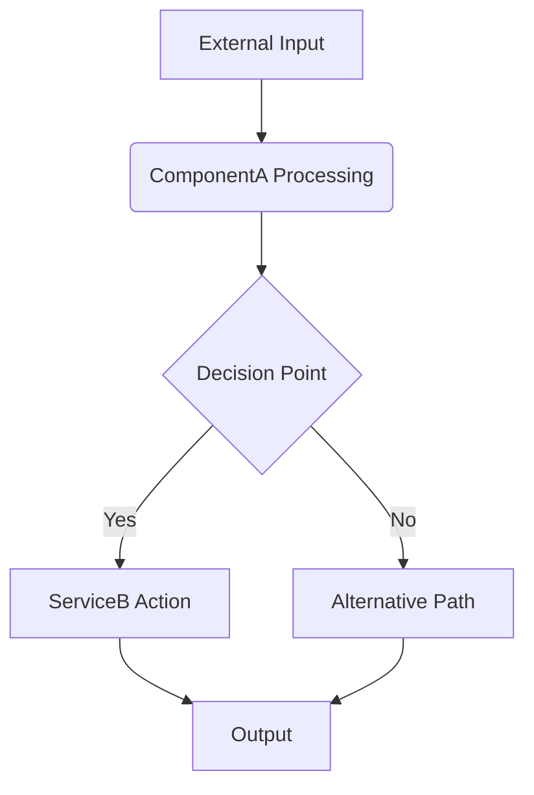

# Model Context Protocol - Technical Overview

## 1. Introduction

This document provides a detailed technical overview of the Model Context Protocol (MCP) within the Codomyrmex project. MCP is designed as a standardized communication interface facilitating interaction between AI models/agents and various software tools. Its primary goals are to ensure interoperability, enable robust tool usage by AI, and provide a clear framework for context and data exchange.

This overview elaborates on the concepts introduced in the main `README.md` and the `MCP_TOOL_SPECIFICATION.md` (meta-specification).

## 2. Core Purpose and Design Philosophy

MCP is built on the following core principles:

-   **Simplicity and Clarity**: Protocol messages and tool specifications should be easy to understand and implement.
-   **Flexibility and Extensibility**: The protocol should accommodate a wide variety of tools and allow for future evolution without breaking existing implementations unnecessarily.
-   **Machine Readability**: Tool specifications and message schemas should be structured to allow for automated parsing, validation, and potentially code generation for client/server interactions. JSON Schema is the recommended standard for this.
-   **Discoverability**: While full dynamic discovery is a more advanced feature, the standardized specification format aids in understanding available tools.
-   **Robustness**: Clear error reporting and versioning are essential for building reliable systems.

## 3. Standard MCP Message Structures

MCP defines two primary message structures for agent-tool interaction: the **Tool Call** message and the **Tool Result** message.

### 3.1. Tool Call Message

This is the message an AI agent sends to invoke a specific tool.

-   **Format**: JSON Object
-   **Key Fields**:
    -   `tool_name` (string, required): The unique invocation name of the tool to be called (e.g., `"ai_code_editing.generate_code_snippet"`). This name must match the `Invocation Name` defined in the tool's `MCP_TOOL_SPECIFICATION.md`.
    -   `arguments` (object, required): A JSON object containing the parameters for the tool, as specified by the tool's `Input Schema`. The keys in this object are the parameter names, and the values are the arguments provided by the agent.

**Conceptual JSON Schema for a Tool Call Message:**

```json
{
  "$schema": "http://json-schema.org/draft-07/schema#",
  "title": "MCP Tool Call",
  "description": "Standard structure for an AI agent to call a tool.",
  "type": "object",
  "properties": {
    "tool_name": {
      "type": "string",
      "description": "The unique invocation name of the tool."
    },
    "arguments": {
      "type": "object",
      "description": "An object containing the arguments for the tool. The schema for this object is defined by the specific tool being called.",
      "additionalProperties": true // Or specific properties if a generic argument schema is preferred for base validation
    }
  },
  "required": ["tool_name", "arguments"]
}
```

**Example Tool Call Message:**

```json
{
  "tool_name": "ai_code_editing.generate_code_snippet",
  "arguments": {
    "prompt": "Create a Python function to sum a list of numbers.",
    "language": "python",
    "context_code": "# This is where the function should be placed"
  }
}
```

### 3.2. Tool Result Message

This is the message a tool sends back to the AI agent after processing a tool call.

-   **Format**: JSON Object
-   **Key Fields**:
    -   `status` (string, required): Indicates the outcome of the tool execution. Common values include:
        -   `"success"`: The tool executed successfully.
        -   `"failure"`: The tool encountered an error during execution.
        -   `"no_change_needed"`: (Optional, for tools like refactoring) The tool executed successfully but determined no changes were necessary.
        -   Other tool-specific success statuses can be defined if meaningful (e.g., `"partial_success"`).
    -   `data` (object, optional): If `status` indicates success, this object contains the primary output of the tool, structured according to the tool's `Output Schema`. This field should be `null` or omitted if `status` is `"failure"`.
    -   `error` (object, optional): If `status` is `"failure"`, this object contains details about the error. This field should be `null` or omitted if `status` is `"success"`. (See Section 3.3 for the recommended error object structure).
    -   `explanation` (string, optional): A human-readable explanation of the results or changes made, often provided by an LLM if the tool uses one.

**Conceptual JSON Schema for a Tool Result Message:**

```json
{
  "$schema": "http://json-schema.org/draft-07/schema#",
  "title": "MCP Tool Result",
  "description": "Standard structure for a tool to return results to an AI agent.",
  "type": "object",
  "properties": {
    "status": {
      "type": "string",
      "description": "The outcome of the tool execution (e.g., success, failure)."
    },
    "data": {
      "type": ["object", "null"],
      "description": "The output data from the tool if successful. Schema is tool-specific."
    },
    "error": {
      "type": ["object", "null"],
      "description": "Details of the error if execution failed.",
      "$ref": "#/definitions/ErrorObject" // Points to the standard error object schema
    },
    "explanation": {
      "type": ["string", "null"],
      "description": "Optional human-readable explanation of the result."
    }
  },
  "required": ["status"],
  "definitions": {
    "ErrorObject": {
      "type": "object",
      "properties": {
        "error_type": {
          "type": "string",
          "description": "A unique code or type for the error (e.g., ValidationError, FileNotFoundError)."
        },
        "error_message": {
          "type": "string",
          "description": "A descriptive message explaining the error."
        },
        "error_details": {
          "type": ["object", "string", "null"],
          "description": "Optional structured details or a string containing more info about the error."
        }
      },
      "required": ["error_type", "error_message"]
    }
  }
}
```

**Example Successful Tool Result Message:**

```json
{
  "status": "success",
  "data": {
    "refactored_code": "def new_code():
  return True",
    "lines_changed": 5
  },
  "explanation": "The code was refactored for clarity.",
  "error": null
}
```

**Example Failure Tool Result Message:**

```json
{
  "status": "failure",
  "data": null,
  "error": {
    "error_type": "FileNotFoundError",
    "error_message": "The specified input file could not be found.",
    "error_details": {
      "path": "/path/to/non_existent_file.py"
    }
  },
  "explanation": null
}
```

### 3.3. Standard Error Object Structure

As referenced in the Tool Result schema, a standard error object is recommended when `status` is `"failure"`:

-   **`error_type`** (string, required): A machine-readable string identifying the general category of the error (e.g., `"ValidationError"`, `"AuthenticationError"`, `"ResourceNotFound"`, `"ToolExecutionError"`, `"ApiLimitExceeded"`). Tools should try to use a consistent set of error types.
-   **`error_message`** (string, required): A human-readable message describing the error.
-   **`error_details`** (object | string, optional): Provides additional, structured (or string) information about the error. For a `ValidationError`, this might include which parameter failed validation and why. For a `FileNotFoundError`, it might include the path that was not found.

## 4. Interaction Patterns

The primary interaction pattern currently defined by MCP is **synchronous request-response**:

1.  The AI Agent constructs a Tool Call JSON message.
2.  The Agent sends this message to the target tool (how this transport occurs is outside MCP's scope but could be via direct function calls in a monolithic system, HTTP requests to a service, etc.).
3.  The Tool executes based on the `tool_name` and `arguments`.
4.  The Tool constructs a Tool Result JSON message.
5.  The Tool sends this message back to the AI Agent.

Future versions of MCP might introduce specifications for asynchronous tool calls, progress updates for long-running tools, or streaming responses.

## 5. Versioning Strategy

MCP employs a two-level versioning approach:

1.  **Overall MCP Version**:
    -   The Model Context Protocol itself will have a semantic version (e.g., `MCP v1.0.0`).
    -   This version applies to the meta-specification, the structure of standard messages (Tool Call, Tool Result), and core principles.
    -   Changes to the overall MCP version will be managed by the `model_context_protocol` module and documented in its `CHANGELOG.md`. Major version changes would indicate potentially breaking changes to the protocol structure itself.

2.  **Individual Tool Versioning**:
    -   Each tool defined by a module (in its `MCP_TOOL_SPECIFICATION.md`) should also be independently versioned (e.g., `ai_code_editing.generate_code_snippet v1.2.0`).
    -   **Breaking Changes**: Any modification to a tool's `Input Schema` (e.g., adding a new required parameter, removing a parameter, changing a parameter's type) or a significant incompatible change to its `Output Schema` **must** result in an increment of the tool's major version (e.g., from `1.x.x` to `2.0.0`). The `Invocation Name` should generally remain stable; if a tool's functionality changes so fundamentally that it's no longer the same tool, a new `Invocation Name` is preferred.
    -   **Non-Breaking Changes**: Adding new *optional* parameters to the `Input Schema` or adding new fields to the `Output Schema` (without altering existing ones) are typically considered non-breaking and would result in a minor or patch version increment (e.g., `1.0.0` to `1.1.0` or `1.0.1`).
    -   Tool versions should be clearly stated in their respective `MCP_TOOL_SPECIFICATION.md` documents.

AI Agents should ideally be aware of the tool versions they are interacting with, although the specifics of how an agent handles version mismatches are an implementation detail for the agent.

## 6. Design Rationale for Key Decisions

-   **JSON as Primary Data Format**: Chosen for its ubiquity, human readability, and wide support across programming languages and platforms.
-   **JSON Schema for Definitions**: Provides a standardized and robust way to define and validate the structure of `arguments` and `data` objects, enabling clear contracts and automated checks.
-   **Emphasis on Module-Owned Tool Specifications**: Each module is responsible for defining and versioning its own tools. This decentralized approach scales better and aligns with the modular architecture of Codomyrmex. The `model_context_protocol` module provides the *template* and *rules* for these specifications.
-   **Explicit `status` Field**: Ensures that the success or failure of a tool call is always clearly and immediately communicated.

## 7. Future Considerations

-   **Asynchronous Operations**: Defining patterns for long-running tools, including how to initiate them, check status, and retrieve results later.
-   **Streaming**: Support for tools that can stream partial results or logs back to the agent.
-   **Tool Discovery**: Mechanisms for agents to dynamically discover available tools and their specifications (e.g., via a central registry or by querying modules).
-   **More Complex Data Types**: Guidelines for handling binary data or other complex data types in tool arguments or results.
-   **Standardized Context Object**: Defining a more formal schema for common contextual information that might be passed to tools or agents.

This technical overview provides the current state and foundational principles of the Model Context Protocol. It will evolve as the Codomyrmex project matures.

## 8. Architecture

(Describe the internal architecture of the module. Include diagrams if helpful.)

- **Key Components/Sub-modules**: (Detail the main internal parts and their roles.)
  - `ComponentA`: Description...
  - `ServiceB`: Description...
  - `DataStoreInterface`: Description...
- **Data Flow**: (How does data move through the module?)
- **Core Algorithms/Logic**: (Explain any complex algorithms or business logic central to the module.)
- **External Dependencies**: (List specific libraries or services it relies on and why.)


(Example Mermaid diagram - adapt as needed)

## 9. Design Decisions and Rationale

(Explain key design choices made during the development of this module and the reasons behind them.)

- **Choice of [Technology/Pattern X]**: Why was it selected over alternatives?
- **Handling [Specific Challenge Y]**: How does the current design address it?

## 10. Data Models

(If the module works with significant data structures, describe them here. This might overlap with API specifications but can be more detailed from an internal perspective.)

- **Model `InternalDataStructure`**:
  - `field1` (type): Internal purpose and constraints.
  - `field2` (type): ...

## 11. Configuration

(Detail any advanced or internal configuration options not typically exposed in the main README or usage examples. How do these configurations affect the module's behavior?)

- `CONFIG_PARAM_1`: (Default value, description, impact)
- `CONFIG_PARAM_2`: (Default value, description, impact)

## 12. Scalability and Performance

(Discuss how the module is designed to scale and perform under load. Any known limitations or bottlenecks?)

## 13. Security Aspects

(Elaborate on security considerations specific to this module's design and implementation, beyond what's in the MCP tool spec if applicable.) 
## Navigation Links

- **Parent**: [Project Overview](../README.md)
- **Module Index**: [All Agents](../../AGENTS.md)
- **Documentation**: [Reference Guides](../../../../../../../docs/README.md)
- **Home**: [Root README](../../../README.md)
